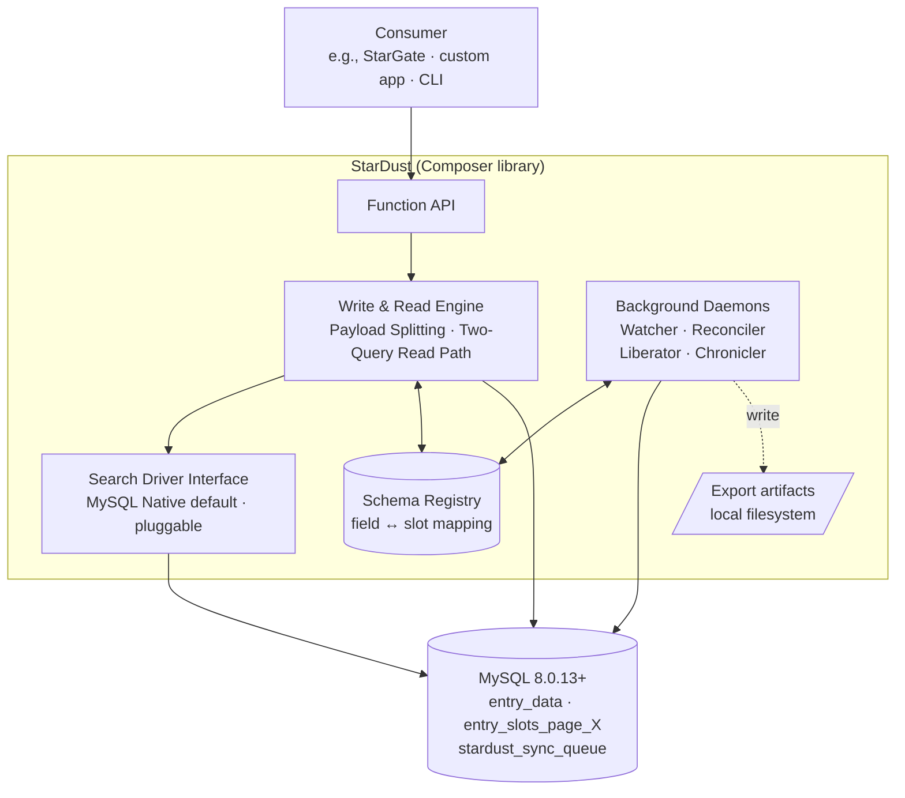
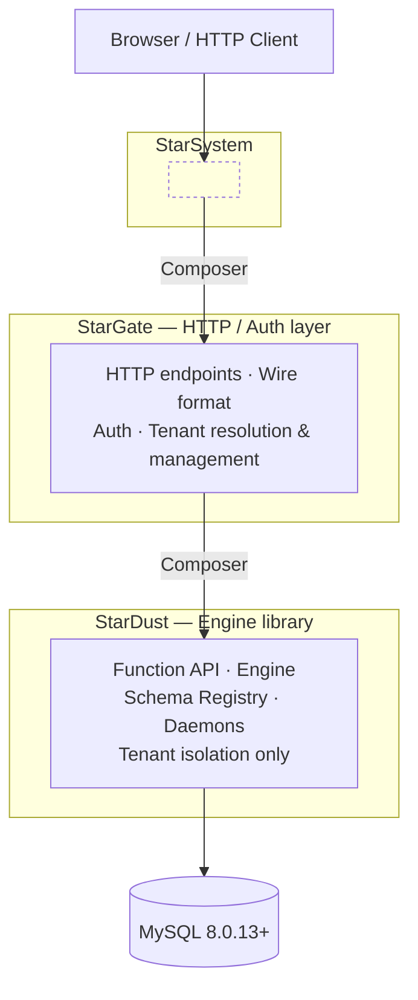

# SDDPG — StarDust Developer & Project Guide

> **This repository contains developer-facing documentation for the StarDust project.**
> It is **not** end-user documentation.

## Purpose

SDDPG serves as the canonical reference for architectural decisions, migration strategies, operational procedures, and domain knowledge related to StarDust. Its audience is:

- **StarDust core developers** — day-to-day technical reference.
- **Internal team members** — onboarding context and project history.
- **Future contributors** — architectural rationale and operational playbooks.

## Architecture Overview

Two eagle-view diagrams to orient new readers. They intentionally omit internal details — see [`architecture_blueprint.md`](architecture_blueprint.md) for the normative specification.

### StarDust internals (component view)

The function API is the only entry point. Any PHP application can consume StarDust via Composer — StarGate is one such consumer, not a required one. The engine, registry, and daemons coordinate exclusively through the database; there is no message bus or direct IPC. The schema registry is the single coordination surface.



### StarDust's position in the stack (context view)

StarDust is the bottom-layer engine library. StarGate wraps it with HTTP, auth, and tenant resolution. StarSystem sits above them. Each upward arrow is a Composer dependency on the layer below.



## Current Contents

| Document                                                                         | Description                                                                                                                                                |
| -------------------------------------------------------------------------------- | ---------------------------------------------------------------------------------------------------------------------------------------------------------- |
| [`architecture_blueprint.md`](architecture_blueprint.md)                         | Core Architecture Blueprint — covers Vertical Schema Partitioning, strict resource bounding, API contracts, and read/write paths.                          |
| [`schemas/schema_reference.md`](schemas/schema_reference.md)                     | ERD & Schema Reference — single source of truth for the physical schema (data plane, registry, and operational/coordination tables).                       |
| [`legacy_data_migration.md`](legacy_data_migration.md)                           | **Stub** — load-bearing migration principles only. Operational details deferred pending blueprint stabilization and legacy method documentation.           |
| [`blueprints/`](blueprints/)                                                     | Feature Blueprints — high-level feature descriptions and acceptance criteria, written before implementation begins.                                        |
| [`glossary.md`](glossary.md)                                                     | Domain Dictionary — canonical definitions for project-specific terms (e.g., "extension table", "slot", "page"). Eliminates cross-team ambiguity.           |
| [`adrs/`](adrs/)                                                                 | Architecture Decision Records — immutable log of _why_ key technical decisions were made. Prevents re-litigating settled debates.                          |
| [`blueprints/queryfilter_wire_format.md`](blueprints/queryfilter_wire_format.md) | QueryFilter Wire Format — normative JSON encoding for consumer filter payloads: envelope, node shapes, typed values, error model, and JSON Schema sidecar. |
| [`schemas/queryfilter.schema.json`](schemas/queryfilter.schema.json)             | JSON Schema (Draft 2020-12) for the v1 QueryFilter wire format. Normative artifact for consumer-side and CI validation.                                    |
| [`implementation_phases.md`](implementation_phases.md)                           | Build sequencer — nine dependency-ordered phases with exit criteria, ADR coverage index, and document precedence rules.                                    |

## Planned Contents

| Document / Directory               | Purpose                                                                                                                |
| ---------------------------------- | ---------------------------------------------------------------------------------------------------------------------- |
| `runbooks/` — Ops Playbook         | Operational procedures: DLQ replay, backfill pump execution, page provisioning, rollback triggers. Reduces bus factor. |
| `onboarding.md` — Onboarding Guide | Step-by-step guide for a new developer to set up, understand, and contribute to StarDust.                              |

> HTTP endpoint contracts, request/response wire formats, status codes, auth, tenant resolution, and tenant management are owned by the separate **StarGate** project (which depends on StarDust via Composer). They are not in scope for SDDPG.

## Repository Structure

```text
SDDPG/
├── README.md
├── architecture_blueprint.md
├── legacy_data_migration.md
├── adrs/                    # Architecture Decision Records
├── schemas/                 # ERD, schema diagrams
├── runbooks/                # Operational playbooks
├── blueprints/              # Feature blueprints & specs
├── glossary.md              # Domain dictionary
└── onboarding.md            # New developer guide
```

## Deployment Requirements

StarDust requires a deployment target that supports persistent background processes — the engine ships four supervised daemons (Watcher, Reconciler, Liberator, Chronicler) that are expected to run continuously, not as cron-triggered one-shots. The supported targets are VPS deployments (systemd / supervisor / equivalent) and containerized deployments (Docker, Kubernetes, etc.). Free shared hosting that disallows long-running processes is structurally unsupported.

A supported host MUST provide:

- The ability to run persistent background processes or long-running containers.
- MySQL 8.0.13+ or Percona Server 8.0.13+.
- PHP 8.x with CLI access (required by the `bin/stardust` entry point).
- Local filesystem write access for export artifacts (a mounted volume in container deployments).

See [`adrs/0027-persistent-process-daemon-execution-model.md`](adrs/0027-persistent-process-daemon-execution-model.md) for the full rationale, the deployment tier matrix, and the status of cron-driven execution (deferred, not foreclosed).

## Conventions

- **File format**: Markdown (`.md`). Use Mermaid fenced blocks for diagrams where possible.
- **Naming**: lowercase with underscores (e.g., `migration_plan.md`, not `MigrationPlan.md`).
- **ADR numbering**: `NNNN-short-title.md` (e.g., `0001-extension-tables-over-eav.md`).
- **Immutability**: ADRs are append-only. To supersede a decision, create a new ADR referencing the old one — never edit the original.
- **Architecture Blueprint is the sole source of truth**: `architecture_blueprint.md` MUST NOT reference any other document in this repository. It is self-contained by design.
- **ADR reference direction**: only newer ADRs may reference older ADRs — never the reverse. This keeps the ADR dependency graph a strict DAG and prevents circular reasoning.
- **Document precedence on conflict**: the full resolution order (blueprint → ADRs → component blueprints → schema reference) is defined in [`implementation_phases.md`](implementation_phases.md#document-precedence).
