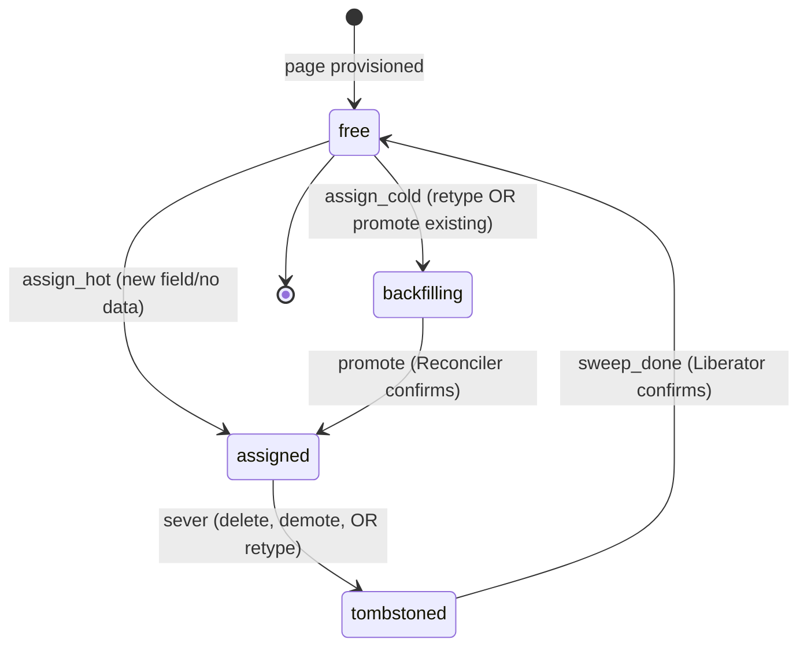

# 0017 - Schema Registry as Coordination Contract

**Status:** Proposed
**Created:** 2026-04-21

## Context

StarDust's extension tables expose typed but generically named slot columns (`i_str_01`...`i_str_25`, `i_int_01`...`i_int_15`, `i_num_01`...`i_num_10`, `i_dt_01`...`i_dt_10`). These column names carry no domain meaning; `blog_title` may land in `entry_slots_page_2.i_str_01` for one model and in `entry_slots_page_7.i_str_14` for another. Some mechanism must record the mapping from each model field to its physical (page, slot) coordinate so that the payload splitting engine, the read path, and all three daemons agree on where a given field's data lives.

The blueprint refers to this mechanism as the "schema registry" across §2.1 (daemon coordination), §2.1.3 (Liberator eviction), §2.1.5 (slot assignment), §2.1.6 (type change), §2.2 (index provisioning), and §4.1 (pre-flight rejection). It is also the load-bearing coordination surface identified in ADR `0015` — the sole channel through which the Watcher, Reconciler, and Liberator communicate.

Despite this centrality, the registry's physical contract — its tables, columns, status enum values, uniqueness constraints, and the atomicity boundaries of its state transitions — was left implicit. The three concrete StarDust tables (`entry_data`, `entry_slots_page_X`, `stardust_sync_queue`) are fully specified in [`schemas/schema_reference.md`](../schemas/schema_reference.md); the registry was not. This asymmetry means any two good-faith implementations could invent incompatible registry schemas and produce subtle data-integrity divergence — particularly around slot reuse, tombstone lifecycle, and type-change backfill suppression.

## Decision

The schema registry is promoted to a first-class architectural contract. Its tables, slot status state machine, and atomicity invariants are normative, not implementation detail.

**The registry comprises four normative tables** (DDL in [`schemas/schema_reference.md`](../schemas/schema_reference.md) §4):

- `stardust_models` — one row per (tenant, model). Identity for field ownership.
- `stardust_fields` — one row per model field. Stores declared type and `is_filterable`. Lifecycle state lives on the slot row, not here — a field's state is derived from its currently-mapped `stardust_slot_assignments` row, or is "unmapped" if none exists.
- `stardust_pages` — one row per provisioned `entry_slots_page_X` table. Owned by the Watcher; no other daemon writes to it.
- `stardust_slot_assignments` — one row per (page, slot_column). The authoritative field-to-slot mapping. Carries the slot's lifecycle status and, when tombstoned, the Liberator's per-slot sweep cursor (`entry_id` high-water mark).

**The slot status state machine is a closed enum** with exactly these values, transitioning only along the arrows below. Each arrow is a single-row transition; a retype involves two rows (old slot and new slot) whose transitions commit in one transaction (see atomicity boundaries below).

- `free` — slot has no field mapping and has been confirmed nullified across all tenant data. Eligible for assignment.
- `assigned` — slot is mapped to a field and being written by the payload splitting engine. Reads go through the slot. If `is_filterable = true`, the index is active.
- `tombstoned` — slot is vacated (by field deletion, filterability demotion, or retype) and pending Liberator sweep. Cannot be reassigned. `field_id` is `NULL`. Reads for the formerly-mapped field fall back to `JSON_EXTRACT`.
- `backfilling` — slot freshly assigned to a field after a retype; Reconciler is populating it from the JSON payload. Slot-based reads and filter acceptance are both suppressed regardless of `is_filterable`; reads fall back to `JSON_EXTRACT`.
- `ready` — backfill complete; slot behaves identically to `assigned`. Terminal state for the post-retype lifecycle.

The old slot and the new slot of a retype are independent rows in `stardust_slot_assignments`: the old row walks `assigned → tombstoned → free` (standard sever/sweep path); the new row walks `free → backfilling → ready`. There is no single-row `retyping` state — the transitional status of the field is fully captured by the `backfilling` status of its new slot (or by the absence of any live slot, if capacity was unavailable at retype time).

**Uniqueness is enforced at the database level.** `stardust_slot_assignments` has a unique key on `(page_id, slot_column)` — two fields cannot race onto the same physical slot. A partial unique key on `(field_id)` filtered to `status IN ('assigned', 'backfilling', 'ready')` ensures a field has at most one live slot at a time. The old slot of an in-flight retype is already `tombstoned` (with `field_id = NULL`) and therefore does not block the new slot's `backfilling` assignment. Registry atomicity derives from these constraints, not from advisory locking.

**State transitions have defined atomicity boundaries.** Each of the following must execute inside a single registry transaction:

- **Sever + tombstone** (ADR `0009`): demoting a field flips `status: assigned → tombstoned` and nulls the `field_id` link in a single commit. Readers never observe a window where the slot is still "assigned" but no longer mapped.
- **Retype + tombstone old + assign new** (ADR `0016`): in one transaction, the field's `declared_type` is updated, the old slot flips `status: assigned → tombstoned` (and `field_id → NULL`), and — if a free slot of the target type exists — a new slot flips `status: free → backfilling` with `field_id` set to this field. If no free slot of the target type is available, the transaction still commits the retype and the old slot's tombstoning; the new-slot assignment is deferred to the standard slot-assignment path (§2.1.5) once the Watcher provisions capacity. Any failure rolls back the entire transition; the field is never observed with two live slots or with a mapped old slot under the new declared type.
- **Sweep completion + slot free**: the Liberator's final nullification batch and the `tombstoned → free` transition commit in the same transaction. A slot cannot be reassigned until the last sweep-confirm is durable.
- **Page provisioning + slot inventory insert**: the Watcher's `CREATE TABLE` and the subsequent `INSERT` of all new free slots into `stardust_slot_assignments` commit together. The page is never visible to the Reconciler as having capacity before its slot inventory is registered.

**The registry is the only coordination surface.** Per ADR `0015`, no daemon signals another except via registry state changes. This ADR specifies the shape of those state changes; ADR `0015` specifies that no other channel exists.

**Unmapped field state is contractual, not incidental.** A field row in `stardust_fields` with no live slot in `stardust_slot_assignments` (no row in `assigned`, `backfilling`, or `ready`) is in a recognized state called **unmapped**. This is not an error condition — it is one of three legitimate ways a field can exist in the registry:

| Unmapped sub-state             | How to detect                                                                                                                                             | Cause                                                                                                                                                                  |
| :----------------------------- | :-------------------------------------------------------------------------------------------------------------------------------------------------------- | :--------------------------------------------------------------------------------------------------------------------------------------------------------------------- |
| `unmapped_new`                 | No live slot AND no `tombstoned` slot exists (or has ever existed) for this `field_id`.                                                                   | Field was just registered and the assignment path (§2.1.5) has not yet found a compatible free slot.                                                                   |
| `unmapped_pending_promotion`   | No live slot AND a `tombstoned` slot exists for this `field_id` AND the field's `declared_type`/`is_filterable` differ from that tombstoned slot's shape. | Migration was triggered (type change or filterability promotion per ADR `0016`), the old slot was tombstoned, but no compatible new slot was available at commit time. |
| `unmapped_orphaned`            | No live slot AND a `tombstoned` slot exists with the same shape as the field.                                                                             | Anomaly — should not occur under correct ADR `0016` semantics. Surfaces as an operator alert.                                                                          |

The read-path and filter-acceptance contract is **identical across all three sub-states**: reads fall back to `JSON_EXTRACT(fields, '$.fieldName')` and any filter request is rejected with a typed exception regardless of `is_filterable`. The sub-state distinction is for operator diagnostics and Watcher prioritization, not for correctness routing — a single contract ("no live slot ⇒ JSON read, rejected filter") covers all three.

The Watcher MAY use `unmapped_pending_promotion` as a signal to prioritize provisioning a page whose slot inventory satisfies the pending field's shape (correct type, indexed if needed). This is the only inter-daemon use of unmapped sub-states; the read path never branches on them.

The schema reference (§4.5 "Read routing per state") includes an explicit `(no live slot)` row covering this contract so the read path's behavior is documented at the same level as the in-status routing rules.

## Consequences

**Positive:**

- The unmapped-field contract removes a class of "ghost state" ambiguity: implementations cannot accidentally diverge on whether a field with no live slot is queryable, filterable, or in error. The single rule is contractual and the diagnostic sub-states are derived, not stored.
- Implementers no longer need to invent the registry schema. A reference DDL and a closed state machine eliminate a wide class of "works in one implementation, silently diverges in another" defects.
- The uniqueness constraints on `stardust_slot_assignments` make double-assignment (two fields racing onto the same slot) a database-level constraint violation rather than a best-effort application invariant. The race condition described in §2.1.5 ("atomically reserved") has an explicit enforcement mechanism.
- The closed slot status enum removes ambiguity around edge cases: a field that is `backfilling` has unambiguously-defined read routing (`JSON_EXTRACT`) and filter behavior (rejected regardless of `is_filterable`). This directly supports ADR `0016`'s filterability-suspension guarantee.
- Defining atomicity boundaries for each transition lets reviewers audit correctness at the SQL level. The "sever + tombstone" commit invariant, for example, is now testable via a migration-level assertion, not by reading through daemon code.
- The registry being declared a contract means changes to it are subject to ADR review. Adding a new slot status value or a new table is a deliberate, auditable decision rather than an implementation detail.

**Negative:**

- The registry schema is now a public-internal contract. Changes require an ADR, schema reference update, and migration plan — the cost of changing it rises. This is the intended trade-off: the registry is too load-bearing to evolve casually.
- Four registry tables add operational surface: backup, monitoring, and migration tooling must cover them. In practice, they are small and slow-changing, so the operational cost is modest.
- The closed state machine constrains future extension. Adding a new lifecycle state (e.g., a hypothetical `readonly` status for archival) requires a new ADR and migration. The alternative — an open-ended status column — was rejected because the current ambiguity across §2.1.3, §2.1.5, and §2.1.6 was exactly the problem this ADR solves.

**Rejected alternatives:**

- Leave the registry schema as implementation detail — the current state. Rejected because the registry is the coordination contract for three daemons, the read path, and the write path; leaving its shape implicit creates silent divergence risk far exceeding the cost of formalization.
- Single flattened table (e.g., merge fields + slot assignments) — rejected because a field without a live slot (pure `JSON_EXTRACT` fallback) is a legitimate state, and a slot without a field (post-sweep `free`) is equally legitimate. Modeling these as the same row forces NULL-heavy columns and obscures the lifecycle.
- Registry in a separate database or config service — rejected because the registry is read during every write transaction (payload splitting) and many reads (field resolution). Cross-database or cross-service reads add latency and violate the zero-dependency core (ADR `0002`).
- Status as free-form strings or booleans — rejected because the Liberator, Reconciler, and read path all need to branch on the exact state. A closed ENUM (or CHECK-constrained VARCHAR) catches invalid transitions at write time, not at runtime in a different daemon days later.
