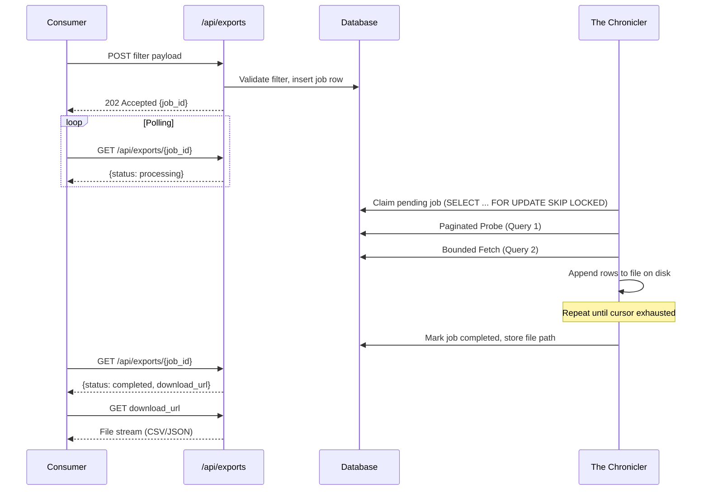

# Blueprint: Asynchronous Exports

> **Status:** Draft
> **Author:** Damar Syah Maulana
> **Created:** 2026-04-10

## 1. Problem Statement

The synchronous `/api/entries` endpoint enforces strict cursor-based page limits to protect database resources (Architecture Blueprint §4). Consumers with legitimate bulk-retrieval needs — data analysts running periodic extractions, inter-system synchronisation jobs — currently have no supported path to retrieve large result sets without manually paginating through potentially thousands of pages.

## 2. Scope

- A new **`/api/exports`** endpoint that accepts a query filter payload and returns `202 Accepted` with a Job ID.
- **The Chronicler** — a background daemon (separate process from the Watcher, Reconciler, and Liberator) — that:
  - Claims pending export jobs.
  - Pages through the database using the same bounded two-query approach (Architecture Blueprint §4, Query 1 + Query 2 in a loop).
  - Streams output to a local CSV or JSON file on disk.
- A **job status polling** mechanism allowing consumers to check export progress and completion.
- An **artifact download** endpoint for retrieving the completed export file.

## 3. Non-Goals

- Real-time streaming or WebSocket delivery of export data.
- Third-party object-storage integration (e.g., S3, GCS). Artifacts are stored on local disk.
- Scheduled or recurring exports — each export is a one-shot request.
- Partial result delivery (consumers receive the artifact only after the export completes).

## 4. Acceptance Criteria

1. A consumer can `POST` a valid filter payload to `/api/exports` and receive a `202 Accepted` response containing a unique Job ID.
2. The Chronicler processes the job without violating the bounded query execution constraints (no single query materialises more than `page_size` rows in application memory).
3. A consumer can poll the job status and receive one of: `pending`, `processing`, `completed`, `failed`.
4. On `completed`, the consumer can download the artifact as CSV or JSON (format specified in the original request).
5. A failed export writes diagnostic information (filter payload, failure reason, row cursor at failure) to the job record for operator inspection.
6. Export jobs respect `tenant_id` isolation — a consumer can only poll and download their own exports.

## 5. Technical Sketch

**Key decisions:**

- The Chronicler uses `SELECT ... FOR UPDATE SKIP LOCKED` to claim jobs, enabling horizontal scaling if export volume demands it.
- The same Cursor-Based Pagination used by `/api/entries` is reused, ensuring no new query execution paths are introduced.
- File writes are streaming (append per chunk), keeping daemon memory bounded regardless of total export size.

## 6. Resolved Decisions

The three open questions previously listed here are all answered by [ADR 0010](../adrs/0010-asynchronous-exports.md):

1. **Job TTL and cleanup** — Completed export artifacts persist for **24 hours** after `completed_at` and are removed by the Chronicler's background GC sweep (which runs each idle cycle). The TTL is fixed by ADR, not configurable, to keep operator runbooks uniform across deployments.
2. **Per-tenant concurrency cap** — A tenant may hold at most **3 concurrent active export jobs**. A 4th submission while three are active returns `429 Too Many Requests` with a `Retry-After` hint. This bounds noisy-neighbor pressure on the Chronicler without requiring per-tenant queueing.
3. **Format negotiation** — The export format (CSV / JSON) is specified in the `POST` body field `format`, **not** the `Accept` header. The submission endpoint returns `202 Accepted` regardless of the eventual artifact MIME type; tying format selection to `Accept` would conflate request-shape negotiation with payload-shape selection.

## 7. Related Documents

- [Architecture Blueprint §4.2 — Asynchronous Exports](../architecture_blueprint.md)
- [Architecture Blueprint §4 — Bounded Query Execution](../architecture_blueprint.md)
