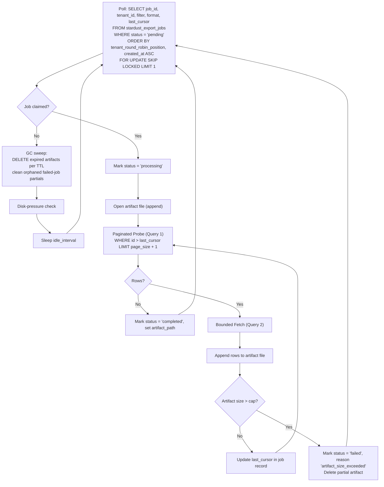

# Blueprint: Chronicler Daemon

> **Status:** Stub
> **Author:** Damar Syah Maulana
> **Created:** 2026-05-04

## 1. Problem Statement

The Chronicler is the engine-side daemon responsible for materializing export jobs. Its decision history (use the bounded read path, write streaming artifacts to local disk, claim jobs via `SKIP LOCKED`, enforce per-tenant fairness, bound disk usage via TTL) was originally captured alongside the consumer-facing `/api/exports` endpoint in [`async_exports.md`](async_exports.md) and [ADR 0010](../adrs/0010-asynchronous-exports.md). This blueprint consolidates the daemon-side decisions that had no dedicated engine-side home.

This blueprint consolidates them. It is a **stub** — it preserves the engine-side decisions made elsewhere but does not yet bring them to Liberator-grade rigor (formal acceptance criteria, structured-log event vocabulary, exhaustive failure-mode coverage). Closing those gaps is the follow-up that resolves problem #6 of [`sddpg_implementation_readiness.md`](../sddpg_implementation_readiness.md).

## 2. Scope

- **The Chronicler**: A multi-worker PHP CLI daemon (`php spark stardust:chronicler`) that:
  - Polls an exports queue (job records with `status = 'pending'`) for unclaimed work, ordered by per-tenant round-robin position to enforce noisy-neighbor fairness.
  - Claims jobs via `SELECT ... FOR UPDATE SKIP LOCKED`, marking the row `processing` and recording the worker's identity for observability.
  - Internally pages through the database using the same Cursor-Based Pagination and Two-Query Approach as the synchronous read path ([ADR 0005](../adrs/0005-two-query-bounded-read-path.md), [ADR 0006](../adrs/0006-cursor-based-pagination.md)) — every database operation remains bounded by `page_size`.
  - Streams output to a local artifact file (CSV or JSON, format selected at job submission time).
  - Marks the job `completed` with the artifact path on success, or `failed` with a diagnostic reason and last-cursor on failure.
- **Per-tenant fairness**: Round-robin claim ordering (per-tenant `MIN(created_at)`), avoiding strict global FIFO. A single tenant's queue depth never starves another tenant.
- **TTL and GC sweep**: On each idle cycle, the Chronicler deletes artifact files whose `completed_at + ttl < now()` (default TTL 24h, configurable). Orphaned partial files from `failed` jobs older than 1 hour are also collected.
- **Disk-pressure circuit**: Before claiming a new job, the Chronicler checks free disk space on the artifact partition. Below 10% free, it skips claim and emits a `low_disk` event until pressure clears. In-flight jobs continue.
- **Per-job size cap**: Each job has a configurable maximum artifact size (default 5 GB). Reaching the cap aborts the job with reason `artifact_size_exceeded` and deletes the partial file.

## 3. Non-Goals

- **HTTP endpoint definition.** How an external consumer submits a job (`POST /api/exports`, request shape, `202 Accepted` response, polling endpoint, artifact download) is owned by StarGate. The Chronicler operates against a database job queue, not against HTTP requests.
- **Job submission semantics.** The function-API surface that creates a job record (input validation, idempotency key handling, cap enforcement) is StarDust's bulk-ingest/export-submission engine API; it is invoked by callers. The Chronicler only consumes already-persisted jobs.
- **Artifact delivery.** The Chronicler writes to local disk and updates the job record with the path. How that path becomes a downloadable URL for the end consumer (HTTP streaming, signed URLs, gateway streaming proxies) is the caller's domain.
- **Coordination with other daemons.** Like Watcher/Reconciler/Liberator, the Chronicler shares no IPC. It reads and writes only the exports queue, the artifact filesystem, and (when paginating) the entry tables.

## 4. Acceptance Criteria

> **TODO** — bring to Liberator-grade rigor. The criteria below are the engine-side decisions known at extraction; they are not yet exhaustive.

- **Multi-worker safe claim**: `SELECT ... FOR UPDATE SKIP LOCKED` provides row-level mutual exclusion. Two Chronicler workers running concurrently never claim the same job.
- **Page-bounded queries**: Every internal database query touches at most `page_size + 1` rows, regardless of total export size.
- **Per-tenant active-job cap**: A tenant may not have more than 3 jobs in `pending` or `processing` status simultaneously (see [ADR 0010](../adrs/0010-asynchronous-exports.md) §Per-Tenant Concurrency for the policy origin). Enforcement is at the engine API boundary, not the Chronicler.
- **Round-robin claim ordering**: When picking the next pending job, the worker orders by `(tenant_round_robin_position, created_at ASC)`, where the position is computed from `MIN(created_at)` per active tenant.
- **Idempotent failure**: A job that the Chronicler claims, partially processes, and then crashes on must be re-claimable on restart. The partial artifact is deleted; the job record's last-cursor diagnostic is preserved for operator inspection.
- **Tenant isolation**: All paginated reads include `tenant_id` predicates; cross-tenant data leakage is forbidden.

> **Pending Liberator-grade work**: closed structured-log event vocabulary, deadlock retry budget, sweep-gap analog for irrecoverable read failures, observability metrics surface, restart resumption from last-cursor.

## 5. Technical Sketch

**Key decisions (carried over from the relocated documents):**

- The Chronicler reuses the synchronous read path's pagination and two-query bounded fetch. No new query execution paths are introduced.
- File writes are streaming (append per chunk), keeping daemon memory bounded regardless of total export size.
- The Chronicler is independent of the Watcher, Reconciler, and Liberator. It does not interact with the schema registry and does not participate in daemon-to-daemon coordination ([ADR 0015](../adrs/0015-database-as-sole-daemon-coordination-point.md)).

## 6. Open Questions

- **Structured-log event vocabulary.** Liberator and Watcher/Reconciler have closed event sets per [ADR 0020](../adrs/0020-structured-logging-mandate.md). The Chronicler's vocabulary (`job_claimed`, `chunk_written`, `job_completed`, `job_failed`, `gc_swept`, `low_disk`, `artifact_size_exceeded`) is not yet pinned.
- **Failure-mode coverage.** What happens when (a) the artifact filesystem is full mid-write, (b) the database connection drops mid-pagination, (c) a row's payload contains an invalid character for the chosen format? The Liberator's deadlock + sweep-gap budgets are the equivalent treatment for that daemon; the Chronicler needs its own.
- **Worker count and throughput tuning.** The original blueprint left worker count to deployment config. Whether StarDust ships an opinionated default is undecided.
- **Observability metrics.** The Liberator emits `chunk_elapsed_ms` and `rows_nullified` per chunk. The Chronicler's equivalent (`rows_streamed`, `bytes_written`, `chunk_elapsed_ms`) needs to be specified.

## 7. Related Documents

- [`async_exports.md`](async_exports.md) — original blueprint (consumer-facing portions).
- [ADR 0010](../adrs/0010-asynchronous-exports.md) — Asynchronous Exports (TTL, per-tenant cap, format negotiation).
- [`liberator_daemon.md`](liberator_daemon.md) — peer daemon blueprint at the rigor level this stub aspires to.
- [`watcher_reconciler_daemons.md`](watcher_reconciler_daemons.md) — the other peer daemon blueprint.
- [ADR 0005 — Two-Query Bounded Read Path](../adrs/0005-two-query-bounded-read-path.md)
- [ADR 0006 — Cursor-Based Pagination](../adrs/0006-cursor-based-pagination.md)
- [ADR 0015 — Database as Sole Daemon Coordination Point](../adrs/0015-database-as-sole-daemon-coordination-point.md)
- [ADR 0020 — Structured Logging Mandate](../adrs/0020-structured-logging-mandate.md)
