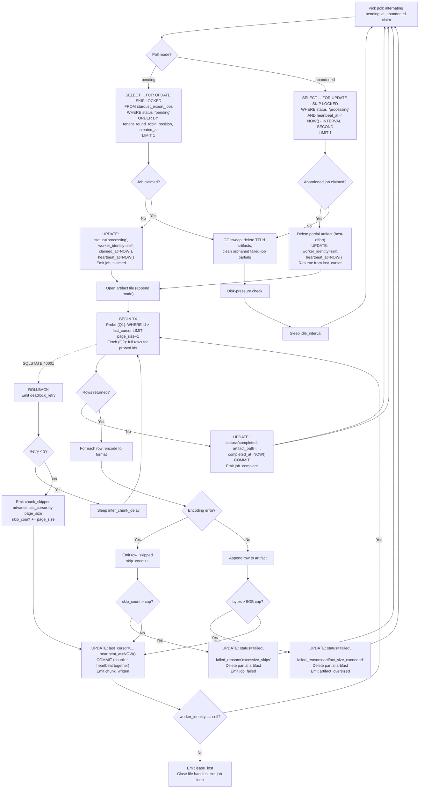

# Blueprint: Chronicler Daemon

> **Status:** Draft
> **Author:** Damar Syah Maulana
> **Created:** 2026-05-04
> **Last revised:** 2026-05-09 (stub → Liberator-grade)

## 1. Problem Statement

The Architecture Blueprint and [ADR 0010](../adrs/0010-asynchronous-exports.md) commit StarDust to asynchronous exports materialized by a multi-worker background daemon — the Chronicler. [ADR 0010](../adrs/0010-asynchronous-exports.md) fixes the high-level lifecycle (claim, materialize, complete; per-tenant cap; 24h artifact TTL; format negotiation). [ADR 0025](../adrs/0025-chronicler-failure-semantics.md) fixes failure semantics (lease/heartbeat for crashed workers, deadlock retry budget, bad-row skip policy, distinct terminal events for infrastructure failures). [`schemas/schema_reference.md`](../schemas/schema_reference.md) §5.2 fixes the persistence substrate.

What none of those provide is a feature-level specification — testable acceptance criteria, the closed structured-log event vocabulary, and operational boundaries — for the daemon that executes the lifecycle. The Watcher and Reconciler each have such a blueprint ([`watcher_reconciler_daemons.md`](watcher_reconciler_daemons.md)); the Liberator has one ([`liberator_daemon.md`](liberator_daemon.md)). This blueprint is the Chronicler's.

## 2. Scope

- **The Chronicler**: A multi-worker PHP CLI daemon (`bin/stardust chronicler`) that:
  - Polls `stardust_export_jobs` for unclaimed pending work, ordered by per-tenant round-robin position to enforce noisy-neighbor fairness.
  - Claims pending jobs via `SELECT ... FOR UPDATE SKIP LOCKED`, marking the row `processing` and recording `worker_identity`, `claimed_at`, and `heartbeat_at` in the same transaction.
  - Periodically polls for abandoned claims (`status='processing' AND heartbeat_at < NOW() - INTERVAL <lease_timeout> SECOND`) and re-claims them, deleting any partial artifact and resuming from `last_cursor` per [ADR 0025](../adrs/0025-chronicler-failure-semantics.md) Commitment 1.
  - Internally pages through `entry_data` only (reading `id, fields` JSON — the system of record per [ADR 0013](../adrs/0013-json-payload-as-system-of-record.md)), inheriting the bounded `LIMIT pageSize + 1` shape of the synchronous read path ([ADR 0005](../adrs/0005-two-query-bounded-read-path.md), [ADR 0006](../adrs/0006-cursor-based-pagination.md)). The slot-join shape of the synchronous read is deliberately not reused: exports must materialize every field, not just the indexed ones, so the JSON payload is the natural source and the per-page slot joins would be redundant work. Every database operation remains bounded by `page_size`.
  - Streams output to a local artifact file (CSV or JSON, format selected at job submission time).
  - Refreshes `heartbeat_at` in every chunk-commit transaction (default 5s cadence — i.e., the chunk-commit transaction *is* the heartbeat write).
  - Marks the job `completed` with the artifact path on success, or `failed` with a diagnostic `failed_reason` and last-cursor on terminal failure.
- **Per-tenant fairness**: Round-robin claim ordering — `(tenant_round_robin_position, created_at ASC)` where the position is computed at claim time as `MIN(created_at)` per tenant over `status='pending'` rows ([schema_reference.md §5.2](../schemas/schema_reference.md)). A single tenant's queue depth never starves another tenant.
- **TTL and GC sweep**: On each idle cycle, the Chronicler deletes artifact files whose `completed_at + ttl < NOW()` (default TTL 24h, configurable). Orphaned partial files from `failed` jobs older than 1 hour are also collected.
- **Disk-pressure circuit**: Before claiming a new job, the Chronicler checks free disk on the artifact partition. Below 10% free, it skips claim and emits `low_disk` until pressure clears. In-flight jobs continue. (Distinct from the `disk_full` mid-write terminal event; see §4.)
- **Per-job artifact size cap**: Default 5 GB, configurable. Reaching the cap aborts the job with `failed_reason='artifact_size_exceeded'` and emits `artifact_oversized`.
- **Bad-row skip + bounded skip cap**: Per [ADR 0025](../adrs/0025-chronicler-failure-semantics.md) Commitments 4 and 5 — single rows with format-incompatible bytes are skipped (emit `row_skipped`, charge `skip_count`); a job's cumulative `skip_count` exceeding the cap aborts with `failed_reason='excessive_skips'`.
- **Closed structured-log event vocabulary**: Aligned with [ADR 0020](../adrs/0020-structured-logging-mandate.md). The full closed set is pinned in §6.
- **Coordination boundary**: The Chronicler reads and writes only `stardust_export_jobs` and the artifact filesystem; it paginates over `entry_data` read-only with mandatory `tenant_id` predicates. The single permitted registry touch is a read of `stardust_fields` (joined with `stardust_models` for tenant isolation) to derive the CSV header column list once per claimed job — this is a field-name catalog lookup, not coordination, and never reads slot status or page metadata. It does not write the schema registry and never reads or writes `stardust_sync_queue`, `stardust_slot_assignments`, `stardust_pages`, or any other daemon's tables ([ADR 0015](../adrs/0015-database-as-sole-daemon-coordination-point.md)).

## 3. Non-Goals

- **HTTP endpoint definition.** How an external consumer submits a job (`POST /api/exports`, request shape, `202 Accepted` response, polling endpoint, artifact download URL) is owned by StarGate. The Chronicler operates against the `stardust_export_jobs` queue, not against HTTP requests.
- **Job submission semantics.** The function-API surface that creates a job record (input validation, idempotency key handling, per-tenant active-job cap enforcement) is StarDust's bulk-ingest/export-submission engine API, invoked by callers. The Chronicler only consumes already-persisted `pending` jobs.
- **Artifact delivery.** The Chronicler writes to local disk and updates the job record with the path. How that path becomes a downloadable URL for the end consumer (HTTP streaming, signed URLs, gateway streaming proxies) is the embedder's concern.
- **Coordination with other daemons.** Like the Watcher, Reconciler, and Liberator, the Chronicler shares no IPC. It reads and writes `stardust_export_jobs` + the artifact filesystem, paginates `entry_data` read-only, and performs one `stardust_fields` read per claim for CSV header derivation.
- **Operator alerting infrastructure.** The Chronicler emits structured events to stdout per [ADR 0020](../adrs/0020-structured-logging-mandate.md); wiring `low_disk`, `chunk_skipped`, or `excessive_skips` thresholds into a paging system is operator concern.
- **Manual stranded-job recovery CLI.** The lease/heartbeat model recovers crashed workers automatically. A manual reset CLI for the residual cases the lease model does not cover (a worker that hangs but keeps heartbeating) is out of scope here — it belongs in operator tooling, not the daemon spec.

## 4. Acceptance Criteria

### Multi-worker claim correctness

1. Two Chronicler workers running concurrently never claim the same `pending` job. `SELECT ... FOR UPDATE SKIP LOCKED` provides row-level mutual exclusion; the `pending → processing` transition, `worker_identity` write, and `claimed_at`/`heartbeat_at` writes commit in **one transaction**.
2. The per-tenant active-job cap (≤ 3 in `pending` or `processing`) is enforced at the engine API submission boundary, not at the Chronicler. The Chronicler trusts that no tenant exceeds the cap and does not re-validate.

### Per-tenant fairness

1. Claim ordering is `(tenant_round_robin_position, created_at ASC)`, where `tenant_round_robin_position` is computed at claim time as `MIN(created_at)` per tenant over `status='pending'` rows. The position is **not** materialized as a column ([schema_reference.md §5.2](../schemas/schema_reference.md)). One tenant's queue depth cannot delay another tenant's oldest job.

### Read-path correctness

1. Every internal database query touches at most `page_size + 1` rows, regardless of total export size, via the Probe-then-Fetch pattern of [ADR 0005](../adrs/0005-two-query-bounded-read-path.md). The Chronicler introduces no new query execution paths.
2. Every paginated read carries a `tenant_id` predicate. Cross-tenant data leakage is forbidden.

### Lease & heartbeat

1. Every chunk-commit transaction also writes `heartbeat_at = NOW()`. There is no separate heartbeat timer or transaction. A worker that cannot commit a chunk also cannot heartbeat — by construction, the worker that has lost its database connection has lost its lease.
2. The Chronicler runs an abandoned-claim sweep (default every 10s, distinct from the pending-job poll) using `SELECT ... FOR UPDATE SKIP LOCKED ... WHERE status='processing' AND heartbeat_at < NOW() - INTERVAL <lease_timeout> SECOND` (default 30s). A row claimed by this path is treated as **abandoned**: the new worker overwrites `worker_identity`, deletes any partial artifact at the row's path (best-effort), and resumes processing from `last_cursor`. The job's `claimed_at` is preserved; only `worker_identity` and `heartbeat_at` are overwritten.
3. A worker that reads its own row mid-processing and observes `worker_identity != self` (a re-claimer overwrote it) emits `lease_lost`, releases all local file handles, deletes any partial artifact it owns, and exits the job loop without further writes. The lease-lost worker does **not** mark the row `failed`. Per [ADR 0025](../adrs/0025-chronicler-failure-semantics.md) Commitment 2, the re-claimer is now responsible for the terminal state.

### Failure handling

1. On `SQLSTATE 40001` during a chunk's bounded read, the Chronicler retries the same chunk from the same `last_cursor` after the inter-chunk delay. The cursor is **not** advanced on failure. After **three consecutive deadlocks** against the same chunk, the Chronicler emits `chunk_skipped` with `cause='deadlock_budget_exhausted'`, advances `last_cursor` past the contended range by `page_size`, increments `skip_count` by `page_size`, and continues. Per [ADR 0025](../adrs/0025-chronicler-failure-semantics.md) Commitment 3.
2. A row whose payload contains bytes not expressible in the chosen `format` is skipped: the Chronicler emits `row_skipped` with `entry_id` and a closed-taxonomy `reason` (`format_invalid` | `unrepresentable_codepoint`), increments `skip_count` by 1, and continues processing. The job still reaches `completed` if `skip_count` does not exceed the cap.
3. When `skip_count` exceeds `skip_count_cap` (default 1000) the Chronicler aborts the job: marks `status='failed'`, sets `failed_reason='excessive_skips'`, deletes the partial artifact, and emits `job_failed`. The cap counts both `row_skipped` increments and the `page_size` charge from each `chunk_skipped` event.
4. Three infrastructure conditions get distinct terminal events for dashboard routing, even though all three share `status='failed'` row state:
    - **DB disconnect mid-pagination**: reconnect with backoff `[1s, 4s, 16s]`. On exhaustion: `failed_reason='query_failure'`, `last_cursor` preserved, emit `job_failed` with `reason='db_disconnect_exhausted'`.
    - **`ENOSPC` on append**: `failed_reason='disk_full'`, partial artifact deleted (best-effort), emit `job_failed` with `reason='disk_full'`. Distinct from the `low_disk` claim-gate event.
    - **Per-job artifact size cap reached**: `failed_reason='artifact_size_exceeded'`, partial artifact deleted, emit `artifact_oversized` (NOT `job_failed` — the cap is a configured boundary, not an unexpected failure).

### Observability

1. The Chronicler emits one event per logical operation per the closed vocabulary in §6. Adding a new event name requires updating §6 ([ADR 0020](../adrs/0020-structured-logging-mandate.md) §Event Vocabulary). All events carry the ADR 0020 baseline (`ts`, `level`, `source='chronicler'`, `event`, `tenant_id`, `correlation_id`); job-scoped events carry `correlation_id` = per-job UUID; the GC and disk-pressure events carry `correlation_id` = per-cycle UUID.
2. Per-`chunk_written` payload includes `rows_streamed`, `bytes_written`, `chunk_elapsed_ms`, and the new `last_cursor`. Per-`job_complete` payload includes `rows_streamed_total`, `bytes_written_total`, `skip_count`, and `elapsed_ms`. Operators can compute throughput, skip rate, and per-tenant export latency from these alone.

### Idle behavior

1. When no `pending` rows exist and the abandoned-claim sweep finds no expired leases, the Chronicler runs the GC sweep (TTL'd artifacts + orphaned partials) and sleeps for the configured idle interval (default 10s). Idle ticks emit no events; only a `gc_swept` with `artifacts_deleted > 0` or a `low_disk` produces output. This matches the Liberator's idle policy and prevents log spam.

## 5. Technical Sketch

```mermaid
flowchart TD
    C0["Pick poll: alternating pending vs. abandoned-claim"] --> C1{"Poll mode?"}
    C1 -- "pending" --> CP1["SELECT ... FOR UPDATE SKIP LOCKED\nFROM stardust_export_jobs\nWHERE status='pending'\nORDER BY tenant_round_robin_position, created_at\nLIMIT 1"]
    C1 -- "abandoned" --> CA1["SELECT ... FOR UPDATE SKIP LOCKED\nWHERE status='processing'\nAND heartbeat_at < NOW() - INTERVAL <lease_timeout> SECOND\nLIMIT 1"]
    CP1 --> C2{"Job claimed?"}
    CA1 --> CA2{"Abandoned job claimed?"}
    CA2 -- Yes --> CA3["Delete partial artifact (best-effort)\nUPDATE: worker_identity=self,\n       heartbeat_at=NOW()\nResume from last_cursor"]
    CA3 --> C7
    CA2 -- No --> C3
    C2 -- No --> C3["GC sweep: delete TTL'd artifacts,\nclean orphaned failed-job partials"]
    C3 --> C4["Disk-pressure check"]
    C4 --> C5["Sleep idle_interval"]
    C5 --> C0
    C2 -- Yes --> C6["UPDATE: status='processing',\n         worker_identity=self,\n         claimed_at=NOW(),\n         heartbeat_at=NOW()\nEmit job_claimed"]
    C6 --> C7["Open artifact file (append mode)"]
    C7 --> C8["BEGIN TX\nProbe (Q1): WHERE id > last_cursor LIMIT page_size+1\nFetch (Q2): full rows for probed ids"]
    C8 -.SQLSTATE 40001.-> CD1["ROLLBACK\nEmit deadlock_retry"]
    CD1 --> CD2{"Retry < 3?"}
    CD2 -- Yes --> CD3["Sleep inter_chunk_delay"]
    CD3 --> C8
    CD2 -- No --> CD4["Emit chunk_skipped\nadvance last_cursor by page_size\nskip_count += page_size"]
    CD4 --> C12
    C8 --> C9{"Rows returned?"}
    C9 -- No --> C10["UPDATE: status='completed',\n         artifact_path=...,\n         completed_at=NOW()\nCOMMIT\nEmit job_complete"]
    C10 --> C0
    C9 -- Yes --> C11["For each row: encode to format"]
    C11 --> C11A{"Encoding error?"}
    C11A -- Yes --> C11B["Emit row_skipped\nskip_count++"]
    C11B --> C11C{"skip_count > cap?"}
    C11C -- Yes --> C13["UPDATE: status='failed',\n         failed_reason='excessive_skips'\nDelete partial artifact\nEmit job_failed"]
    C11C -- No --> C12
    C11A -- No --> C11D["Append row to artifact"]
    C11D --> C11E{"bytes > 5GB cap?"}
    C11E -- Yes --> C14["UPDATE: status='failed',\n         failed_reason='artifact_size_exceeded'\nDelete partial artifact\nEmit artifact_oversized"]
    C11E -- No --> C12["UPDATE: last_cursor=...,\n         heartbeat_at=NOW()\nCOMMIT (chunk + heartbeat together)\nEmit chunk_written"]
    C12 --> C12A{"worker_identity == self?"}
    C12A -- No --> C12B["Emit lease_lost\nClose file handles, exit job loop"]
    C12A -- Yes --> C8
    C13 --> C0
    C14 --> C0
    C10 --> C0
```

**Key decisions:**

- The chunk-commit transaction is the heartbeat write. There is deliberately no separate heartbeat cadence — a worker that has lost its database connection has lost its lease, and that semantic is what the lease model exists to enforce.
- The deadlock budget is 3 retries, mirroring the Liberator. The same MySQL InnoDB regime gives the same contention profile; the same budget gives operators one number to remember across daemons.
- `chunk_skipped` charges `skip_count` by `page_size` even though the actual skipped row count is unknown. This is conservative: the cap fires earlier than perfect accounting would, but a job hitting the deadlock budget repeatedly is already failing in a way the operator should investigate.
- The Chronicler inherits the bounded `LIMIT pageSize + 1` shape and tenant-scoped `WHERE` invariants of the synchronous read path ([ADR 0005](../adrs/0005-two-query-bounded-read-path.md), [ADR 0006](../adrs/0006-cursor-based-pagination.md)). It reads `entry_data` only — `id, fields` — and never joins `entry_slots_page_X` (exports include every field, so the JSON payload is the natural source and slot joins would be redundant). The export workload is the same bounded shape as a synchronous read, with a simpler projection.
- Three failure terminal events (`job_failed`, `artifact_oversized`, `lease_lost`) collapse onto two `status` values (`failed`, plus the lease-lost case where the re-claimer determines terminal state). Distinct events are for dashboard routing; row state is for operator-visible job status.

## 6. Chronicler Event Payloads

The closed event-name vocabulary for `source: "chronicler"` is pinned below. The list extends the illustrative list in [ADR 0020 §Event Vocabulary](../adrs/0020-structured-logging-mandate.md). Per-event payload sub-fields layered on top of the standard daemon fields (`ts`, `level`, `source`, `event`, `tenant_id`, `correlation_id`) are normative.

| Event                  | Level   | Sub-fields                                                                                                                          |
| :--------------------- | :------ | :---------------------------------------------------------------------------------------------------------------------------------- |
| `job_claimed`          | `info`  | `job_id`, `worker_identity`, `claimed_at`, `claim_kind` (`pending` \| `abandoned`).                                                 |
| `chunk_written`        | `info`  | `job_id`, `worker_identity`, `last_cursor`, `rows_streamed`, `bytes_written`, `chunk_elapsed_ms`.                                   |
| `deadlock_retry`       | `warn`  | `job_id`, `worker_identity`, `retry_count` (1-indexed, `1`/`2`/`3`), `last_cursor`.                                                 |
| `chunk_skipped`        | `warn`  | `job_id`, `worker_identity`, `start_cursor`, `end_cursor`, `cause` (closed: `deadlock_budget_exhausted`).                           |
| `row_skipped`          | `warn`  | `job_id`, `worker_identity`, `entry_id`, `reason` (closed: `format_invalid` \| `unrepresentable_codepoint`).                        |
| `lease_lost`           | `warn`  | `job_id`, `worker_identity` (the losing worker), `last_heartbeat_at`.                                                               |
| `low_disk`             | `warn`  | `partition`, `free_pct`, `threshold_pct`. `tenant_id` is `null` (cycle-scoped).                                                     |
| `artifact_oversized`   | `warn`  | `job_id`, `worker_identity`, `bytes_written`, `cap_bytes`. Job is marked `failed` with `failed_reason='artifact_size_exceeded'`.    |
| `job_complete`         | `info`  | `job_id`, `worker_identity`, `artifact_path`, `rows_streamed_total`, `bytes_written_total`, `skip_count`, `elapsed_ms`.             |
| `job_failed`           | `error` | `job_id`, `worker_identity`, `failed_reason`, `reason` (event-level; closed taxonomy in Notes), `last_cursor`, `bytes_written`.     |
| `gc_swept`             | `info`  | `artifacts_deleted`, `bytes_reclaimed`. Emitted only when `artifacts_deleted > 0`. `tenant_id` is `null`.                           |

**Notes:**

- `worker_identity` carries the daemon's hostname/PID per [`schema_reference.md`](../schemas/schema_reference.md) §5.2. Carrying it on every event lets operators trace a single worker's full job timeline from the structured log alone, even after the row's `worker_identity` has been overwritten by a re-claimer.
- `correlation_id` is the per-job UUID for all job-scoped events. The same UUID is reused by a re-claimer for the same `job_id` — operators tracing a job's history see one timeline, not two. `gc_swept` and `low_disk` use a per-cycle UUID instead.
- A `lease_lost` event and a subsequent `job_complete` (or `job_failed`) for the same `job_id` may carry different `worker_identity` values. This is the normal recovery signal.
- `job_failed` carries both a row-level `failed_reason` and an event-level `reason`. The event-level `reason` taxonomy is closed: `excessive_skips`, `db_disconnect_exhausted`, `disk_full`, `other`. The event field is finer-grained than the row state — `failed_reason='query_failure'` is the row state; `reason='db_disconnect_exhausted'` is the structured-log signal that a future `failed_reason='query_failure'` could also include other causes.
- A job hitting the per-job artifact size cap emits `artifact_oversized`, **not** `job_failed`. The cap is an expected boundary, not an unexpected failure; routing it to a different event lets dashboards distinguish "consumer requested too much data" from "infrastructure broke".

## 7. Resolved Decisions

The cross-cutting decisions this blueprint depends on have been resolved:

- High-level export contract (per-tenant cap, TTL, format negotiation): [ADR 0010](../adrs/0010-asynchronous-exports.md).
- Failure semantics (lease/heartbeat, deadlock budget, bad-row policy, infrastructure-failure routing): [ADR 0025](../adrs/0025-chronicler-failure-semantics.md).
- Persistence schema (columns, indexes, `failed_reason` taxonomy): [`schemas/schema_reference.md`](../schemas/schema_reference.md) §5.2.
- Bounded read path: [ADR 0005](../adrs/0005-two-query-bounded-read-path.md), [ADR 0006](../adrs/0006-cursor-based-pagination.md).
- Coordination model (database-only, no IPC): [ADR 0015](../adrs/0015-database-as-sole-daemon-coordination-point.md).
- Structured-log event vocabulary discipline: [ADR 0020](../adrs/0020-structured-logging-mandate.md).

Open: none.

## 8. Related Documents

- [Architecture Blueprint — Async Exports](../architecture_blueprint.md)
- [ADR 0005 — Two-Query Bounded Read Path](../adrs/0005-two-query-bounded-read-path.md)
- [ADR 0006 — Cursor-Based Pagination](../adrs/0006-cursor-based-pagination.md)
- [ADR 0010 — Asynchronous Exports](../adrs/0010-asynchronous-exports.md)
- [ADR 0015 — Database as Sole Daemon Coordination Point](../adrs/0015-database-as-sole-daemon-coordination-point.md)
- [ADR 0020 — Structured Logging Mandate](../adrs/0020-structured-logging-mandate.md)
- [ADR 0025 — Chronicler Failure Semantics](../adrs/0025-chronicler-failure-semantics.md)
- [`liberator_daemon.md`](liberator_daemon.md) — peer feature blueprint (singleton daemon).
- [`watcher_reconciler_daemons.md`](watcher_reconciler_daemons.md) — peer feature blueprint (singleton + multi-worker).
- [`schemas/schema_reference.md`](../schemas/schema_reference.md) §5.2 — `stardust_export_jobs` schema.
- [`async_exports.md`](async_exports.md) — relocated HTTP-facing portions (StarGate concern).
