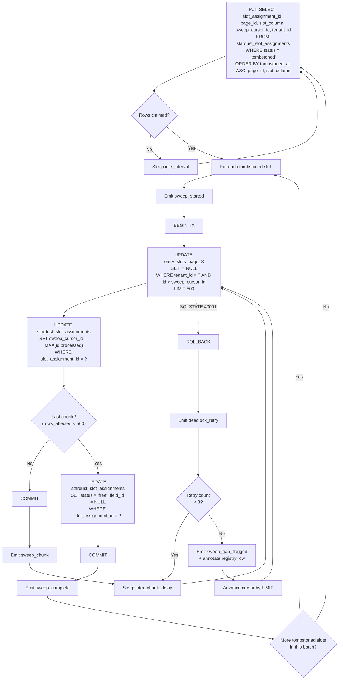

# Blueprint: Liberator Daemon

> **Status:** Draft
> **Author:** Damar Syah Maulana
> **Created:** 2026-04-24

## 1. Problem Statement

The Architecture Blueprint (§2.1.3) and [ADR 0009](../adrs/0009-tombstone-based-slot-eviction.md) define a **sever → tombstone → sweep → reclaim** lifecycle that prevents data bleeding when extension-table slots are reused after a field deletion, demotion, or retype. ADR 0009 fixes the lifecycle and its operational parameters; what it does not provide is a feature-level specification — testable acceptance criteria, observability surface, and operational boundaries — for the daemon that executes the lifecycle.

The Watcher and Reconciler each have such a blueprint ([`watcher_reconciler_daemons.md`](watcher_reconciler_daemons.md)). The Liberator does not. Without one, the daemon's expected behavior under failure (deadlock, crash, sweep gap), its observability surface (which structured-log events it emits and when), and its operational interactions with the Watcher's capacity accounting are scattered across ADR 0009, ADR 0016, ADR 0017, and ADR 0020. This blueprint consolidates them.

## 2. Scope

- **The Liberator**: A singleton PHP CLI daemon (`php spark stardust:liberator`) that:
  - Polls `stardust_slot_assignments` for rows in `status = 'tombstoned'`.
  - Sweeps each tombstoned slot via chunked `UPDATE entry_slots_page_X SET <slot_column> = NULL WHERE tenant_id = ? AND id > ? LIMIT 500`.
  - Commits `sweep_cursor_id` advancement in the **same transaction** as the chunk's `UPDATE` (per [ADR 0009](../adrs/0009-tombstone-based-slot-eviction.md)).
  - Transitions the slot from `tombstoned → free` once the per-slot sweep cursor reaches the partition's `MAX(id)` and the final nullification batch commits.
- **Sweep ordering**: oldest-`tombstoned_at` first, tie-broken by `(page_id, slot_column)`.
- **Failure handling**: bounded deadlock retry, sweep-gap flagging, restart resumption from the last committed cursor.
- **Observability**: structured-log event vocabulary aligned with [ADR 0020](../adrs/0020-structured-logging-mandate.md) — `sweep_started`, `sweep_chunk`, `sweep_complete`, `deadlock_retry`, `sweep_gap_flagged`.
- **Coordination boundary**: the Liberator reads and writes only `stardust_slot_assignments` and the slot columns of `entry_slots_page_X`. It never reads or writes `stardust_fields` or `stardust_pages` (Watcher-owned).

## 3. Non-Goals

- **Horizontal scaling.** [ADR 0009](../adrs/0009-tombstone-based-slot-eviction.md) fixes the Liberator as a singleton. This blueprint inherits that constraint and does not attempt to design a multi-worker variant.
- **Tombstone authorship.** The Liberator does not create tombstones. The API (field deletion, demotion) and the schema-registry retype handler ([ADR 0016](../adrs/0016-field-type-change-lifecycle.md)) commit `assigned → tombstoned` transitions. The Liberator only consumes them.
- **Capacity accounting.** The Watcher's "is the global capacity below threshold?" computation is the Watcher's responsibility ([`watcher_reconciler_daemons.md`](watcher_reconciler_daemons.md)). The Liberator's `tombstoned → free` transition feeds that computation but does not perform it.
- **DLQ semantics for failed nullifications.** A nullification chunk either succeeds, deadlocks (retry path), or surfaces as a `sweep_gap_flagged` event for operator inspection. There is no Liberator equivalent to the Reconciler's per-row poison-pill DLQ ([ADR 0018](../adrs/0018-reconciler-poison-pill-semantics.md)) — `UPDATE ... SET col = NULL` is idempotent and has no per-row failure mode that a DLQ would meaningfully capture.
- **Alerting infrastructure.** The Liberator emits structured events to stdout (per [ADR 0020](../adrs/0020-structured-logging-mandate.md)); wiring `sweep_gap_flagged` or stalled-sweep thresholds into a paging system is operator concern.

## 4. Acceptance Criteria

### Singleton enforcement

1. Starting a second Liberator instance against the same database fails fast with a clear error (PID file, OS-level process lock, or advisory lock collision identical to the Watcher's mechanism per [ADR 0008](../adrs/0008-singleton-watcher-multi-worker-reconciler.md)).
2. The Liberator's PID file or lock identity is logged on startup as a `sweep_started`-class event with `correlation_id` set to a per-process UUID (used as the cycle correlation for all subsequent events from this process).

### Sweep correctness

3. For each row in `stardust_slot_assignments` with `status = 'tombstoned'`, the Liberator nullifies every value in the corresponding `(page, slot_column)` for `id > sweep_cursor_id`, in chunks of `LIMIT 500`, until the partition's `MAX(id)` is reached.
4. The chunk's `UPDATE` and the `sweep_cursor_id` advancement on `stardust_slot_assignments` commit in **one transaction**. There is no observable window where the slot's nullified rows are durable but the registry cursor lags.
5. On final-chunk commit (the chunk that consumes the last `id > sweep_cursor_id` rows), the same transaction also flips the row from `status = 'tombstoned'` to `status = 'free'` and clears `field_id` (already NULL by construction per [ADR 0017](../adrs/0017-schema-registry-as-coordination-contract.md), but explicitly re-asserted).
6. After `sweep_complete`, the freed slot satisfies the partial-unique constraint `UNIQUE (page_id, slot_column)` and is eligible for assignment by the schema-registry slot-reservation path (§2.1.5).

### Failure handling

7. On `SQLSTATE 40001` (InnoDB deadlock detected), the Liberator rolls back the chunk transaction, sleeps for the inter-chunk delay, and retries the same chunk from the same `sweep_cursor_id`. The cursor is **not** advanced on failure.
8. After three consecutive deadlocks against the same chunk, the Liberator: (a) emits a `sweep_gap_flagged` event carrying the slot identity and the chunk's `(start_id, end_id)` range, (b) advances the cursor by `LIMIT` rows leaving a registry-row `sweep_gap` annotation for operator review, and (c) continues to the next chunk. Per [ADR 0009](../adrs/0009-tombstone-based-slot-eviction.md), this bounds pathological contention rather than blocking sweep progress indefinitely.
9. On daemon crash mid-sweep, restart resumes from the last committed `sweep_cursor_id` for that slot. Because nullification is idempotent and the cursor checkpoint commits with the chunk, no row is left half-nullified across the restart boundary.

### Sweep ordering

10. Tombstoned slots are processed in `tombstoned_at ASC` order, tie-broken by `(page_id, slot_column)`. Restart yields the same processing order against the same registry state.

### Observability

11. The Liberator emits one `sweep_started` event per polled batch (set of tombstoned slots claimed for this cycle), one `sweep_chunk` event per chunk commit, one `sweep_complete` event per slot transitioned to `free`, one `deadlock_retry` event per retry, and one `sweep_gap_flagged` event per gap annotation. All events carry `correlation_id` (per-cycle UUID) and `slot_assignment_id`. Per [ADR 0020](../adrs/0020-structured-logging-mandate.md), events are NDJSON to stdout — no other event names are emitted.
12. The structured-log payload of `sweep_chunk` includes `rows_nullified`, `chunk_elapsed_ms`, and the new `sweep_cursor_id`. Operators can compute sweep throughput from these alone.

### Idle behavior

13. When no rows in `stardust_slot_assignments` are `status = 'tombstoned'`, the Liberator sleeps for the configured idle interval (default 10s) and re-polls. The idle path emits no events to avoid log spam — only `sweep_started` (with a populated batch) generates output.

## 5. Technical Sketch

**Key decisions:**

- The Liberator never coordinates with another Liberator — singleton enforcement is invariant per [ADR 0009](../adrs/0009-tombstone-based-slot-eviction.md). The sweep workload is IO-bound; horizontal scaling delivers no throughput benefit and degrades the per-slot `sweep_cursor_id` semantics.
- Cursor advancement and chunk `UPDATE` commit in one transaction. There is deliberately no separate "checkpoint flush" cadence — a stale cursor after a Liberator crash would let the Watcher undercount free capacity, defeating the whole capacity-accounting model the Liberator exists to feed.
- `sweep_gap_flagged` is non-fatal. The Liberator continues past a gap rather than blocking forever on a hot-read partition. Operators reviewing the gap can re-tombstone the slot to retry sweep over the gap range, or accept the gap (the rows in the gap range are a small fraction of one slot column, and the field's data is still authoritative in `entry_data.fields` per [ADR 0013](../adrs/0013-json-payload-as-system-of-record.md)).

## 6. Open Questions

None. The cross-cutting decisions this blueprint depends on have been resolved:

- Scaling, checkpoint cadence, and deadlock policy: [ADR 0009](../adrs/0009-tombstone-based-slot-eviction.md).
- Structured-log event vocabulary: [ADR 0020](../adrs/0020-structured-logging-mandate.md).
- Slot status state machine and atomicity boundaries: [ADR 0017](../adrs/0017-schema-registry-as-coordination-contract.md).
- Coordination model (registry-only, no IPC): [ADR 0015](../adrs/0015-database-as-sole-daemon-coordination-point.md).

## 7. Related Documents

- [Architecture Blueprint §2.1.3 — The Liberator](../architecture_blueprint.md)
- [ADR 0008 — Singleton Watcher, Multi-Worker Reconciler](../adrs/0008-singleton-watcher-multi-worker-reconciler.md)
- [ADR 0009 — Tombstone-Based Slot Eviction](../adrs/0009-tombstone-based-slot-eviction.md)
- [ADR 0013 — JSON Payload as System of Record](../adrs/0013-json-payload-as-system-of-record.md)
- [ADR 0015 — Database as Sole Daemon Coordination Point](../adrs/0015-database-as-sole-daemon-coordination-point.md)
- [ADR 0016 — Field Type Change Lifecycle](../adrs/0016-field-type-change-lifecycle.md)
- [ADR 0017 — Schema Registry as Coordination Contract](../adrs/0017-schema-registry-as-coordination-contract.md)
- [ADR 0020 — Structured Logging Mandate](../adrs/0020-structured-logging-mandate.md)
- [`watcher_reconciler_daemons.md`](watcher_reconciler_daemons.md) — peer feature blueprint
