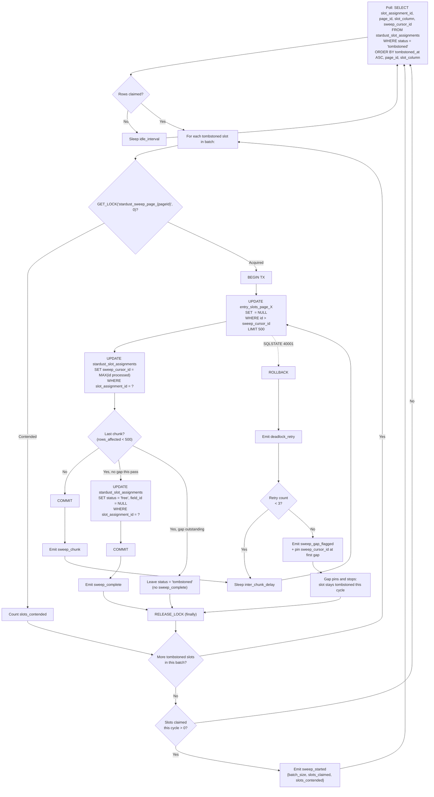

# Blueprint: Liberator Daemon

> **Status:** Draft
> **Author:** Damar Syah Maulana
> **Created:** 2026-04-24

## 1. Problem Statement

The Architecture Blueprint (§2.1.3) and [ADR 0009](../adrs/0009-tombstone-based-slot-eviction.md) define a **sever → tombstone → sweep → reclaim** lifecycle that prevents data bleeding when extension-table slots are reused after a field deletion, demotion, or retype. ADR 0009 fixes the lifecycle and its operational parameters; what it does not provide is a feature-level specification — testable acceptance criteria, observability surface, and operational boundaries — for the daemon that executes the lifecycle.

The Watcher and Reconciler each have such a blueprint ([`watcher_reconciler_daemons.md`](watcher_reconciler_daemons.md)). The Liberator does not. Without one, the daemon's expected behavior under failure (deadlock, crash, sweep gap), its observability surface (which structured-log events it emits and when), and its operational interactions with the Watcher's capacity accounting are scattered across ADR 0009, ADR 0016, ADR 0017, and ADR 0020. This blueprint consolidates them.

## 2. Scope

- **The Liberator**: A multi-worker PHP CLI daemon (`bin/stardust liberator`, since [ADR 0049](../adrs/0049-multi-worker-liberator-excluded-per-page.md)) that:
  - Polls `stardust_slot_assignments` for rows in `status = 'tombstoned'`.
  - Sweeps each tombstoned slot via chunked `UPDATE entry_slots_page_X SET <slot_column> = NULL WHERE id > ? LIMIT 500` (no `tenant_id` predicate — the slot column is single-owner by `UNIQUE (page_id, slot_column)`; see AC#3 and [ADR 0029](../adrs/0029-liberator-sweep-omits-tenant-predicate.md)).
  - Commits `sweep_cursor_id` advancement in the **same transaction** as the chunk's `UPDATE` (per [ADR 0009](../adrs/0009-tombstone-based-slot-eviction.md)).
  - Transitions the slot from `tombstoned → free` once the per-slot sweep cursor reaches the partition's `MAX(id)` and the final nullification batch commits.
- **Sweep ordering**: oldest-`tombstoned_at` first, tie-broken by `(page_id, slot_column)`.
- **Failure handling**: bounded deadlock retry, sweep-gap flagging, restart resumption from the last committed cursor.
- **Observability**: structured-log event vocabulary aligned with [ADR 0020](../adrs/0020-structured-logging-mandate.md) — `sweep_started`, `sweep_chunk`, `sweep_complete`, `deadlock_retry`, `sweep_gap_flagged`.
- **Coordination boundary**: the Liberator reads and writes only `stardust_slot_assignments` and the slot columns of `entry_slots_page_X`. It never reads or writes `stardust_fields` or `stardust_pages` (Watcher-owned).

## 3. Non-Goals

- ~~**Horizontal scaling.**~~ Reversed by [ADR 0049](../adrs/0049-multi-worker-liberator-excluded-per-page.md): the Liberator is multi-worker, excluded at page-table granularity via `GET_LOCK`. See AC#1/AC#2/AC#10/AC#11 below and §5's key decisions, both updated accordingly.
- **Tombstone authorship.** The Liberator does not create tombstones. The API (field deletion, demotion) and the schema-registry retype handler ([ADR 0016](../adrs/0016-field-type-change-lifecycle.md)) commit `assigned → tombstoned` transitions. The Liberator only consumes them.
- **Capacity accounting.** The Watcher's "is the global capacity below threshold?" computation is the Watcher's responsibility ([`watcher_reconciler_daemons.md`](watcher_reconciler_daemons.md)). The Liberator's `tombstoned → free` transition feeds that computation but does not perform it.
- **DLQ semantics for failed nullifications.** A nullification chunk either succeeds, deadlocks (retry path), or surfaces as a `sweep_gap_flagged` event for operator inspection. There is no Liberator equivalent to the Reconciler's per-row poison-pill DLQ ([ADR 0018](../adrs/0018-reconciler-poison-pill-semantics.md)) — `UPDATE ... SET col = NULL` is idempotent and has no per-row failure mode that a DLQ would meaningfully capture.
- **Alerting infrastructure.** The Liberator emits structured events to stdout (per [ADR 0020](../adrs/0020-structured-logging-mandate.md)); wiring `sweep_gap_flagged` or stalled-sweep thresholds into a paging system is operator concern.

## 4. Acceptance Criteria

### Page-level exclusion (multi-worker since ADR 0049)

1. Multiple Liberator instances may run concurrently against the same database with no PID file, OS-level process lock, or startup-time collision of any kind — [ADR 0008](../adrs/0008-singleton-watcher-multi-worker-reconciler.md)'s singleton mechanism applies to the Watcher only. Instead, two workers never sweep the same `entry_slots_page_N` table at the same time: each worker takes a `GET_LOCK('stardust_sweep_page_{pageId}', 0)` advisory lock before sweeping a slot on that page, and skips the slot for this cycle on contention rather than waiting. See [ADR 0049](../adrs/0049-multi-worker-liberator-excluded-per-page.md). **Since [ADR 0053](../adrs/0053-advisory-lock-names-are-qualified-per-installation.md)**, the literal name reaching the server carries a per-installation suffix derived from the schema name — page ids restart at 1 in every installation, so `stardust_sweep_page_1` was the most collision-prone lock name in the engine on shared hosting before this; the base name and the zero-second timeout stated here remain normative and unchanged.
2. Each worker mints its own per-process `worker_identity` (`host:pid:uuid`), which rides every event it emits, since the event stream alone can no longer distinguish which of N processes did what. `correlation_id` remains a per-*cycle* UUID as before — it does not change meaning, and does not correlate across workers.

### Sweep correctness

3. For each row in `stardust_slot_assignments` with `status = 'tombstoned'`, the Liberator nullifies every value in the corresponding `(page, slot_column)` for `id > sweep_cursor_id`, in chunks of `LIMIT 500`, until the partition's `MAX(id)` is reached. This is the **normative sweep shape**: keyed on `(page, slot_column)` for `id > sweep_cursor_id` with **no `tenant_id` predicate**. The predicate is redundant — `UNIQUE (page_id, slot_column)` makes each slot column single-owner (one model, one tenant), so only one tenant ever held data in it — and is unavailable in any case because `field_id` is `NULL` once tombstoned. See [ADR 0029](../adrs/0029-liberator-sweep-omits-tenant-predicate.md), which refines [ADR 0009](../adrs/0009-tombstone-based-slot-eviction.md) on this point.
4. The chunk's `UPDATE` and the `sweep_cursor_id` advancement on `stardust_slot_assignments` commit in **one transaction**. There is no observable window where the slot's nullified rows are durable but the registry cursor lags.
5. On final-chunk commit (the chunk that consumes the last `id > sweep_cursor_id` rows), the same transaction also flips the row from `status = 'tombstoned'` to `status = 'free'` and clears `field_id` (already NULL by construction per [ADR 0017](../adrs/0017-schema-registry-as-coordination-contract.md), but explicitly re-asserted).
6. After `sweep_complete`, the freed slot satisfies the partial-unique constraint `UNIQUE (page_id, slot_column)` and is eligible for assignment by the schema-registry slot-reservation path (§2.1.5). Per [ADR 0046](../adrs/0046-a-gapped-sweep-skips-the-chunk-and-does-not-reclaim.md) this is unconditional, because a sweep that abandoned a chunk (AC#8) does not reach `sweep_complete` at all — the slot it did not empty is never offered for assignment, which is what [ADR 0009](../adrs/0009-tombstone-based-slot-eviction.md) step 4 requires.

### Failure handling

7. On `SQLSTATE 40001` (InnoDB deadlock detected), the Liberator rolls back the chunk transaction, sleeps for the inter-chunk delay, and retries the same chunk from the same `sweep_cursor_id`. The cursor is **not** advanced on failure.
8. After three consecutive deadlocks against the same chunk, the Liberator: (a) emits a `sweep_gap_flagged` event carrying the slot identity and the chunk's `(start_id, end_id)` range — the **chunk's own** first and last ids, not a cursor span, (b) advances the cursor past that chunk, by `max(chunk's last id, cursor + LIMIT)` so the skip is `LIMIT` **rows** rather than `LIMIT` of *id space*, leaving a `sweep_gap_count` annotation for operator review, and (c) continues to the next chunk. Per [ADR 0009](../adrs/0009-tombstone-based-slot-eviction.md), this bounds pathological contention rather than blocking sweep progress indefinitely. **A sweep that took this path does not reclaim** — see AC#16.
9. On daemon crash mid-sweep, restart resumes from the last committed `sweep_cursor_id` for that slot. Because nullification is idempotent and the cursor checkpoint commits with the chunk, no row is left half-nullified across the restart boundary.

### Sweep ordering

10. Tombstoned slots are processed in `tombstoned_at ASC` order, tie-broken by `(page_id, slot_column)`. Restart yields the same processing order against the same registry state. **Since ADR 0049 this describes the *candidate* order a single worker's `loadBatch()` walks, not a global claim order across workers** — every worker's batch read runs the same query with no claim taken (§2 AC#1), so two workers loading concurrently see the same candidate list in the same order, but which one actually *sweeps* a given slot depends on which reaches that slot's page-lock acquisition first. Cross-worker execution order is therefore not deterministic; within one worker's own walk of its own batch, it still is.

### Observability

11. The Liberator emits one `sweep_started` event per polled batch **that claimed at least one slot** (a batch every one of whose slots is contended by other workers emits nothing at all — see §4 Idle behavior), one `sweep_chunk` event per chunk commit, one `sweep_complete` event per slot transitioned to `free`, one `deadlock_retry` event per retry, and one `sweep_gap_flagged` event per gap annotation. All events carry `correlation_id` (per-cycle UUID), `slot_assignment_id`, and — since [ADR 0049](../adrs/0049-multi-worker-liberator-excluded-per-page.md) — `worker_identity`. **`sweep_started` fires once at the END of a cycle, not the start**, and additionally carries `slots_claimed` / `slots_contended` alongside `batch_size`: those tallies are unknowable before the whole batch has been walked one slot at a time (§2 AC#1), so the pre-0049 "announce the batch, then sweep it" ordering is no longer possible without either pre-acquiring every claimable slot's page lock up front (which would let one worker monopolize a whole multi-page batch) or reporting incomplete tallies. Per [ADR 0020](../adrs/0020-structured-logging-mandate.md), events are NDJSON to stdout — no other event names are emitted.
12. The structured-log payload of `sweep_chunk` includes `rows_nullified`, `chunk_elapsed_ms`, and the new `sweep_cursor_id`. Operators can compute sweep throughput from these alone — **from `rows_nullified`, specifically.** Once a pass has taken a gap the reported `sweep_cursor_id` is pinned (AC#16) and repeats unchanged on every subsequent chunk, because it names the value actually committed to the registry rather than where the sweep is reading. A constant cursor alongside a non-zero `rows_nullified` therefore means "progressing, with an unresolved gap", not "stalled".

### Idle behavior

13. When no rows in `stardust_slot_assignments` are `status = 'tombstoned'`, the Liberator sleeps for the configured idle interval (default 10s) and re-polls. The idle path emits no events to avoid log spam — only a cycle that actually claimed at least one slot generates output. **Since ADR 0049 this extends to a non-empty batch every one of whose candidate slots is contended by another worker**: the worker still emits nothing, because from its own point of view it made no progress this cycle, even though `stardust_slot_assignments` is not actually empty of tombstoned rows.

### Slot recycling

14. A slot that has been through the lifecycle before begins its next sweep at the **beginning of the page**, not at its previous occupant's cursor. `sweep_cursor_id` and `sweep_gap_count` are cleared by the UPDATE that flips a slot to `tombstoned` — in the severing lifecycle's own transaction, not by the Liberator — and are **preserved** across the `tombstoned → free` reclaim of AC#5, so both annotations always describe the sweep that produced the slot's current state and remain readable by an operator after it. Per [ADR 0045](../adrs/0045-tombstoning-resets-the-sweep-annotations.md), which amends [ADR 0009](../adrs/0009-tombstone-based-slot-eviction.md) on a case 0009 does not specify. This is what makes AC#6's "eligible for assignment" claim hold on the second and later occupants: measured on 8.0.13 before the reset existed, a recycled column returned to `free` still holding all twenty of the previous field's values, with AC#12's `sweep_chunk` payload and `sweep_complete` both honest for the empty range they walked. AC#8's gap path was a second route to the same residue, and is closed separately by AC#16 — a sweep that abandons a chunk no longer reclaims at all, so it never reaches the `sweep_complete` this AC's claim is conditioned on. The `sweep_gap_count` annotation attributes to exactly one sweep, per this AC.
15. The reset never applies to a slot that is already `tombstoned`. Every site that performs the flip is guarded on the slot's status being live (`assigned`, `backfilling`, `ready`), so a sweep in flight — including one the Liberator is mid-chunk on — keeps the cursor that is correct for it, and AC#9's crash-resumption property is unaffected.
16. A sweep that abandoned one or more chunks (AC#8) **does not reclaim the slot**. Its chunks commit their nullification as normal but leave `status = 'tombstoned'`, and **while a gap is outstanding every commit pins `sweep_cursor_id` at the cursor of the *first* gap in that pass** rather than advancing to its own high-water mark. Pinning rather than rewinding-at-the-end is what makes the guarantee survive a restart: the no-reclaim decision is otherwise held only in the sweeping process, and a daemon killed after an intermediate commit would resume past the skipped rows and reclaim over them. **No `sweep_complete` is emitted**, consistent with AC#11 defining that event as one per slot transitioned to `free`. The slot is therefore re-swept from its first gap on the next cycle, and reclaims only once a pass completes with no gap. Per [ADR 0046](../adrs/0046-a-gapped-sweep-skips-the-chunk-and-does-not-reclaim.md), restoring [ADR 0009](../adrs/0009-tombstone-based-slot-eviction.md) step 4. The trade is explicit: a slot under sustained contention keeps its capacity squatted rather than being reclaimed with a hole in it.
17. The gap path performs **no database write of its own**. The `sweep_gap_count` increment is folded into the next chunk's registry UPDATE, inside the retry budget of AC#7. A dedicated transaction for it is forbidden: it would be invoked from inside that retry handler, so its own lock failure escapes both the budget and the gap path, and the daemon exits (AC#9's crash path, reached without a crash). Correspondingly, **an empty chunk never takes a gap** — there is nothing to skip, so the pass ends and the slot waits for the next cycle.

## 5. Technical Sketch

```mermaid
flowchart TD
    L1["Poll: SELECT slot_assignment_id, page_id, slot_column, sweep_cursor_id\nFROM stardust_slot_assignments\nWHERE status = 'tombstoned'\nORDER BY tombstoned_at ASC, page_id, slot_column"] --> L2{"Rows claimed?"}
    L2 -- No --> L3["Sleep idle_interval"]
    L3 --> L1
    L2 -- Yes --> L4["For each tombstoned slot in batch:"]
    L4 --> LG1{"GET_LOCK('stardust_sweep_page_{pageId}', 0)?"}
    LG1 -- Contended --> LG2["Count slots_contended"]
    LG2 --> L16{"More tombstoned slots\nin this batch?"}
    LG1 -- Acquired --> L6["BEGIN TX"]
    L6 --> L7["UPDATE entry_slots_page_X\nSET <slot_column> = NULL\nWHERE id > sweep_cursor_id\nLIMIT 500"]
    L7 --> L8["UPDATE stardust_slot_assignments\nSET sweep_cursor_id = MAX(id processed)\nWHERE slot_assignment_id = ?"]
    L8 --> L9{"Last chunk?\n(rows_affected < 500)"}
    L9 -- No --> L10["COMMIT"]
    L10 --> L11["Emit sweep_chunk"]
    L11 --> L12["Sleep inter_chunk_delay"]
    L12 --> L7
    L9 -- "Yes, no gap this pass" --> L13["UPDATE stardust_slot_assignments\nSET status = 'free', field_id = NULL\nWHERE slot_assignment_id = ?"]
    L13 --> L14["COMMIT"]
    L14 --> L15["Emit sweep_complete"]
    L15 --> LR1["RELEASE_LOCK (finally)"]
    L9 -- "Yes, gap outstanding" --> L13B["Leave status = 'tombstoned'\n(no sweep_complete)"]
    L13B --> LR1
    LR1 --> L16
    L16 -- Yes --> L4
    L16 -- No --> L22{"Slots claimed\nthis cycle > 0?"}
    L22 -- Yes --> L23["Emit sweep_started\n{batch_size, slots_claimed, slots_contended}"]
    L23 --> L1
    L22 -- No --> L1

    %% Failure branch
    L7 -.SQLSTATE 40001.-> L17["ROLLBACK"]
    L17 --> L18["Emit deadlock_retry"]
    L18 --> L19{"Retry count\n< 3?"}
    L19 -- Yes --> L12
    L19 -- No --> L20["Emit sweep_gap_flagged\n+ pin sweep_cursor_id at first gap"]
    L20 --> L21["Gap pins and stops:\nslot stays tombstoned this cycle"]
    L21 --> LR1
```

**Key decisions:**

- **Since [ADR 0049](../adrs/0049-multi-worker-liberator-excluded-per-page.md), the Liberator coordinates with other Liberators at page-table granularity** — no process singleton, but never two workers sweeping the same `entry_slots_page_N` table at once, via `GET_LOCK`. [ADR 0009](../adrs/0009-tombstone-based-slot-eviction.md)'s IO-bound observation still holds *within one page*: horizontal scaling delivers no throughput benefit there, and per-slot `sweep_cursor_id` semantics are exactly as single-writer as before, because exactly one worker ever sweeps a given slot at a time. The throughput gain 0049 unlocks is **across** pages, not within one.
- Cursor advancement and chunk `UPDATE` commit in one transaction. There is deliberately no separate "checkpoint flush" cadence — a stale cursor after a Liberator crash would let the Watcher undercount free capacity, defeating the whole capacity-accounting model the Liberator exists to feed.
- `sweep_gap_flagged` is non-fatal. The Liberator continues past a gap rather than blocking forever on a hot-read partition, and retries the skipped range on its next cycle (AC#16). **The "accept the gap" advice this note used to carry was wrong and is withdrawn** — it argued from [ADR 0013](../adrs/0013-json-payload-as-system-of-record.md) that the gap range is safe because the *departing* field's data is still authoritative in `entry_data.fields`, which is true and answers the wrong question: the risk is the *arriving* field inheriting those values, and [ADR 0009](../adrs/0009-tombstone-based-slot-eviction.md) step 4 forbids offering the slot at all until it is confirmed empty. See [ADR 0046](../adrs/0046-a-gapped-sweep-skips-the-chunk-and-does-not-reclaim.md). An operator may still re-tombstone a slot to restart its sweep from the beginning, which AC#14 is what makes effective.

## 6. Open Questions

None. The cross-cutting decisions this blueprint depends on have been resolved:

- Checkpoint cadence and deadlock policy: [ADR 0009](../adrs/0009-tombstone-based-slot-eviction.md). Scaling (originally fixed as a singleton by the same ADR): reversed by [ADR 0049](../adrs/0049-multi-worker-liberator-excluded-per-page.md), which multi-workers the Liberator at page-table granularity.
- Structured-log event vocabulary: [ADR 0020](../adrs/0020-structured-logging-mandate.md).
- Slot status state machine and atomicity boundaries: [ADR 0017](../adrs/0017-schema-registry-as-coordination-contract.md).
- Coordination model (registry-only, no IPC): [ADR 0015](../adrs/0015-database-as-sole-daemon-coordination-point.md).

## 7. Related Documents

- [Architecture Blueprint §2.1.3 — The Liberator](../architecture_blueprint.md)
- [ADR 0008 — Singleton Watcher, Multi-Worker Reconciler](../adrs/0008-singleton-watcher-multi-worker-reconciler.md)
- [ADR 0009 — Tombstone-Based Slot Eviction](../adrs/0009-tombstone-based-slot-eviction.md)
- [ADR 0013 — JSON Payload as System of Record](../adrs/0013-json-payload-as-system-of-record.md)
- [ADR 0015 — Database as Sole Daemon Coordination Point](../adrs/0015-database-as-sole-daemon-coordination-point.md)
- [ADR 0016 — Field Type Change Lifecycle](../adrs/0016-field-type-change-lifecycle.md)
- [ADR 0017 — Schema Registry as Coordination Contract](../adrs/0017-schema-registry-as-coordination-contract.md)
- [ADR 0020 — Structured Logging Mandate](../adrs/0020-structured-logging-mandate.md)
- [ADR 0029 — Liberator Sweep Omits the Tenant Predicate](../adrs/0029-liberator-sweep-omits-tenant-predicate.md)
- [ADR 0046 — A Gapped Sweep Skips the Chunk and Does Not Reclaim](../adrs/0046-a-gapped-sweep-skips-the-chunk-and-does-not-reclaim.md)
- [ADR 0049 — Multi-Worker Liberator, Excluded at Page-Table Granularity](../adrs/0049-multi-worker-liberator-excluded-per-page.md)
- [`watcher_reconciler_daemons.md`](watcher_reconciler_daemons.md) — peer feature blueprint
