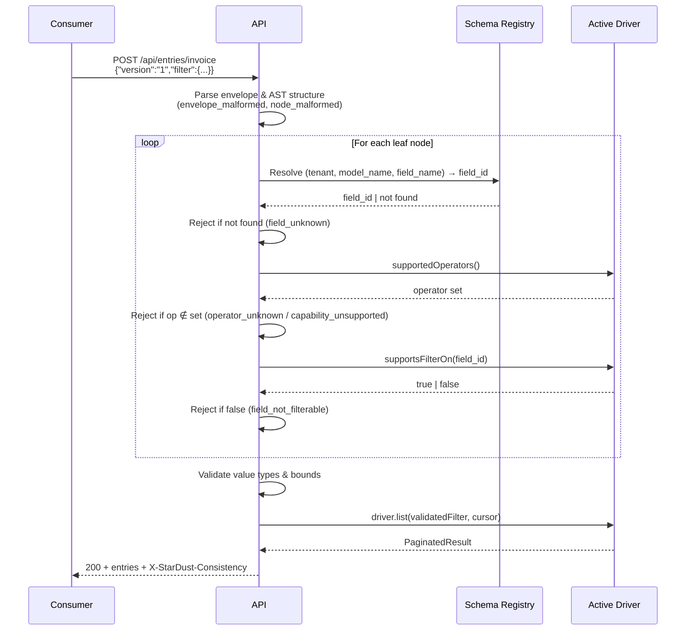

# Blueprint: QueryFilter Wire Format

> **Status:** Draft
> **Author:** Damar Syah Maulana
> **Created:** 2026-05-02

## 1. Problem Statement

ADR [`0021`](../adrs/0021-search-driver-query-representation.md) fixes the `QueryFilter` operator set and AST node taxonomy, and ADR [`0022`](../adrs/0022-search-driver-capability-jurisdiction.md) pins the pre-flight capability-check flow. Neither document specifies **how consumers encode a filter as JSON over the wire**. Without a normative wire format, every implementer invents the consumer contract independently — an architectural decision that belongs with the author, not the implementer.

This blueprint closes that gap. It pins the exact JSON shape for every operator and AST node, the typed-value encoding rules, the validation error model, and a normative JSON Schema artifact that enables consumer-side and CI-side verification against the closed v1 operator set.

## 2. Scope

- Top-level request envelope (`version`, `filter` key).
- Node discriminator strategy (tagged `"op"` key for all node types).
- Leaf node shape for each of the 12 v1 operators.
- Composite node shape (`and`, `or`, `not`).
- Field reference encoding (`{"model": "...", "name": "..."}`).
- Typed-value encoding rules for all four `declared_type` values (`string`, `int`, `numeric`, `datetime`).
- Bounds and limit defaults (nesting depth, total nodes, array sizes, payload size).
- Validation error model: HTTP status, body shape, closed discriminator set.
- Normative JSON Schema artifact at [`schemas/queryfilter.schema.json`](../schemas/queryfilter.schema.json).
- Version field and its forward-compatibility semantics.

## 3. Non-Goals

- Sort field and sort direction (deferred to the future `api/` contract spec — readiness gap #1).
- Cursor and pagination parameters (same deferral).
- Response envelope shape (gap #1).
- Tenant resolution and authentication (gap #3).
- Capability extension node body shapes — those are declared and documented per-driver alongside the driver's capability ADR.
- Rate limiting and quota enforcement.
- Idempotency-key handling.

## 4. Acceptance Criteria

### 4.1 Envelope

1. The request body is a JSON object of the form `{"version": "1", "filter": <node>}`. The `version` key is optional and defaults to `"1"` when absent. An unrecognised `version` value returns `400` with code `version_unsupported`.
2. When the `filter` key is omitted entirely, the query matches all entries for the (tenant, model) tuple — equivalent to an unconstrained read.
3. `"filter": null` is rejected with code `node_malformed`. A consumer that wants match-all must omit the key, not null it.

### 4.2 Node shape

4. Every node — leaf or composite — is a JSON object with a string `"op"` key. No node kind is represented by any other encoding (no bare arrays, no string shorthands).
5. Composite `and` and `or` nodes: `{"op": "and"|"or", "args": [<node>, <node>, ...]}`. `args` MUST contain at least one child; an empty array is rejected with code `value_count_mismatch`.
6. Composite `not` node: `{"op": "not", "arg": <node>}`. The singular form `"arg"` (not `"args"`) is the only accepted encoding.
7. Leaf nodes: `{"op": <leaf-op>, "field": {"model": <string>, "name": <string>}, "value": <typed>}`. Operator-specific `value` shape is pinned in §4.3.

### 4.3 Leaf operators (closed v1 set — ADR 0021)

8. **Single-value operators** (`eq`, `neq`, `lt`, `lte`, `gt`, `gte`, `prefix`): `value` is exactly one typed primitive matching the field's `declared_type`. Extra keys alongside `value` are ignored; missing `value` is rejected as `node_malformed`.
9. **Set operators** (`in`, `nin`): `value` is a JSON array of typed primitives of length 1–1024. The API silently deduplicates entries before driver dispatch. An empty array or an array exceeding 1024 elements is rejected with `value_count_mismatch` or `value_out_of_bounds` respectively.
10. **Range operator** (`between`): `value` is a 2-element array `[lower, upper]` representing an inclusive range — both bounds are part of the matched set. Both elements MUST be of the same declared type. Any arity other than 2 is rejected with `value_count_mismatch`.
11. **Presence operators** (`is_null`, `is_not_null`): the `value` key MUST be omitted. A payload that includes any `value` key — even `null` — is rejected with `value_unexpected`. This prevents conflation with value-bearing operators.
12. `prefix` with an empty string value (`""`) is rejected with `value_out_of_bounds`; an empty prefix matches every row and must be expressed by omitting `filter` instead.

### 4.4 Field reference

13. The `field` key is an object: `{"model": <string>, "name": <string>}`. Both sub-keys are required; missing either is rejected as `node_malformed`.
14. The API resolves `(tenant_id, model_name)` → `model_id` and `(model_id, field_name)` → `field_id` against the schema registry before handing the validated tree to the driver (ADR 0021 §Decision). Drivers never see unresolved field references.
15. A `model` or `name` value that does not resolve in the schema registry returns `400` with code `field_unknown`.
16. A field that resolves in the registry but for which the active driver returns `supportsFilterOn(field_id) === false` returns `400` with code `field_not_filterable` (ADR 0022).

### 4.5 Typed values

17. **`string`** fields: `value` is a JSON string, max 4096 characters. The API passes the value through without Unicode normalisation; driver collation governs equality and prefix semantics.
18. **`int`** fields: `value` is a JSON number that is integer-valued and within the signed 64-bit range (`-2^63` to `2^63 - 1` inclusive). A fractional JSON number (e.g., `3.14`) is rejected with `value_type_mismatch`.
19. **`numeric`** fields: `value` is any JSON number. JSON's grammar already excludes `NaN` and `Infinity`; if a client sends them through a non-conforming transport, they are rejected with `value_type_mismatch`.
20. **`datetime`** fields: `value` is a JSON string in **strict RFC 3339** format with an explicit UTC offset (`Z` or `±HH:MM`). Naive datetimes (no offset) are rejected with `value_type_mismatch`. Sub-second precision is optional; the maximum accepted resolution is microseconds (`DATETIME(6)` on MySQL). The API normalises all datetime values to UTC before handing the filter to the driver.

### 4.6 Bounds and limits

All limits below are defaults. Operators may tune them via configuration keys; the defaults are normative for an out-of-the-box deployment.

21. Maximum nesting depth: **8 levels** (`stardust.queryfilter.max_depth`). Exceeding this returns `400` with code `nesting_too_deep`.
22. Maximum total nodes (leaves + composites) in a single filter: **256** (`stardust.queryfilter.max_nodes`). Exceeding this returns `400` with code `node_count_exceeded`.
23. Maximum `args` length on a single `and` or `or` node: **64** (contributes toward the 256-node total).
24. Maximum `in` / `nin` array length: **1024** (enforced per-operator by criterion 9).
25. Maximum `value` string length: **4096 characters** for `string`-typed fields.
26. Maximum request payload: **64 KiB** at the HTTP layer. Oversized payloads are rejected before parsing begins.

### 4.7 Error model

27. All wire-format and pre-flight violations return **HTTP 400**. The response body is:

    ```json
    {
      "error": {
        "code": "<discriminator>",
        "message": "<human-readable>",
        "path": "<RFC 6901 JSON Pointer to the offending node>",
        "details": {}
      }
    }
    ```

    `path` is relative to the request body root (e.g., `/filter/args/1/value/0`). `details` carries discriminator-specific structured data (e.g., `{"expected": "int", "received": "number"}` for `value_type_mismatch`).

28. The closed error discriminator set for v1:

    | Code                     | Trigger                                                                                                                  |
    | :----------------------- | :----------------------------------------------------------------------------------------------------------------------- |
    | `envelope_malformed`     | JSON parse failure, or `filter` key is present but not an object.                                                        |
    | `node_malformed`         | Required key missing from a node (`op`, `field`, `args`, `arg`, or `value` where expected).                              |
    | `operator_unknown`       | `op` value is not in the v1 closed set and has not been declared by the driver's capability surface.                     |
    | `capability_unsupported` | `op` is in the closed set but the active driver's `supportedOperators()` excludes it (ADR 0021).                         |
    | `field_unknown`          | `field.model` or `field.name` does not resolve in the schema registry (ADR 0021).                                        |
    | `field_not_filterable`   | Field resolves but `driver.supportsFilterOn(field_id) === false` (ADR 0022).                                             |
    | `value_type_mismatch`    | `value` JSON type is incompatible with the field's `declared_type`.                                                      |
    | `value_count_mismatch`   | `between` array not exactly 2 elements; `in`/`nin` empty; `args` on `and`/`or` is empty.                                 |
    | `value_unexpected`       | `value` key present on `is_null` or `is_not_null` node.                                                                  |
    | `value_out_of_bounds`    | `in`/`nin` array exceeds 1024; `prefix` is an empty string; `int` out of signed 64-bit range; string exceeds 4096 chars. |
    | `nesting_too_deep`       | Filter tree exceeds the configured max nesting depth (default 8).                                                        |
    | `node_count_exceeded`    | Total node count exceeds the configured maximum (default 256).                                                           |
    | `version_unsupported`    | `version` value is set but not recognised.                                                                               |

29. Validation is **fail-fast**: only the first error found is returned. Multi-error reporting is a future enhancement.
30. Pre-flight rejections emit a structured-log event with the `correlation_id` from the request context (ADR [`0020`](../adrs/0020-structured-logging-mandate.md)). The event carries the error code and the offending node path.

### 4.8 JSON Schema artifact

31. [`schemas/queryfilter.schema.json`](../schemas/queryfilter.schema.json) is the normative machine-checkable specification for the v1 closed operator set and structural rules.
32. Capability extension operators (per ADR 0022) are **not** representable in the static schema — they are driver-specific and declared at runtime via `supportedOperators()`. The schema validates the closed v1 set only; extension nodes pass schema validation as `operator_unknown` and are accepted or rejected by the runtime pre-flight check.

## 5. Technical Sketch

### Grammar

| Node kind     | `op` value                       | Required keys    | `value` shape    |
| :------------ | :------------------------------- | :--------------- | :--------------- |
| AND composite | `"and"`                          | `args: array`    | —                |
| OR composite  | `"or"`                           | `args: array`    | —                |
| NOT composite | `"not"`                          | `arg: object`    | —                |
| Equality      | `"eq"`, `"neq"`                  | `field`, `value` | single primitive |
| Comparison    | `"lt"`, `"lte"`, `"gt"`, `"gte"` | `field`, `value` | single primitive |
| Set           | `"in"`, `"nin"`                  | `field`, `value` | array (1–1024)   |
| Prefix        | `"prefix"`                       | `field`, `value` | non-empty string |
| Range         | `"between"`                      | `field`, `value` | 2-element array  |
| Presence      | `"is_null"`, `"is_not_null"`     | `field`          | omitted          |

### Envelope

```json
{
  "version": "1",
  "filter": { ... }
}
```

`filter` is optional (omit for match-all). `version` is optional (defaults to `"1"`).

### Examples

**`eq`** — status equals "paid"

```json
{
  "op": "eq",
  "field": { "model": "invoice", "name": "status" },
  "value": "paid"
}
```

**`neq`** — status is not "draft"

```json
{
  "op": "neq",
  "field": { "model": "invoice", "name": "status" },
  "value": "draft"
}
```

**`lt`** — amount less than 1000 (int field)

```json
{
  "op": "lt",
  "field": { "model": "invoice", "name": "amount" },
  "value": 1000
}
```

**`lte` / `gt` / `gte`** — same shape as `lt`, substituting the `op` value.

**`in`** — status is one of several values

```json
{
  "op": "in",
  "field": { "model": "invoice", "name": "status" },
  "value": ["open", "pending", "overdue"]
}
```

**`nin`** — status is not in the set

```json
{
  "op": "nin",
  "field": { "model": "invoice", "name": "status" },
  "value": ["cancelled", "void"]
}
```

**`prefix`** — reference starts with "INV-2026"

```json
{
  "op": "prefix",
  "field": { "model": "invoice", "name": "reference" },
  "value": "INV-2026"
}
```

**`between`** — amount between 100 and 500 inclusive

```json
{
  "op": "between",
  "field": { "model": "invoice", "name": "amount" },
  "value": [100, 500]
}
```

**`is_null`** — due_date is absent in the JSON payload

```json
{
  "op": "is_null",
  "field": { "model": "invoice", "name": "due_date" }
}
```

**`is_not_null`** — due_date is present

```json
{
  "op": "is_not_null",
  "field": { "model": "invoice", "name": "due_date" }
}
```

**`and`** — composite: paid invoices with amount > 100

```json
{
  "op": "and",
  "args": [
    {
      "op": "eq",
      "field": { "model": "invoice", "name": "status" },
      "value": "paid"
    },
    {
      "op": "gt",
      "field": { "model": "invoice", "name": "amount" },
      "value": 100
    }
  ]
}
```

**`not`** — exclude cancelled

```json
{
  "op": "not",
  "arg": {
    "op": "eq",
    "field": { "model": "invoice", "name": "status" },
    "value": "cancelled"
  }
}
```

**`datetime` value** — issued_at after a specific timestamp

```json
{
  "op": "gt",
  "field": { "model": "invoice", "name": "issued_at" },
  "value": "2026-01-01T00:00:00Z"
}
```

### Error response examples

**`field_unknown`** — model "invoices" (plural) does not exist:

```json
{
  "error": {
    "code": "field_unknown",
    "message": "Model 'invoices' not found in schema registry.",
    "path": "/filter/field/model",
    "details": { "model": "invoices" }
  }
}
```

**`value_type_mismatch`** — string value on an int field:

```json
{
  "error": {
    "code": "value_type_mismatch",
    "message": "Field 'amount' has declared_type 'int'; received a JSON string.",
    "path": "/filter/value",
    "details": { "declared_type": "int", "received_json_type": "string" }
  }
}
```

**`value_count_mismatch`** — `between` with three bounds:

```json
{
  "error": {
    "code": "value_count_mismatch",
    "message": "'between' requires exactly 2 elements in value; received 3.",
    "path": "/filter/value",
    "details": { "expected": 2, "received": 3 }
  }
}
```

### Pre-flight sequence



### JSON Schema excerpt

[`schemas/queryfilter.schema.json`](../schemas/queryfilter.schema.json) uses Draft 2020-12. The root schema is a recursive `oneOf` that dispatches on `"op"`:

```json
{
  "$schema": "https://json-schema.org/draft/2020-12/schema",
  "$ref": "#/$defs/node",
  "$defs": {
    "node": {
      "oneOf": [
        { "$ref": "#/$defs/andNode" },
        { "$ref": "#/$defs/orNode" },
        { "$ref": "#/$defs/notNode" },
        { "$ref": "#/$defs/eqNode" },
        { "... 8 more leaf schemas ...": true }
      ]
    },
    "andNode": {
      "properties": {
        "op": { "const": "and" },
        "args": {
          "type": "array",
          "minItems": 1,
          "items": { "$ref": "#/$defs/node" }
        }
      },
      "required": ["op", "args"],
      "additionalProperties": false
    }
  }
}
```

The schema validates structural rules (required keys, `args`/`arg` arity, array length limits). It does **not** validate that `value` matches `declared_type` — that is a runtime check against the schema registry (`declared_type` is unknown at static schema-validation time).

## 6. Resolved Decisions

1. **Tagged `op` discriminator** — every node has an explicit `"op"` key. Chosen for JSON Schema `oneOf` compatibility, alignment with ADR 0021's `supportedOperators()` vocabulary, and unambiguous log-event representation. Confirmed 2026-05-02.
2. **Explicit field reference object** — `{"model": "...", "name": "..."}` rather than an implicit model (URL-scoped) or flat dotted string. Decouples wire format from URL design; future-proof for cross-model filters; avoids a parser. Confirmed 2026-05-02.
3. **Scope limited to filter payload** — sort, cursor, and pagination keys are not defined here; they belong in the future `api/` contract spec (gap #1). Confirmed 2026-05-02.
4. **Normative JSON Schema sidecar** — `schemas/queryfilter.schema.json` is a deliverable of this blueprint, not a follow-up. Enables consumer-side and CI validation against the closed v1 set. Confirmed 2026-05-02.
5. **Closed v1 leaf-operator set** — `eq`, `neq`, `lt`, `lte`, `gt`, `gte`, `in`, `nin`, `prefix`, `between`, `is_null`, `is_not_null` — per ADR [`0021`](../adrs/0021-search-driver-query-representation.md).
6. **Capability-surface pre-flight** — `supportedOperators()` + `supportsFilterOn(field_id)` per ADR [`0022`](../adrs/0022-search-driver-capability-jurisdiction.md).
7. **Fail-fast on unindexed / non-filterable fields** — ADR [`0004`](../adrs/0004-fail-fast-on-unindexed-filters.md), ADR [`0014`](../adrs/0014-schema-level-safety-over-runtime-circuit-breaking.md).
8. **Structured-log event on rejection** — ADR [`0020`](../adrs/0020-structured-logging-mandate.md).

## 7. Related Documents

- [ADR 0004 — Fail-fast on unindexed filters](../adrs/0004-fail-fast-on-unindexed-filters.md)
- [ADR 0005 — Two-query bounded read path](../adrs/0005-two-query-bounded-read-path.md)
- [ADR 0014 — Schema-level safety over runtime circuit breaking](../adrs/0014-schema-level-safety-over-runtime-circuit-breaking.md)
- [ADR 0017 — Schema registry as coordination contract](../adrs/0017-schema-registry-as-coordination-contract.md)
- [ADR 0020 — Structured logging mandate](../adrs/0020-structured-logging-mandate.md)
- [ADR 0021 — Search driver query representation](../adrs/0021-search-driver-query-representation.md)
- [ADR 0022 — Search driver capability jurisdiction](../adrs/0022-search-driver-capability-jurisdiction.md)
- [Blueprint: Search Driver Adapter](search_driver_adapter.md)
- [Schema Reference §4.2 — `stardust_fields`](../schemas/schema_reference.md)
