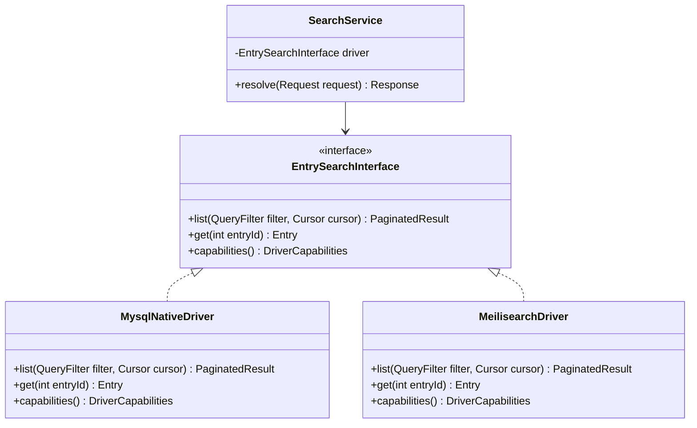

# Blueprint: Search Driver Adapter

> **Status:** Draft
> **Author:** Damar Syah Maulana
> **Created:** 2026-04-10

## 1. Problem Statement

StarDust's core read path is a tightly bounded MySQL-native engine. It rejects filters on non-indexed fields with `400 Bad Request` by design (Architecture Blueprint §2.2). This is the correct default for a zero-dependency standalone deployment, but enterprise consumers may eventually need capabilities the native driver cannot provide — full-text search, faceted filtering, fuzzy matching — without rewriting the ingestion or API layers.

The architecture already names an `EntrySearchInterface` and a "Driver/Adapter" pattern (Architecture Blueprint §3) but does not specify the contract, registration mechanism, or behavioral constraints.

## 2. Scope

- A formal **`EntrySearchInterface`** PHP interface defining the search contract (query input, paginated output, capability declaration).
- A **`MysqlNativeDriver`** implementing that interface (extracting the current inline read-path logic into a discrete, testable class).
- A **driver registration / resolution** mechanism at the CI4 service layer, allowing configuration-based driver injection.
- **Consistency headers** — a response header (e.g., `X-StarDust-Consistency: strong | eventual`) that signals to the consumer which consistency model the active driver provides.

## 3. Non-Goals

- Shipping a production-ready Meilisearch, OpenSearch, or any third-party driver. A minimal stub or test double is sufficient to validate the interface.
- Real-time index synchronisation between MySQL and an external search engine. That is a separate blueprint.
- Altering the write path. Ingestion always targets MySQL; search drivers are read-only consumers.

## 4. Acceptance Criteria

1. `EntrySearchInterface` is a PHP interface with clearly documented method signatures covering: filtered listing (with cursor pagination), single-entry retrieval, and capability introspection (e.g., `supportsFuzzySearch(): bool`).
2. The existing MySQL read path is encapsulated in `MysqlNativeDriver` implementing `EntrySearchInterface` with zero behavioral changes.
3. A non-MySQL stub driver can be injected via CI4 service configuration and successfully resolves search queries (returning canned data is acceptable for validation).
4. Every search response includes an `X-StarDust-Consistency` header reflecting the active driver's consistency model.
5. If a consumer requests a capability the active driver does not support (e.g., fuzzy search on the native driver), the API returns `400 Bad Request` with a descriptor identifying the unsupported capability.

## 5. Technical Sketch

**Key decisions:**

- The interface is **read-only**. Writes always go through the MySQL ingestion path. A search driver that maintains its own index is responsible for consuming database events or sync-queue entries independently.
- `capabilities()` enables graceful capability negotiation rather than runtime `try/catch` against unsupported operations.
- Driver resolution is a CI4 service binding — no factory registry or plugin loader complexity at this stage.

## 6. Resolved Decisions

1. **Query translation boundary** — resolved by [ADR 0021](../adrs/0021-search-driver-query-representation.md). `EntrySearchInterface` accepts a StarDust-native `QueryFilter` value object; raw DSL passthrough is rejected. The closed leaf-operator set (`eq`, `neq`, `lt`/`lte`/`gt`/`gte`, `in`/`nin`, `prefix`, `between`, `is_null`/`is_not_null`) plus composite nodes (`and`, `or`, `not`) bound what consumers can express in v1.
2. **Capability granularity & `is_filterable` jurisdiction** — resolved by [ADR 0022](../adrs/0022-search-driver-capability-jurisdiction.md). Drivers expose a closed capability surface: `supportedOperators()`, `supportsFilterOn(field_id)`, `supportsFuzzySearch()`, `consistencyModel()`. The `is_filterable` registry flag retains MySQL-driver jurisdiction; non-MySQL drivers answer filter-acceptance via `supportsFilterOn`. Pre-flight rejects on either an unsupported operator or `supportsFilterOn(field_id) === false`.
3. **Consumer-facing wire format** — resolved by [blueprints/queryfilter_wire_format.md](queryfilter_wire_format.md). The JSON encoding consumers POST is now normative: tagged `"op"` discriminator, explicit `{"model","name"}` field reference, per-operator `value` shapes, typed-value rules, bounds, and a closed error discriminator set. A normative JSON Schema artifact ships at `schemas/queryfilter.schema.json`.
4. **Multi-driver composition** — out of scope for v1. One active driver per deployment, selected via CI4 service binding. A hybrid-driver routing mode would be a separate ADR if a use case emerges.

## 7. Related Documents

- [Architecture Blueprint §3 — The API Contract & Consumer Abstraction](../architecture_blueprint.md)
- [Architecture Blueprint §2.2 — Index Provisioning Policy](../architecture_blueprint.md)
