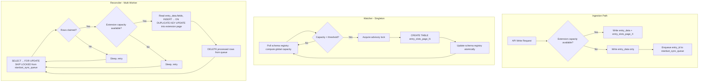

# Blueprint: Watcher & Reconciler Daemons

> **Status:** Draft
> **Author:** Damar Syah Maulana
> **Created:** 2026-04-09

## 1. Problem Statement

The Architecture Blueprint (§2.1) describes two independent background daemons — the **Watcher** (capacity monitor and page provisioner) and the **Reconciler** (sync-queue drain and data backfill) — in architectural prose. The prose defines their responsibilities and concurrency constraints but does not establish testable feature-level acceptance criteria, observability requirements, or operational boundaries needed to build and validate them as deliverables.

## 2. Scope

- **The Watcher**: A singleton PHP CLI daemon (`php spark stardust:watcher`) that:
  - Polls global slot consumption across all `entry_slots_page_X` tables on a configurable interval.
  - Provisions a new extension page when available capacity drops below the configured threshold (default: 20%).
  - Uses advisory locking (`GET_LOCK`) and empty-table-only DDL to avoid metadata lock contention.
  - Atomically updates the schema registry on successful provisioning.
- **The Reconciler**: A multi-worker PHP CLI daemon (`php spark stardust:reconciler`) that:
  - Continuously polls `stardust_sync_queue` using `SELECT ... FOR UPDATE SKIP LOCKED`.
  - Backfills entries into extension tables using `INSERT ... ON DUPLICATE KEY UPDATE`.
  - Processes in configurable chunks with configurable inter-chunk delay.
  - Supports horizontal scaling via row-level mutual exclusion.
- **Exhaustion fallback**: Ingestion gracefully degrades when slot capacity reaches 100% — writes land in `entry_data` only, and `entry_id` is enqueued to `stardust_sync_queue`.
- **Observability**: Both daemons report throughput metrics to stdout.

## 3. Non-Goals

- Auto-scaling daemon instances based on load (manual horizontal scaling of the Reconciler is in scope; auto-scaling orchestration is not).
- Kubernetes operator, systemd unit files, or any deployment-specific packaging.
- Alerting or monitoring infrastructure (daemons report to stdout; hooking that into Prometheus, Datadog, etc. is operational concern).
- Schema registry design — the registry is assumed to exist. This blueprint covers the daemons that _read and write_ to it.

## 4. Acceptance Criteria

### Watcher

1. When global slot capacity drops below the configured threshold, the Watcher provisions exactly one new `entry_slots_page_X` table whose schema matches the canonical extension table DDL.
2. Provisioning acquires an advisory lock (`GET_LOCK('stardust_page_provision', 10)`) and releases it upon completion or failure.
3. `ALTER TABLE` is never executed against a populated page.
4. The schema registry is atomically updated to reflect the new page. The ingestion path picks it up on its next schema cache refresh without requiring a restart.
5. If a second Watcher instance attempts to start, it fails fast with a clear error (PID file or lock contention).
6. Each poll cycle logs: timestamp, pages inspected, global capacity percentage, action taken (provisioned / no action).

### Reconciler

1. The Reconciler drains entries from `stardust_sync_queue` by reading the authoritative `entry_data.fields` payload (not a stale snapshot) and upserting into the appropriate extension page.
2. Chunk size and inter-chunk delay are configurable via CLI flags or environment variables.
3. Multiple Reconciler workers can run concurrently without processing the same queue row.
4. If no capacity exists in any extension page, the Reconciler sleeps and retries rather than crashing.
5. Each chunk logs: timestamp, rows claimed, rows processed, elapsed time.

### Exhaustion Fallback

1. When slot capacity is 100% and no pages are available, an entry-write call still succeeds — `entry_data` is written, extension table write is skipped, and `entry_id` is enqueued to `stardust_sync_queue`.
2. Once the Watcher provisions a new page and the Reconciler drains the queue, the previously skipped entry's indexed fields are present in the extension table.

## 5. Technical Sketch

**Key decisions:**

- The Watcher and Reconciler share **no direct IPC**. The schema registry (database rows) is the sole coordination point. This keeps them as isolated failure domains.
- The Reconciler always reads `entry_data.fields` at upsert time — never a cached or stale event payload — to prevent backfill races from overwriting fresher data.
- Stdout-based observability is the minimum viable surface. Structured logging (JSON to stdout) is recommended to enable downstream aggregation without coupling the daemons to a specific monitoring stack.

## 6. Resolved Decisions

The three open questions previously listed here have all been answered by ADRs:

1. **Schema cache invalidation** — resolved by [ADR 0015](../adrs/0015-database-as-sole-daemon-coordination-point.md). The schema cache is keyed by a registry-versioned token (the `schema_version` row), not a static TTL; cache refreshes are event-driven by version-row bumps, eliminating the staleness window during exhaustion bursts.
2. **Chunk failure semantics** — resolved by [ADR 0018](../adrs/0018-reconciler-poison-pill-semantics.md). Poison rows are quarantined in a per-row DLQ and the chunk commits its remaining rows; a single bad row never rolls back the chunk.
3. **Metric format** — resolved by [ADR 0020](../adrs/0020-structured-logging-mandate.md). NDJSON to stdout is mandatory across all daemons and the API; plain-text logging is removed from the supported surface. The closed event vocabulary for the Watcher and Reconciler is declared in this blueprint's acceptance criteria via the events listed in ADR 0020.

## 7. Related Documents

- [Architecture Blueprint §2.1 — Automated Page Provisioning & Exhaustion Fallback](../architecture_blueprint.md)
- [Architecture Blueprint §2.1.1 — The Watcher](../architecture_blueprint.md)
- [Architecture Blueprint §2.1.2 — The Reconciler](../architecture_blueprint.md)
- [Architecture Blueprint §2.1.3 — Coordination & Concurrency Constraints](../architecture_blueprint.md)
