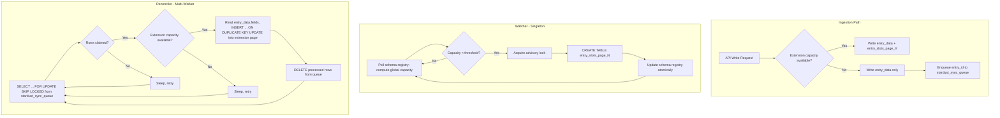

# Blueprint: Watcher & Reconciler Daemons

> **Status:** Accepted
> **Author:** Damar Syah Maulana
> **Created:** 2026-04-09

## 1. Problem Statement

The Architecture Blueprint (§2.1) describes two independent background daemons — the **Watcher** (capacity monitor and page provisioner) and the **Reconciler** (sync-queue drain and data backfill) — in architectural prose. The prose defines their responsibilities and concurrency constraints but does not establish testable feature-level acceptance criteria, observability requirements, or operational boundaries needed to build and validate them as deliverables.

## 2. Scope

- **The Watcher**: A singleton PHP CLI daemon (`bin/stardust watcher`) that:
  - Polls global slot consumption across all `entry_slots_page_X` tables on a configurable interval.
  - Provisions a new extension page when available **usable** capacity drops below the configured threshold (default: 20%) — free slots that cannot satisfy any pending demand shape (e.g. unindexed free slots when every waiting filterable field requires an index) do not count toward the threshold.
  - Derives the new page's indexed-column set from registry demand at provisioning time — the filterable fields currently unmapped (exhaustion fallback) or waiting in deferred retype/promotion assignments ([ADR 0016](../adrs/0016-field-type-change-lifecycle.md), [ADR 0034](../adrs/0034-non-filterable-fields-are-json-only.md)) — so a deferred `requireIndexed` reservation is always eventually satisfiable.
  - Uses advisory locking (`GET_LOCK`) and empty-table-only DDL to avoid metadata lock contention.
  - Atomically updates the schema registry on successful provisioning.
- **The Reconciler**: A multi-worker PHP CLI daemon (`bin/stardust reconciler`) that:
  - Continuously polls `stardust_sync_queue` using `SELECT ... FOR UPDATE SKIP LOCKED`.
  - Backfills entries into extension tables using `INSERT ... ON DUPLICATE KEY UPDATE`.
  - Processes in configurable chunks with configurable inter-chunk delay.
  - Supports horizontal scaling via row-level mutual exclusion.
- **Exhaustion fallback**: Ingestion gracefully degrades when slot capacity reaches 100% — writes land in `entry_data` only, and `entry_id` is enqueued to `stardust_sync_queue`.
- **Observability**: Both daemons report throughput metrics to stdout.

## 3. Non-Goals

- Auto-scaling daemon instances based on load (manual horizontal scaling of the Reconciler is in scope; auto-scaling orchestration is not).
- Kubernetes operator, systemd unit files, or any deployment-specific packaging.
- Alerting or monitoring infrastructure (daemons report to stdout; hooking that into Prometheus, Datadog, etc. is operational concern).
- Schema registry design — the registry is assumed to exist. This blueprint covers the daemons that _read and write_ to it.

## 4. Acceptance Criteria

### Watcher

1. When usable slot capacity drops below the configured threshold, the Watcher provisions exactly one new `entry_slots_page_X` table whose column layout matches the canonical extension table DDL and whose composite indexes cover the slot columns derived from current registry demand (filterable fields unmapped or awaiting deferred retype/promotion assignment). A page provisioned while a filterable field is waiting on an indexed slot of a given type family must carry an index on at least one free column of that family, so the pending reservation can be satisfied on the next Reconciler tick. "Usable" capacity excludes free slots that cannot satisfy any pending demand shape: when every waiting field requires an indexed slot, unindexed free slots do not count toward the threshold, so a page full of unindexed free columns never masks a real shortage of indexed capacity. Additionally, the threshold comparison is not the only trigger: **any pending reservation that no existing free slot can satisfy triggers provisioning unconditionally**, regardless of the global usable ratio — otherwise satisfiable demand of one type family could dilute the ratio above threshold and starve a single unsatisfiable waiter of another family indefinitely (starvation-freedom guarantee). **Refined 2026-08-10 by [ADR 0035](../adrs/0035-usable-capacity-is-a-satisfiability-test.md):** the "usable capacity below threshold" comparison in this criterion is not implementable as a ratio (it names a numerator with no denominator, and both candidate denominators diverge), so usable capacity governs provisioning as a per-family satisfiability test OR-composed with the existing global-ratio headroom check. The unconditional trigger stated here is exactly that satisfiability test; the usable percentage is still computed and logged per AC#6.
2. Provisioning acquires an advisory lock (`GET_LOCK('stardust_page_provision', 10)`) and releases it upon completion or failure.
3. `ALTER TABLE` is never executed against a populated page.
4. The schema registry is atomically updated to reflect the new page. The ingestion path picks it up on its next schema cache refresh without requiring a restart.
5. If a second Watcher instance attempts to start, it fails fast with a clear error (PID file or lock contention).
6. Each poll cycle logs: timestamp, pages inspected, usable capacity percentage, action taken (provisioned / no action), and — when a page is provisioned — the indexed slot columns emitted for it and the pending demand that drove them.

### Reconciler

1. The Reconciler drains entries from `stardust_sync_queue` by reading the authoritative `entry_data.fields` payload (not a stale snapshot) and upserting into the appropriate extension page.
2. Chunk size and inter-chunk delay are configurable via CLI flags or environment variables.
3. Multiple Reconciler workers can run concurrently without processing the same queue row.
4. If no capacity exists in any extension page, the Reconciler sleeps and retries rather than crashing.
5. Each chunk logs: timestamp, rows claimed, rows processed, elapsed time.

### Exhaustion Fallback

1. When slot capacity is 100% and no pages are available, an entry-write call still succeeds — `entry_data` is written, extension table write is skipped, and `entry_id` is enqueued to `stardust_sync_queue`.
2. Once the Watcher provisions a new page and the Reconciler drains the queue, the previously skipped entry's indexed fields are present in the extension table.

## 5. Technical Sketch

```mermaid
flowchart TD
    subgraph Ingestion Path
        A["API Write Request"] --> B{"Extension capacity available?"}
        B -- Yes --> C["Write entry_data + entry_slots_page_X"]
        B -- No --> D["Write entry_data only"]
        D --> E["Enqueue entry_id to stardust_sync_queue"]
    end

    subgraph Watcher - Singleton
        W1["Poll schema registry: compute global capacity"] --> W2{"Capacity < threshold?"}
        W2 -- Yes --> W3["Acquire advisory lock"]
        W3 --> W4["CREATE TABLE entry_slots_page_N"]
        W4 --> W5["Update schema registry atomically"]
        W5 --> W1
        W2 -- No --> W1
    end

    subgraph Reconciler - Multi-Worker
        R1["SELECT ... FOR UPDATE SKIP LOCKED from stardust_sync_queue"] --> R2{"Rows claimed?"}
        R2 -- Yes --> R3{"Extension capacity available?"}
        R3 -- Yes --> R4["Read entry_data.fields, INSERT ... ON DUPLICATE KEY UPDATE into extension page"]
        R4 --> R5["DELETE processed rows from queue"]
        R5 --> R1
        R3 -- No --> R6["Sleep, retry"]
        R6 --> R1
        R2 -- No --> R7["Sleep, retry"]
        R7 --> R1
    end
```

**Key decisions:**

- The Watcher and Reconciler share **no direct IPC**. The schema registry (database rows) is the sole coordination point. This keeps them as isolated failure domains.
- The Reconciler always reads `entry_data.fields` at upsert time — never a cached or stale event payload — to prevent backfill races from overwriting fresher data.
- Stdout-based observability is the minimum viable surface. Structured logging (JSON to stdout) is recommended to enable downstream aggregation without coupling the daemons to a specific monitoring stack.

## 6. Resolved Decisions

The three open questions previously listed here have all been answered by ADRs:

1. **Schema cache invalidation** — resolved by [ADR 0015](../adrs/0015-database-as-sole-daemon-coordination-point.md). The schema cache is keyed by a registry-versioned token (the `schema_version` row), not a static TTL; cache refreshes are event-driven by version-row bumps, eliminating the staleness window during exhaustion bursts.
2. **Chunk failure semantics** — resolved by [ADR 0018](../adrs/0018-reconciler-poison-pill-semantics.md). Poison rows are quarantined in a per-row DLQ and the chunk commits its remaining rows; a single bad row never rolls back the chunk.
3. **Metric format** — resolved by [ADR 0020](../adrs/0020-structured-logging-mandate.md). NDJSON to stdout is mandatory across all daemons and the API; plain-text logging is removed from the supported surface. The closed event vocabulary for the Watcher and Reconciler is declared in this blueprint's acceptance criteria via the events listed in ADR 0020.

## 7. Reconciler Event Payloads

The closed event-name vocabulary for `source: "reconciler"` lives in [ADR 0020 §Event Vocabulary](../adrs/0020-structured-logging-mandate.md). Per-event payload sub-fields layered on top of the standard daemon fields (`ts`, `level`, `source`, `event`, `tenant_id`, `correlation_id`) are pinned here.

### `chunk_claimed` / `chunk_complete` — the `queue` discriminator

The Reconciler drains several independent work sources in a fixed round-robin order, and they all report progress through the same two chunk events. **`queue` is the closed discriminator that says which source a chunk came from**, and it is required on both events. New work sources append to this enum; they never reuse another source's value, and they never introduce a parallel event name for the same thing.

| `queue` | Work source | Added by | Chunk sub-fields beyond the standard set |
| :-- | :-- | :-- | :-- |
| `sync_queue` | Capacity-exhaustion fallback drain | Phase 5 | — |
| `import_jobs` | Async bulk-ingest drain | Phase 5 | — |
| `retype_backfill` | Field retype / filterability promotion | [ADR 0016](../adrs/0016-field-type-change-lifecycle.md) | — |
| `rename_backfill` | Field rename payload rewrite | [ADR 0036](../adrs/0036-entry-payload-keys-are-field-names.md) | `rows_skipped` |
| `delete_purge` | Field deletion payload purge | [ADR 0037](../adrs/0037-field-deletion-lifecycle.md) | `rows_scanned`, `rows_purged` |
| `model_delete_purge` | Model deletion entry purge | [ADR 0038](../adrs/0038-model-deletion-lifecycle.md) | `rows_scanned`, `rows_deleted`, `sync_rows_deleted`, and `fields_dropped` on the final chunk |

Two notes on the last row, because the naming is deliberate. `rows_deleted` rather than `rows_purged`: the rows are removed rather than rewritten, and an operator watching a destructive drain needs to see that distinction at a glance. `sync_rows_deleted` counts the `stardust_sync_queue` rows removed alongside their entries in the same transaction — it is the count of dead-letter rows that in-transaction delete _prevented_, and the only observable that would reveal it regressing.

> **Recorded as drift, 2026-08-24.** This subsection was added with ADR 0038 and back-fills the `queue` values and chunk sub-fields introduced by ADR 0016, 0036 and 0037, none of which updated this document at the time. §5's technical sketch still describes the Reconciler as a single sync-queue loop and has not been brought forward; that is a larger edit and is left outstanding.

### `coercion_null`

Emitted when the Reconciler attempts to coerce a JSON payload value into a typed slot column during retype backfill (per [ADR 0024](../adrs/0024-type-coercion-matrix-for-retype-backfill.md)) and the coercion fails. The slot column receives `NULL`; the JSON payload remains authoritative (ADR [`0013`](../adrs/0013-json-payload-as-system-of-record.md)); reads fall back to `JSON_EXTRACT`. The event is NOT emitted when the JSON value was already absent or already JSON `null` (no coercion was attempted).

| Field                | Type                                                 | Description                                                                                                                              |
| :------------------- | :--------------------------------------------------- | :--------------------------------------------------------------------------------------------------------------------------------------- |
| `level`              | `"warn"`                                             | Fixed. Operationally surprising (caller-visible NULL in indexed view) but not data-loss (JSON authoritative).                            |
| `source`             | `"reconciler"`                                       | Fixed.                                                                                                                                   |
| `event`              | `"coercion_null"`                                    | Fixed.                                                                                                                                   |
| `tenant_id`          | integer                                              | Tenant of the affected entry. Required (this event is always tenant-scoped).                                                             |
| `correlation_id`     | string (UUID)                                        | Per-chunk correlation ID. Lets operators trace this event to the chunk's `chunk_complete` event.                                         |
| `chunk_id`           | integer                                              | Reconciler chunk identifier; also carried on `chunk_claimed` / `chunk_complete` for joinability.                                         |
| `field_id`           | integer                                              | The retyping field's `stardust_fields.id`.                                                                                               |
| `slot_assignment_id` | integer                                              | The new slot (in `backfilling` status per ADR 0017) receiving the `NULL`. Aggregate per-retype-operation here.                           |
| `entry_id`           | integer                                              | The affected `entry_data.id`. Lets operators inspect the original JSON payload for triage.                                               |
| `source_type`        | `"string"` \| `"int"` \| `"numeric"` \| `"datetime"` | Field's pre-retype `declared_type`.                                                                                                      |
| `target_type`        | `"string"` \| `"int"` \| `"numeric"` \| `"datetime"` | Field's post-retype `declared_type`.                                                                                                     |
| `reason`             | string (closed set — see below)                      | Closed taxonomy keyed to the failure modes in ADR 0024's matrix.                                                                         |

**Reason taxonomy:**

- `out_of_range` — value parsed but exceeded the target type's representable range (e.g., `string → int` value `"99999999999999999999"`; signed-64-bit overflow).
- `non_integer` — `numeric → int` source was not integer-valued (e.g., `42.5`).
- `malformed_datetime` — `string → datetime` value did not satisfy strict RFC 3339 with explicit offset.
- `malformed_number` — `string → int` or `string → numeric` value did not satisfy the target type's grammar (e.g., `"42abc"`, `"42.0"` for `string → int`).
- `epoch_coercion_rejected` — fell into one of the four cells the matrix rejects categorically (`int ↔ datetime`, `numeric ↔ datetime`).
- `unparseable` — JSON value's structural type (object, array, boolean) was incompatible with the source `declared_type`. Should be rare; surfaces out-of-band JSON edits or chained-retype anomalies.

Operators MUST monitor `coercion_null` event volume per active backfill (correlated by `slot_assignment_id`). A non-zero rate over a meaningful sample of the tenant/model partition is the only signal that retype-incompatible data is being silently NULL'd in the new slot column.

## 8. Related Documents

- [Architecture Blueprint §2.1 — Automated Page Provisioning & Exhaustion Fallback](../architecture_blueprint.md)
- [Architecture Blueprint §2.1.1 — The Watcher](../architecture_blueprint.md)
- [Architecture Blueprint §2.1.2 — The Reconciler](../architecture_blueprint.md)
- [Architecture Blueprint §2.1.3 — Coordination & Concurrency Constraints](../architecture_blueprint.md)
