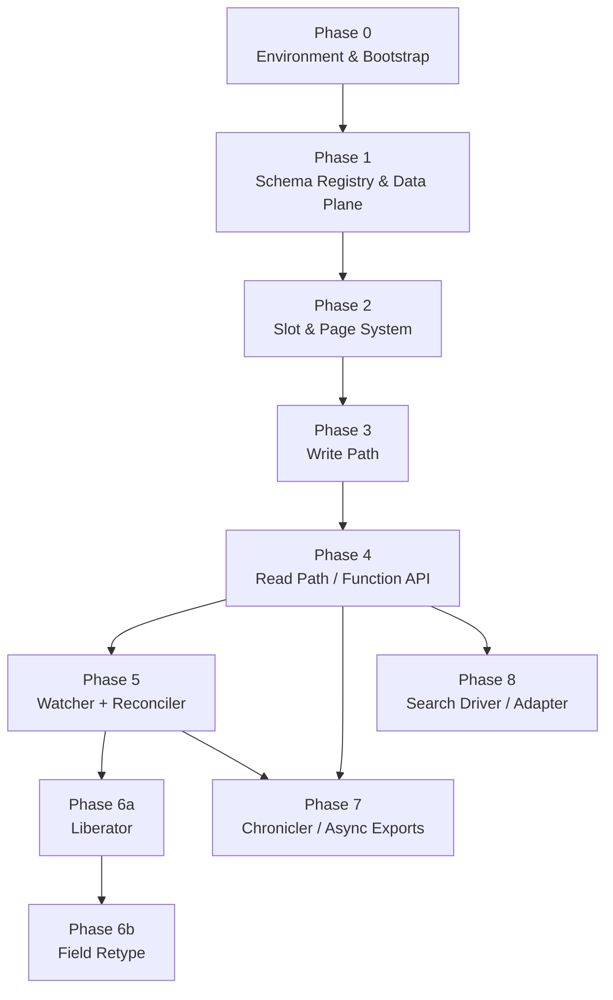

# StarDust Implementation Phases

> **Scope:** Engine build only. Legacy data migration and StarGate integration are out of scope.
> Migration principles are in [`legacy_data_migration.md`](legacy_data_migration.md).

## Overview

This document sequences the StarDust engine build into nine dependency-respecting phases. Each phase is a **gate**: all exit criteria must be met before work on the next phase begins. The source-of-truth specifications for each component remain in their respective [`adrs/`](adrs/) and [`blueprints/`](blueprints/) files; this document tells you in which order to build them and what "done" looks like.

**Audience:** StarDust core developers. Familiarity with [`architecture_blueprint.md`](architecture_blueprint.md) is assumed. Terms are defined in [`glossary.md`](glossary.md); they are not redefined here.

The architectural practice of recording decisions as ADRs is itself documented in [ADR 0000](adrs/0000-use-adrs.md).

---

## Document Precedence

When design documents disagree, this is the resolution order (strongest → weakest):

1. **ADRs** ([`adrs/`](adrs/)) — the authoritative source of truth. They record the decisions that shape the architecture and govern over every other document on conflict. ADRs form a one-way dependency chain: newer ADRs may reference older ones, never the reverse. On conflict between two ADRs, the newer ADR wins.
2. **[Architecture Blueprint](architecture_blueprint.md)** — the synthesis of the architecture beneath the ADRs. It MAY cite the ADRs it derives from; where it diverges from an ADR, the ADR governs.
3. **Component blueprints** ([`blueprints/`](blueprints/)) — feature-level specs derived from the architecture and ADRs.
4. **[Schema Reference](schemas/schema_reference.md)** — normative table definitions; follows the design above it.
5. **This document** (`implementation_phases.md`) — sequencer only; never overrides any design document.

Two documents at the same level should not disagree. If they do, flag it and resolve before proceeding.

---

## Phase Dependency Graph

---

## Cross-Phase Concerns

Two constraints apply to every phase and must not regress once established:

| Concern | Mandate | Governing ADR |
| :--- | :--- | :--- |
| **Structured logging** | Every daemon and every function-API entry point emits structured log events (machine-parseable, `chunk_correlation_id` carried through). | [ADR 0020](adrs/0020-structured-logging-mandate.md) |
| **Zero external dependencies** | The Composer package must be installable with no third-party runtime dependencies beyond `psr/log` and `psr/clock` (interface-only packages explicitly permitted by ADR 0026). Pluggability is via constructor injection, not bundled adapters. | [ADR 0026](adrs/0026-framework-neutral-composer-packaging.md) |
| **Stderr reserved for panics** | All structured operational log events — including `error`-level events — go to stdout as JSON. Stderr is reserved exclusively for unhandled exceptions and PHP fatal errors. This separation lets log-shipping pipelines treat stdout as structured ingest and stderr as crash-loop signal. | [ADR 0020](adrs/0020-structured-logging-mandate.md) |

---

## Phase 0 — Operating Environment & Repo Bootstrap

**Goal:** Establish a provably correct runtime environment and a zero-dependency PHP package skeleton before any engine code is written.

**Depends on:** nothing.

**Deliverables:**

- MySQL 8.0.13+ (or Percona 8.0.13+) environment with partial unique indexes and CTEs confirmed available. (`EXPLAIN ANALYZE` is an 8.0.18+ operator-runbook tool per ADR `0019`/`0023`; the engine does not depend on it and Phase 0 does not smoke-test for it.)
- Composer package skeleton: namespace, autoloader, entry-point class, no third-party `require` entries in `composer.json`.
- Structured logging shim wired at construction time (PSR-3 or equivalent injected via Config; no hard dependency on any logging library).
- CI pipeline that runs the smoke tests below against a real MySQL 8.0.13+ instance (no mocks).

**References:**

| ADR | Decision |
| :--- | :--- |
| [ADR 0002](adrs/0002-mysql-native-zero-dependency-core.md) | MySQL native, no ORM, no framework |
| [ADR 0020](adrs/0020-structured-logging-mandate.md) | Structured logging mandate |
| [ADR 0023](adrs/0023-minimum-mysql-version.md) | MySQL 8.0.13+ floor |
| [ADR 0026](adrs/0026-framework-neutral-composer-packaging.md) | Framework-neutral Composer packaging |
| [ADR 0027](adrs/0027-persistent-process-daemon-execution-model.md) | Persistent-process daemon execution model; host capability requirements |

**Exit criteria:**

- [ ] `composer install` completes against a fresh checkout with no warnings about missing extensions or unresolved dependencies.
- [ ] A smoke-test query confirms partial unique indexes are supported: `CREATE UNIQUE INDEX … WHERE …` succeeds.
- [ ] A smoke-test query confirms CTEs are available: `WITH cte AS (SELECT 1) SELECT * FROM cte` succeeds.
- [ ] MariaDB rejection: the same smoke suite exits non-zero when pointed at a MariaDB instance.
- [ ] `composer.json` has zero entries under `require` other than `php`, the `ext-pdo` / `ext-pdo_mysql` extensions, `psr/log`, and `psr/clock` (the two interface-only packages explicitly permitted by [ADR 0026](adrs/0026-framework-neutral-composer-packaging.md)).

---

## Phase 1 — Schema Registry & Core Data Plane

**Goal:** All physical tables exist on a fresh database after a single idempotent bootstrap run; no application code can execute without them.

**Depends on:** Phase 0.

**Deliverables:**

- **Data plane tables:** `entry_data`, `stardust_sync_queue`.
- **Schema registry tables:** `stardust_models`, `stardust_fields`, `stardust_pages`, `stardust_slot_assignments` (with full 5-state enum: `free | assigned | tombstoned | backfilling | ready`), `stardust_schema_version` (singleton row, `id = 1`, `CHECK (id = 1)`).
- **Operational & coordination tables:** `stardust_export_jobs`, `stardust_reconciler_dlq`, `backfill_checkpoints` (table created here; the Backfill Pump CLI that also writes to this table is out of scope for this build sequence — see scope note at top of document).
- **Bootstrap migration runner:** a single callable that applies all DDL idempotently (safe to run on an already-bootstrapped database).

Full column definitions, index specifications, and atomicity invariants for all tables are in [`schemas/schema_reference.md`](schemas/schema_reference.md).

**References:**

| ADR | Decision |
| :--- | :--- |
| [ADR 0001](adrs/0001-extension-tables-over-eav.md) | Extension tables over EAV — why `entry_data` + `entry_slots_page_X` exists |
| [ADR 0013](adrs/0013-json-payload-as-system-of-record.md) | `entry_data.fields` JSON is the system of record |
| [ADR 0015](adrs/0015-database-as-sole-daemon-coordination-point.md) | Database as sole daemon coordination point |
| [ADR 0017](adrs/0017-schema-registry-as-coordination-contract.md) | Schema registry as coordination contract; atomicity invariants |
| [Schema Reference](schemas/schema_reference.md) | Normative table definitions, ERD, slot-status state machine |

**Exit criteria:**

- [ ] Bootstrap runner applied to a blank database creates all tables without errors.
- [ ] Bootstrap runner applied a second time to the same database is a no-op (no errors, no duplicate-table failures).
- [ ] `stardust_schema_version` contains exactly one row with `id = 1` after bootstrap.
- [ ] `stardust_slot_assignments.status` ENUM rejects any value outside `free | assigned | tombstoned | backfilling | ready` at the database level.
- [ ] The partial unique index `UNIQUE (field_id) WHERE status IN ('assigned','backfilling','ready')` on `stardust_slot_assignments` is confirmed present via `SHOW INDEX`.
- [ ] Tenant-scoped composite indexes on `entry_data` are confirmed: `(tenant_id, model_id)` and `(tenant_id, deleted_at, created_at)`.

---

## Phase 2 — Slot & Page System (Vertical Schema Partitioning)

**Goal:** The engine can provision an `entry_slots_page_X` table, register its slots in the schema registry, and atomically reserve a slot for a new model field — all without any DML against an existing populated page.

**Depends on:** Phase 1.

**Deliverables:**

- **Page provisioner:** creates `entry_slots_page_1` (and subsequent pages) using Empty-Table-Only DDL; inserts the `stardust_pages` row and all `stardust_slot_assignments` rows (`status='free'`) in one atomic transaction after the DDL auto-commits.
- **Index Provisioning Policy:** at page DDL time, a composite B-tree index `(tenant_id, slot_column)` is emitted for each slot column named in the provisioner's filterable-column set (the filterable fields awaiting slots); all other columns on the page are created unindexed. Non-filterable fields are JSON-only and never occupy a slot ([ADR 0034](adrs/0034-non-filterable-fields-are-json-only.md)).
- **Slot reservation:** scanning the registry for a free slot of the required type and atomically transitioning it `free → assigned` (`field_id` set) — a pure registry write, no DDL.

**References:**

| ADR | Decision |
| :--- | :--- |
| [ADR 0003](adrs/0003-schema-driven-index-provisioning.md) | Schema-driven index provisioning via `is_filterable` |
| [ADR 0012](adrs/0012-immutable-extension-page-ddl.md) | Immutable extension page DDL — no `ALTER TABLE` on populated pages |
| [ADR 0019](adrs/0019-index-cardinality-policy.md) | Index cardinality policy |
| [ADR 0030](adrs/0030-string-slot-storage-type-and-index-prefix.md) | String slots are `TEXT` with a 766-char prefix index (`ROW_FORMAT=DYNAMIC`) |
| [Architecture Blueprint §2.1.5](architecture_blueprint.md) | Slot assignment lifecycle |
| [Architecture Blueprint §2.2](architecture_blueprint.md) | Index Provisioning Policy |

**Exit criteria:**

- [ ] Provisioning a new page with a set of filterable slot columns produces composite indexes on exactly those columns and no others; columns beyond the requested filterable set are created unindexed (verified via `SHOW INDEX FROM entry_slots_page_1`). Non-filterable fields are JSON-only and never contribute a slot ([ADR 0034](adrs/0034-non-filterable-fields-are-json-only.md)).
- [ ] Attempting `ALTER TABLE entry_slots_page_1 ADD COLUMN …` on a page that contains any rows is rejected by the engine guard (not by MySQL; the guard must fire first).
- [ ] Slot reservation for a field transitions exactly one `stardust_slot_assignments` row from `free` to `assigned`; the row's `field_id` is set; no other rows are mutated.
- [ ] The `stardust_pages` row and all slot inventory rows for a newly provisioned page are present or absent together — no partial inventory state after a simulated mid-transaction crash (verify via rollback test).
- [ ] `stardust_schema_version.version` is incremented in the same transaction as every page provisioning event.

---

## Phase 3 — Write Path (Payload Splitting + Exhaustion Fallback)

**Goal:** Entries can be ingested atomically; when slot capacity is exhausted the engine degrades gracefully to the sync queue without blocking or losing writes.

**Depends on:** Phase 2.

**Deliverables:**

- **JSON payload writer:** writes the complete `fields` JSON to `entry_data` in every case, regardless of slot availability.
- **Slot extraction engine:** for each `assigned`, `backfilling`, or `ready` slot on a live field, extracts the field's value from `fields` and writes it to the reserved slot column on `entry_slots_page_X` in the same transaction. (New writes during an active retype must land in the `backfilling` slot so that promotion to `ready` yields complete data.)
- **Atomic transaction boundary:** `entry_data` insert + all `entry_slots_page_X` writes commit together; a partial write must not be visible.
- **Chunked bulk ingestion:** accepts a batch of entry payloads; processes in configurable chunks with a configurable inter-chunk delay to limit write spikes.
- **Async bulk-ingest submission:** for payloads that exceed the synchronous size threshold, the write path accepts an async submission, persists a job record, and returns an Import Job ID to the caller; the actual processing is handled by the Reconciler. Payloads at or below the threshold are processed inline per the chunked path above. Full contract — size threshold, idempotency-key semantics, per-chunk result manifest — is in [ADR 0011](adrs/0011-chunked-bulk-ingestion.md).
- **Exhaustion fallback:** when no free/assigned slots of the required type exist, the engine writes `entry_data.fields`, skips the slot write, and enqueues the `entry_id` into `stardust_sync_queue` — all in one transaction. The caller receives no error.

**References:**

| ADR | Decision |
| :--- | :--- |
| [ADR 0007](adrs/0007-write-availability-over-query-completeness.md) | Write availability over query completeness — motivation for the exhaustion fallback |
| [ADR 0011](adrs/0011-chunked-bulk-ingestion.md) | Chunked bulk ingestion |
| [ADR 0013](adrs/0013-json-payload-as-system-of-record.md) | `entry_data.fields` is always the system of record |
| [ADR 0028](adrs/0028-single-document-json-for-import-artifacts.md) | Single-document JSON for async import job artifacts |
| [Architecture Blueprint §2.1](architecture_blueprint.md) | Exhaustion fallback and sync queue semantics |

**Exit criteria:**

- [ ] Ingesting an entry when slot capacity exists: `entry_data` row present; corresponding `entry_slots_page_X` row present; `stardust_sync_queue` has no new row.
- [ ] Ingesting an entry when all slots are at 100% capacity: `entry_data` row present; no `entry_slots_page_X` row written; one `stardust_sync_queue` row inserted; no exception thrown to the caller.
- [ ] Killing the database connection mid-transaction leaves neither a partial `entry_slots_page_X` row nor a `stardust_sync_queue` row without a corresponding `entry_data` row.
- [ ] Bulk ingestion of N entries in chunks of K produces exactly N `entry_data` rows with no duplicates (`ON DUPLICATE KEY` guard is wired).
- [ ] The inter-chunk delay is applied between chunks, not before the first or after the last.
- [ ] All `entry_slots_page_X` writes use `INSERT … ON DUPLICATE KEY UPDATE`; submitting the same `entry_id` a second time updates the row rather than producing a constraint error (per Architecture Blueprint §5).
- [ ] Passing `tenant_id = 0`, a negative value, or a value exceeding `2^63 − 1` to any write-path entry point throws a typed validation exception before any SQL executes.

---

## Phase 4 — Read Path (Function API)

**Goal:** The public function API surfaces cursor-paginated, bounded reads with pre-flight filter validation and strict tenant isolation.

**Depends on:** Phase 3.

**Deliverables:**

- **Two-query bounded read:** Paginated Probe (count/existence check, pre-flight rejection) + Bounded Fetch (actual data retrieval). No single query touches unbounded row sets.
- **Cursor-based pagination:** page traversal uses `entry_id` cursor values; no `OFFSET`; results are stable across pages for a given cursor.
- **Pre-flight rejection:** any filter against a field with `is_filterable = false` — or against an unmapped/`backfilling`/`tombstoned` slot — is rejected with a typed exception before any data query executes.
- **Tenant isolation:** every `SELECT`, `JOIN`, and sub-query carries a `WHERE tenant_id = ?` predicate. Cross-tenant access is forbidden; any function that genuinely needs it must be a separately named function with its own structured-log event.
- **JSON_EXTRACT fallback:** fields whose slots are `unmapped`, `backfilling`, or `tombstoned` are retrieved via `JSON_EXTRACT` on `entry_data.fields`; they are never the target of a `WHERE` clause filter.
- **Schema-version cache:** an in-process cache (owned by API workers) keyed to `stardust_schema_version.version`; on each request the worker compares the cached version against the live row and refreshes on mismatch; a bounded-staleness 60-second TTL fallback applies when the version check itself fails (per [ADR 0015](adrs/0015-database-as-sole-daemon-coordination-point.md)); cache refresh emits a `registry: cache_miss` structured-log event.

**References:**

| ADR | Decision |
| :--- | :--- |
| [ADR 0004](adrs/0004-fail-fast-on-unindexed-filters.md) | Fail-fast on unindexed filters |
| [ADR 0005](adrs/0005-two-query-bounded-read-path.md) | Two-query bounded read path |
| [ADR 0006](adrs/0006-cursor-based-pagination.md) | Cursor-based pagination, no OFFSET |
| [ADR 0014](adrs/0014-schema-level-safety-over-runtime-circuit-breaking.md) | Schema-level safety over runtime circuit-breaking |
| [Architecture Blueprint §1.2](architecture_blueprint.md) | Multi-tenancy boundary and `tenant_id` enforcement |

**Exit criteria:**

- [ ] A filter on a field with `is_filterable = false` throws a typed exception; no `JSON_EXTRACT` appears in the resulting `EXPLAIN` output.
- [ ] A filter on a field whose slot is `backfilling` throws a typed exception.
- [ ] Cursor pagination: fetching pages 1, 2, 3 across a dataset that is mutated between requests does not produce duplicated or skipped rows for entries that existed before page 1.
- [ ] Every `EXPLAIN` for a slot-based filter shows an index range scan on the `(tenant_id, slot_column)` composite index; no full-table scans.
- [ ] Constructing a query that attempts to join two tenants' data in one call returns an error; it does not silently return cross-tenant rows.
- [ ] Retrieving a field in `backfilling` state returns a value sourced via `JSON_EXTRACT`; the slot column is not consulted.
- [ ] Passing `tenant_id = 0`, a negative value, or a value exceeding `2^63 − 1` to any read-path entry point throws a typed validation exception before any SQL executes.
- [ ] The Paginated Probe query uses `LIMIT page_size + 1`; the extra row is the only mechanism used to determine whether a next page exists — no separate `COUNT` query is issued.
- [ ] When fewer than `page_size + 1` rows are returned by the probe, the API returns a null / absent next-cursor sentinel; this is verified by paginating to the last page of a known dataset.
- [ ] Any operation that genuinely requires cross-tenant data access is exposed as a separately-named function with its own structured-log event; the standard read-path functions throw a typed exception on cross-tenant input and never silently return cross-tenant rows.

---

## Phase 5 — Resilience Daemons (Watcher + Reconciler)

**Goal:** Slot capacity is managed automatically and the sync queue is drained without operator intervention after a capacity gap.

**Depends on:** Phase 4.

**Deliverables:**

- **Watcher (singleton):** lazy polling loop (default 60 s); acquires `GET_LOCK('stardust_page_provision', 10)` before any DDL; provisions a new page when available capacity drops below 20%; emits structured-log events per ADR 0020; enforced singleton via PID file or OS-level process lock.
- **Cardinality advisory (periodic):** on a 24-hour cadence, the Watcher samples index cardinality for each active slot and emits `cardinality_sampled` structured-log events; emits `low_cardinality_index` when a slot's cardinality falls below the policy threshold. See [ADR 0019](adrs/0019-index-cardinality-policy.md).
- **Reconciler (multi-worker):** polls `stardust_sync_queue` via `SELECT … FOR UPDATE SKIP LOCKED`; on each cycle queries the registry for available capacity; if capacity exists, backfills entries using `INSERT … ON DUPLICATE KEY UPDATE` and deletes the processed queue rows; processes in configurable chunks (default 500) with configurable inter-chunk delay; reports throughput to stdout.
- **DLQ semantics:** entries the Reconciler cannot process (malformed JSON, missing `entry_data` row, schema incompatibility) are quarantined in `stardust_reconciler_dlq`; no automatic retry; operator-initiated replay only.
- **`reconciler:dlq:replay` operator command** (`bin/stardust reconciler:dlq:replay`): re-inserts the target DLQ row's `entry_id` into `stardust_sync_queue`, increments `retry_count`, and deletes the DLQ row in one transaction. This is the sole recovery path for quarantined entries. See [ADR 0018](adrs/0018-reconciler-poison-pill-semantics.md).
- **Structured-log events:** all daemon lifecycle events emit structured log events with `chunk_correlation_id`. The closed event-name vocabulary for the Watcher (`poll_started`, `poll_complete`, `provision_started`, `provision_complete`, `provision_failed`, `lock_contention`) is declared in [ADR 0020](adrs/0020-structured-logging-mandate.md); the closed vocabulary for the Reconciler (`chunk_claimed`, `chunk_complete`, `chunk_partial`, `dlq_inserted`, `cache_miss`, `capacity_wait`, `coercion_null`) is declared in [ADR 0020](adrs/0020-structured-logging-mandate.md) (sub-field payload details in [watcher_reconciler_daemons.md §7](blueprints/watcher_reconciler_daemons.md)). No event names outside these lists are permitted.

**References:**

| ADR | Decision |
| :--- | :--- |
| [ADR 0008](adrs/0008-singleton-watcher-multi-worker-reconciler.md) | Singleton Watcher + multi-worker Reconciler concurrency model |
| [ADR 0018](adrs/0018-reconciler-poison-pill-semantics.md) | Reconciler poison-pill / DLQ semantics |
| [ADR 0019](adrs/0019-index-cardinality-policy.md) | Index cardinality policy; periodic cardinality advisory |
| [ADR 0020](adrs/0020-structured-logging-mandate.md) | Structured logging mandate |
| [ADR 0027](adrs/0027-persistent-process-daemon-execution-model.md) | Persistent-process execution model; Watcher singleton enforcement |
| [ADR 0028](adrs/0028-single-document-json-for-import-artifacts.md) | Single-document JSON for async import job artifacts — Reconciler reader contract |
| [Blueprint: Watcher + Reconciler](blueprints/watcher_reconciler_daemons.md) | Feature spec and acceptance criteria |

**Exit criteria:**

- [ ] Simulating capacity exhaustion (fill all slots to 100%) and then starting the Watcher causes a new page to be provisioned; the advisory lock is acquired before `CREATE TABLE` and released after the registry transaction commits.
- [ ] Running two Watcher instances concurrently: the second instance either exits immediately (PID file guard) or waits and discovers the first already provisioned — it does not attempt a duplicate `CREATE TABLE`.
- [ ] After capacity is restored, the Reconciler drains all rows from `stardust_sync_queue` to zero; each drained entry gains an `entry_slots_page_X` row.
- [ ] Inserting a row into `stardust_sync_queue` with a corrupted `entry_id` (no matching `entry_data` row) causes the Reconciler to quarantine it in `stardust_reconciler_dlq` with `reason = 'missing_entry_data'`; the main queue row is deleted.
- [ ] `stardust_reconciler_dlq` is never automatically retried; the row persists until an operator action removes it.
- [ ] Every Reconciler chunk-commit log event carries a `chunk_correlation_id` that is stable across the chunk and resolvable in `stardust_reconciler_dlq.chunk_correlation_id`.
- [ ] Every slot-status transition (`free → assigned`, `assigned → tombstoned`, `backfilling → ready`) increments `stardust_schema_version.version` in the same transaction as the status change.

---

## Phase 6a — Slot Reclamation (Liberator)

**Goal:** Dead slots are reclaimed without operator intervention.

**Depends on:** Phase 5.

**Deliverables:**

- **Liberator daemon:** independent polling loop; scans `stardust_slot_assignments` for `status = 'tombstoned'` rows; executes chunked `UPDATE entry_slots_page_X SET i_XX = NULL WHERE entry_id > ? LIMIT 500` nullification without locking (no `tenant_id` predicate per ADR 0029 — single-owner column); on confirmed 100% nullification transitions the slot `tombstoned → free` in the same transaction as the final `UPDATE` batch; emits the closed structured-log event vocabulary declared in [liberator_daemon.md §4 AC#11](blueprints/liberator_daemon.md) (`sweep_started`, `sweep_chunk`, `sweep_complete`, `deadlock_retry`, `sweep_gap_flagged`). No event names outside this list are permitted.

**References:**

| ADR | Decision |
| :--- | :--- |
| [ADR 0009](adrs/0009-tombstone-based-slot-eviction.md) | Tombstone-based slot eviction strategy |
| [ADR 0029](adrs/0029-liberator-sweep-omits-tenant-predicate.md) | Liberator sweep omits the `tenant_id` predicate (refines ADR 0009) |
| [ADR 0027](adrs/0027-persistent-process-daemon-execution-model.md) | Persistent-process execution model; Liberator singleton enforcement |
| [Blueprint: Liberator](blueprints/liberator_daemon.md) | Liberator feature spec and acceptance criteria |
| [Architecture Blueprint §2.1.3](architecture_blueprint.md) | Liberator sweep mechanics |

**Exit criteria:**

- [ ] Tombstoning a slot (via field deletion or `is_filterable` demotion): the Liberator nullifies all non-NULL values for that slot across the tenant/model partition; the slot transitions `tombstoned → free`; no subsequent field can observe stale values in the reclaimed slot.
- [ ] Slot reclamation is chunked: the Liberator does not acquire a table-level lock; concurrent reads and writes against the same page proceed unblocked during the sweep.
- [ ] The Liberator enforces singleton operation; a second Liberator instance starting concurrently exits immediately (PID file guard or advisory lock collision) and does not begin a sweep.
- [ ] The chunk `UPDATE entry_slots_page_X … SET slot = NULL` and the corresponding `sweep_cursor_id` advancement on `stardust_slot_assignments` commit atomically in a single transaction; no window exists where nullified rows are durable but the registry cursor lags.
- [ ] On InnoDB deadlock (`SQLSTATE 40001`), the Liberator retries the same chunk up to 3 times; after the third consecutive failure it emits a `sweep_gap_flagged` structured-log event (per [liberator_daemon.md §4 AC#8](blueprints/liberator_daemon.md)) and advances the cursor by `LIMIT` rows before continuing.
- [ ] Tombstoned slots are processed in `tombstoned_at ASC` order (oldest first); restarting the Liberator against unchanged registry state produces the same processing sequence.

---

## Phase 6b — Field Retype & Filterability-Promotion Pipeline

**Goal:** A field's declared type can be safely changed, and a non-filterable field can be promoted to filterable — both with read availability maintained throughout the transition.

**Depends on:** Phase 6a. The retype lifecycle produces `tombstoned` slots that the Liberator reclaims; building the consumer first means 6b lands with a working sink for the tombstones it generates.

**Deliverables:**

- **Field retype & filterability-promotion pipeline:** implements the `retype → tombstone → assign → backfill → promote` lifecycle per [Architecture Blueprint §2.1.6](architecture_blueprint.md) and [ADR 0016](adrs/0016-field-type-change-lifecycle.md) for two triggers: (1) a `declared_type` change, and (2) an `is_filterable: false → true` promotion. Because non-filterable fields are JSON-only and hold no slot ([ADR 0034](adrs/0034-non-filterable-fields-are-json-only.md)), a promotion normally reserves a fresh indexed slot (`free → backfilling`) with no old slot to tombstone; a `declared_type` change tombstones the existing live slot and reserves the new one. (A promotion of a field carrying a grandfathered pre-`0034` unindexed slot additionally tombstones that legacy slot.) Both triggers use the same atomic registry transaction and the same Reconciler-driven backfill (cursor scan over `entry_data` for the `(tenant_id, model_id)` partition, progress tracked in a `backfill_checkpoints` row keyed `retype_field_{field_id}`; see [schema_reference.md §5.4](schemas/schema_reference.md)); slot advances `backfilling → ready` once all rows in the partition are processed.
- **Type coercion matrix:** applied during Reconciler backfill for type-change retypes; values that cannot be coerced store `NULL` in the new slot and emit a `coercion_null` structured-log event. Categorical rejections (numeric ↔ datetime) are enforced at registry-write time. No coercion applies to filterability-promotion (the value is already the correct type). See [ADR 0024](adrs/0024-type-coercion-matrix-for-retype-backfill.md).
- **Cardinality post-backfill sample:** after any slot advances to `ready`, trigger the one-shot cardinality sample per [ADR 0019](adrs/0019-index-cardinality-policy.md), emitting a `cardinality_sampled` structured-log event.

**References:**

| ADR | Decision |
| :--- | :--- |
| [ADR 0016](adrs/0016-field-type-change-lifecycle.md) | Field type change lifecycle (both triggers: type-change and filterability-promotion) |
| [ADR 0019](adrs/0019-index-cardinality-policy.md) | Index cardinality policy; post-backfill cardinality sample |
| [ADR 0024](adrs/0024-type-coercion-matrix-for-retype-backfill.md) | Normative type coercion matrix |
| [Architecture Blueprint §2.1.6](architecture_blueprint.md) | Field type change lifecycle |

**Exit criteria:**

- [ ] Retyping a field `string → int`: immediately after the atomic registry transaction, reads fall back to `JSON_EXTRACT` for that field; filter queries against it throw a typed exception (`backfilling` state blocks filterability).
- [ ] A numeric ↔ datetime retype attempt is rejected at registry-write time with a typed exception; no registry rows are mutated.
- [ ] A coercible value (e.g., `"42"` retyped to `int`) is written as `42` in the new slot; a non-coercible value (e.g., `"hello"` retyped to `int`) is written as `NULL` and a `coercion_null` structured-log event is emitted.
- [ ] Once the Reconciler completes backfill for all rows in the partition, the slot advances to `ready`; if `is_filterable = true`, filter queries against the field succeed using the new slot's index.
- [ ] Killing the Reconciler mid-retype-backfill and restarting it causes it to resume from `last_processed_id + 1` in `backfill_checkpoints`; no entry's new slot receives a double-write and no entry is left unprocessed after the run completes.
- [ ] The atomic retype registry transaction (declared_type update + old-slot tombstone + new-slot `free → backfilling`) also increments `stardust_schema_version.version` in the same transaction as the three registry writes.
- [ ] Promoting a field from `is_filterable = false` to `is_filterable = true` triggers the full pipeline: since the field was JSON-only and held no slot ([ADR 0034](adrs/0034-non-filterable-fields-are-json-only.md)), a new indexed slot is reserved `free → backfilling`, the Reconciler backfills all existing entries into it from the JSON payload, and once the slot advances to `ready` the `(tenant_id, slot_column)` composite index is used for filter queries against that field. (A field still carrying a grandfathered pre-`0034` unindexed slot has that legacy slot tombstoned as part of the same transaction.)

---

## Phase 7 — Async Exports (The Chronicler)

**Goal:** Consumers can submit an asynchronous export job and retrieve a complete CSV or JSON artifact without holding a synchronous connection open.

**Depends on:** Phase 4 (cursor-based read path), Phase 5 (structured logging, SKIP LOCKED pattern).

**Deliverables:**

- **Export job submission API:** validates the `QueryFilter` payload; enforces per-tenant active-job cap (≤ 3 `pending` or `processing`); inserts a `stardust_export_jobs` row with `status = 'pending'`.
- **Chronicler daemon:** claims pending jobs via `SELECT … FOR UPDATE SKIP LOCKED`; uses cursor-based pagination to page through `entry_data`; writes a streaming CSV or JSON artifact to disk; refreshes `heartbeat_at` every chunk; transitions job to `completed` (with `artifact_path`) or `failed` (with `failed_reason`) on completion.
- **Abandoned-claim sweep:** detects `status = 'processing'` rows where `heartbeat_at` is older than the configured lease timeout; re-queues or marks `failed` per ADR 0025.
- **Artifact GC:** removes artifacts and nulls `artifact_path` after the 24-hour TTL; enforces the 5 GB per-artifact cap.
- **Failure semantics:** exponential backoff on transient failures; `excessive_skips` abort when `skip_count` crosses the configured cap; `failed_reason` taxonomy per ADR 0025.
- **Structured-log events:** the closed event-name vocabulary is declared in [chronicler_daemon.md §6](blueprints/chronicler_daemon.md) (`job_claimed`, `chunk_written`, `deadlock_retry`, `chunk_skipped`, `row_skipped`, `lease_lost`, `low_disk`, `artifact_oversized`, `job_complete`, `job_failed`, `gc_swept`). No event names outside this list are permitted.

**References:**

| ADR | Decision |
| :--- | :--- |
| [ADR 0010](adrs/0010-asynchronous-exports.md) | Asynchronous exports (relocation notice — normative content is in [Blueprint: Chronicler Daemon](blueprints/chronicler_daemon.md)) |
| [ADR 0025](adrs/0025-chronicler-failure-semantics.md) | Chronicler failure semantics, backoff, lease, worker identity |
| [ADR 0027](adrs/0027-persistent-process-daemon-execution-model.md) | Persistent-process execution model; artifact filesystem requirement |
| [Blueprint: Async Exports](blueprints/async_exports.md) | Feature spec and acceptance criteria |
| [Blueprint: Chronicler Daemon](blueprints/chronicler_daemon.md) | Daemon design, claim protocol, GC, per-tenant round-robin |

**Exit criteria:**

- [ ] Submitting a 4th concurrent export job for the same tenant is rejected with a typed exception; no `stardust_export_jobs` row is inserted.
- [ ] An export job for a dataset with 1 million rows completes without OOM; the artifact file is written incrementally (not buffered entirely in memory).
- [ ] Killing the Chronicler process mid-export and restarting it: the job is re-claimed and the artifact is rebuilt from `last_cursor`; the final artifact is complete and identical to an uninterrupted run.
- [ ] A Chronicler worker that stops refreshing `heartbeat_at` (simulated hang): the abandoned-claim sweep re-queues the job; the original worker self-aborts when it detects a `worker_identity` mismatch on its next heartbeat write.
- [ ] An artifact that reaches the 5 GB cap aborts with `failed_reason = 'artifact_size_exceeded'`; no partial artifact is left at `artifact_path`.
- [ ] After 24 hours, the GC sweep removes the artifact file from disk and sets `artifact_path = NULL`; the `stardust_export_jobs` row is retained for audit.
- [ ] Given two tenants each with pending jobs, successive Chronicler claim cycles alternate between tenants — per-tenant round-robin (`MIN(created_at)` position computed at claim time per [chronicler_daemon.md §4](blueprints/chronicler_daemon.md)); one tenant's queue depth cannot starve another's oldest job.
- [ ] The `heartbeat_at` refresh is written inside each chunk-commit transaction (not on a separate timer); the abandoned-claim sweep runs on a 10-second cadence with a 30-second lease timeout; a worker that loses its database connection simultaneously loses its lease.
- [ ] After 3 consecutive deadlocks on a single chunk, the Chronicler emits `chunk_skipped` with `cause='deadlock_budget_exhausted'`, advances `last_cursor` by `page_size`, increments `skip_count` by `page_size`, and continues — it does not abort the job.
- [ ] A row containing bytes not expressible in the chosen output format emits `row_skipped` (with a closed-taxonomy `reason`) and increments `skip_count` by 1; when `skip_count` exceeds `skip_count_cap` (default 1 000), the job is marked `failed` with `failed_reason='excessive_skips'` and the partial artifact is deleted.
- [ ] When free disk on the artifact partition falls below 10%, the Chronicler emits `low_disk` and stops claiming new jobs until pressure clears; in-flight jobs continue unaffected (distinct from the terminal `disk_full` state triggered by `ENOSPC` during a write).
- [ ] The three terminal events `job_failed`, `artifact_oversized`, and `lease_lost` appear as distinct `event` values in structured log output and are never conflated; a job reaching the 5 GB artifact cap emits `artifact_oversized` (not `job_failed`).
- [ ] The GC sweep collects both (a) artifact files from completed jobs whose `completed_at + ttl` has elapsed and (b) orphaned partial files from `failed` jobs whose `completed_at` is older than 1 hour.

---

## Phase 8 — Search Extensibility (Driver/Adapter)

**Goal:** The engine's read path is backed by a stable, negotiable interface so that non-MySQL search backends can be registered at construction time without modifying core engine code.

**Depends on:** Phase 4 (the canonical MySQL read path is the reference implementation the interface must match).

**Deliverables:**

- **`EntrySearchInterface` contract:** defines the methods a driver must implement to service filter queries and paginated fetches.
- **Capability negotiation:** drivers declare which filter operations and field types they support; the engine negotiates at query time and routes accordingly; unsupported operations produce a structured rejection, not silent fallthrough.
- **QueryFilter wire-format parser:** validates consumer filter payloads against the JSON Schema sidecar ([`schemas/queryfilter.schema.json`](schemas/queryfilter.schema.json)); rejects malformed payloads at the API boundary before any driver is consulted.
- **Default MySQL driver:** wraps the read path from Phase 4 behind the interface; used when no external driver is injected.
- **Construction-time driver injection:** the engine's Composer entry-point class accepts an optional driver via its Config object; if omitted, the MySQL driver is used; no global state or static registries.

**References:**

| ADR | Decision |
| :--- | :--- |
| [ADR 0021](adrs/0021-search-driver-query-representation.md) | Search driver query representation interface design |
| [ADR 0022](adrs/0022-search-driver-capability-jurisdiction.md) | What drivers report vs. what callers negotiate |
| [ADR 0026](adrs/0026-framework-neutral-composer-packaging.md) | Zero-dependency packaging; constructor injection model |
| [Blueprint: Search Driver / Adapter](blueprints/search_driver_adapter.md) | Interface spec and capability negotiation protocol |
| [Blueprint: QueryFilter Wire Format](blueprints/queryfilter_wire_format.md) | Normative JSON encoding for consumer filter payloads |
| [Schema: queryfilter.schema.json](schemas/queryfilter.schema.json) | JSON Schema (Draft 2020-12) for CI validation |

**Exit criteria:**

- [ ] A stub driver that reports no supported filter operations can be registered at construction time; a filter query against it returns a capability-negotiation rejection, not an exception from the MySQL driver.
- [ ] Swapping from the MySQL driver to the stub driver at construction time requires no change to any call-site code.
- [ ] A QueryFilter payload that fails JSON Schema validation (`queryfilter.schema.json`) is rejected at the API boundary before the driver's query method is called; CI validates this with the schema sidecar.
- [ ] The MySQL driver (wrapping Phase 4's read path) passes all Phase 4 exit criteria unchanged when accessed through the `EntrySearchInterface` contract.
- [ ] No static registry, global state, or `static::` calls exist in the driver injection path; the engine is constructible twice in the same process with different drivers without interference.

---

## ADR Coverage Index

Every accepted ADR is referenced by at least one phase above.

| ADR | Phase(s) |
| :--- | :--- |
| [0000](adrs/0000-use-adrs.md) — Use ADRs | Overview |
| [0001](adrs/0001-extension-tables-over-eav.md) — Extension Tables over EAV | 1 |
| [0002](adrs/0002-mysql-native-zero-dependency-core.md) — MySQL Native Zero-Dependency Core | 0 |
| [0003](adrs/0003-schema-driven-index-provisioning.md) — Schema-Driven Index Provisioning | 2 |
| [0004](adrs/0004-fail-fast-on-unindexed-filters.md) — Fail-Fast on Unindexed Filters | 4 |
| [0005](adrs/0005-two-query-bounded-read-path.md) — Two-Query Bounded Read Path | 4 |
| [0006](adrs/0006-cursor-based-pagination.md) — Cursor-Based Pagination | 4 |
| [0007](adrs/0007-write-availability-over-query-completeness.md) — Write Availability over Query Completeness | 3 |
| [0008](adrs/0008-singleton-watcher-multi-worker-reconciler.md) — Singleton Watcher + Multi-Worker Reconciler | 5 |
| [0009](adrs/0009-tombstone-based-slot-eviction.md) — Tombstone-Based Slot Eviction | 6a |
| [0010](adrs/0010-asynchronous-exports.md) — Asynchronous Exports | 7 |
| [0011](adrs/0011-chunked-bulk-ingestion.md) — Chunked Bulk Ingestion | 3 |
| [0012](adrs/0012-immutable-extension-page-ddl.md) — Immutable Extension Page DDL | 2 |
| [0013](adrs/0013-json-payload-as-system-of-record.md) — JSON Payload as System of Record | 1, 3 |
| [0014](adrs/0014-schema-level-safety-over-runtime-circuit-breaking.md) — Schema-Level Safety over Runtime Circuit-Breaking | 4 |
| [0015](adrs/0015-database-as-sole-daemon-coordination-point.md) — Database as Sole Daemon Coordination Point | 1 |
| [0016](adrs/0016-field-type-change-lifecycle.md) — Field Type Change Lifecycle | 6b |
| [0017](adrs/0017-schema-registry-as-coordination-contract.md) — Schema Registry as Coordination Contract | 1 |
| [0018](adrs/0018-reconciler-poison-pill-semantics.md) — Reconciler Poison-Pill Semantics | 5 |
| [0019](adrs/0019-index-cardinality-policy.md) — Index Cardinality Policy | 2, 5, 6b |
| [0020](adrs/0020-structured-logging-mandate.md) — Structured Logging Mandate | 0 (cross-phase), 5 |
| [0021](adrs/0021-search-driver-query-representation.md) — Search Driver Query Representation | 8 |
| [0022](adrs/0022-search-driver-capability-jurisdiction.md) — Search Driver Capability Jurisdiction | 8 |
| [0023](adrs/0023-minimum-mysql-version.md) — Minimum MySQL Version | 0 |
| [0024](adrs/0024-type-coercion-matrix-for-retype-backfill.md) — Type Coercion Matrix for Retype Backfill | 6b |
| [0025](adrs/0025-chronicler-failure-semantics.md) — Chronicler Failure Semantics | 7 |
| [0026](adrs/0026-framework-neutral-composer-packaging.md) — Framework-Neutral Composer Packaging | 0 (cross-phase), 8 |
| [0027](adrs/0027-persistent-process-daemon-execution-model.md) — Persistent-Process Daemon Execution Model | 0, 5, 6a, 7 |
| [0028](adrs/0028-single-document-json-for-import-artifacts.md) — Single-Document JSON for Import Artifacts | 3, 5 |
| [0029](adrs/0029-liberator-sweep-omits-tenant-predicate.md) — Liberator Sweep Omits Tenant Predicate (refines 0009) | 6a |
| [0030](adrs/0030-string-slot-storage-type-and-index-prefix.md) — String Slot Storage Type and Index Prefix | 2, 8 |
| [0031](adrs/0031-slot-spread-metric.md) — Slot Spread Metric | Future (unsequenced) |
| [0032](adrs/0032-model-affine-slot-reservation.md) — Model-Affine Slot Reservation | Future (unsequenced) |
| [0033](adrs/0033-operator-initiated-model-compaction.md) — Operator-Initiated Model Compaction | Future (unsequenced) |
| [0034](adrs/0034-non-filterable-fields-are-json-only.md) — Non-Filterable Fields Are JSON-Only | 2, 3, 6b |
| [0035](adrs/0035-usable-capacity-is-a-satisfiability-test.md) — Usable Capacity Is a Satisfiability Test (refines 0016) | 5 |
