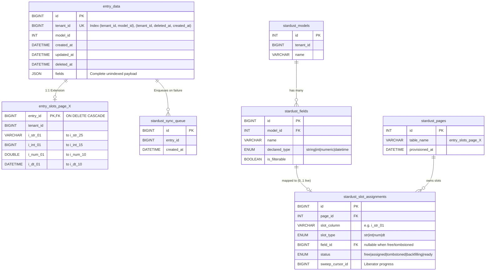
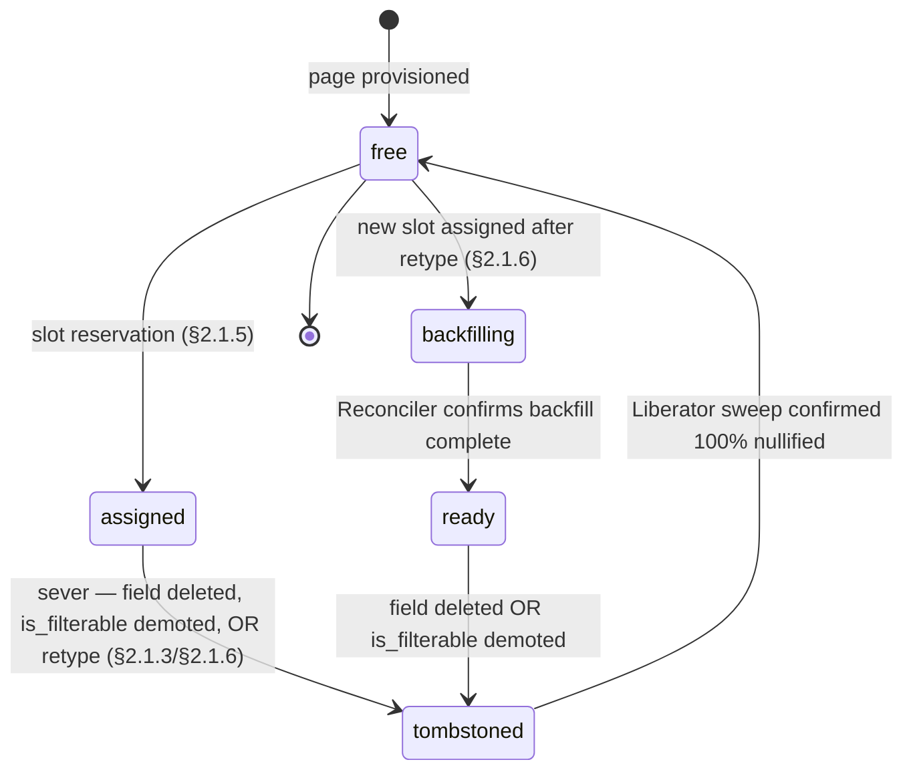

# ERD & Schema Reference

> **This document is the single source of truth for the physical schema of the StarDust core ingestion engine.**
> It is kept in sync with the core architecture blueprint.

The schema comprises two concern groups:

1. **Data plane** (§1–§3) — `entry_data`, `entry_slots_page_X`, `stardust_sync_queue`. Stores entry payloads and the indexed projections.
2. **Schema Registry** (§4) — `stardust_models`, `stardust_fields`, `stardust_pages`, `stardust_slot_assignments`. The coordination contract between the write path, the read path, and the three daemons (ADR [`0017`](../adrs/0017-schema-registry-as-coordination-contract.md)).

## Entity-Relationship Diagram

## Schema Definitions

### `entry_data` (Core Payload Table)

The primary transactional storage for all entries. It stores the complete, unindexed JSON payload.

| Column       | Type       | Description                                                       |
| :----------- | :--------- | :---------------------------------------------------------------- |
| `id`         | `BIGINT`   | Primary Key.                                                      |
| `tenant_id`  | `BIGINT`   | Used for strict tenant isolation.                                 |
| `model_id`   | `INT`      | The ID of the model this entry belongs to.                        |
| `created_at` | `DATETIME` | Timestamp of creation.                                            |
| `updated_at` | `DATETIME` | Timestamp of last update.                                         |
| `deleted_at` | `DATETIME` | Timestamp for soft deletion.                                      |
| `fields`     | `JSON`     | The complete, unindexed JSON payload containing all dynamic data. |

**Indexes:**

- `(tenant_id, model_id)`
- `(tenant_id, deleted_at, created_at)`

### `entry_slots_page_X` (Extension Tables)

1:1 extension tables that store explicitly indexed fields for rapid filtering and lookup. A new page is dynamically provisioned when capacity runs low.

| Column                  | Type       | Description                                                                 |
| :---------------------- | :--------- | :-------------------------------------------------------------------------- |
| `entry_id`              | `BIGINT`   | Primary Key. Foreign Key referencing `entry_data.id` (`ON DELETE CASCADE`). |
| `tenant_id`             | `BIGINT`   | Used to ensure `INNER JOIN` matches across pages are secure.                |
| `i_str_01`...`i_str_25` | `VARCHAR`  | Indexed string slots.                                                       |
| `i_int_01`...`i_int_15` | `BIGINT`   | Indexed integer slots.                                                      |
| `i_num_01`...`i_num_10` | `DOUBLE`   | Indexed numeric (float/double) slots.                                       |
| `i_dt_01`...`i_dt_10`   | `DATETIME` | Indexed date/time slots.                                                    |

> [!WARNING]
> Indexes are only created if the corresponding model field is flagged with `is_filterable = true` in the schema registry at provisioning time.

### `stardust_sync_queue` (Ephemeral Operations Queue)

A tiny, dedicated table exclusively for queuing writes that fail due to extension capacity exhaustion or other temporary sync issues. Handled asynchronously by The Reconciler background process.

| Column       | Type       | Description                                     |
| :----------- | :--------- | :---------------------------------------------- |
| `id`         | `BIGINT`   | Primary Key.                                    |
| `entry_id`   | `BIGINT`   | The ID of the `entry_data` row that needs sync. |
| `created_at` | `DATETIME` | Timestamp of queue entry creation.              |

---

## 4. Schema Registry Tables

> **Normative contract.** The registry is the sole coordination surface between the write path, the read path, and the three daemons (Watcher, Reconciler, Liberator). See ADR [`0017`](../adrs/0017-schema-registry-as-coordination-contract.md) for the rationale and atomicity invariants; ADR [`0015`](../adrs/0015-database-as-sole-daemon-coordination-point.md) for why the registry is the only coordination surface.

### 4.1 `stardust_models` (Model Catalog)

One row per logical model within a tenant. Models are the owner of fields.

| Column       | Type           | Description                                        |
| :----------- | :------------- | :------------------------------------------------- |
| `id`         | `INT`          | Primary Key. Matches `entry_data.model_id`.        |
| `tenant_id`  | `BIGINT`       | Tenant owning the model.                           |
| `name`       | `VARCHAR(128)` | Human-readable model name, unique within a tenant. |
| `created_at` | `DATETIME`     | Timestamp of model registration.                   |

**Indexes:**

- `UNIQUE (tenant_id, name)` — a tenant cannot define two models with the same name.

### 4.2 `stardust_fields` (Field Registry)

One row per model field. The declared type and `is_filterable` flag are set here and consumed by the slot assignment lifecycle (§2.1.5 of the blueprint).

| Column          | Type                                        | Description                                                                                       |
| :-------------- | :------------------------------------------ | :------------------------------------------------------------------------------------------------ |
| `id`            | `BIGINT`                                    | Primary Key.                                                                                      |
| `model_id`      | `INT`                                       | Foreign Key → `stardust_models.id` (`ON DELETE CASCADE`).                                         |
| `name`          | `VARCHAR(128)`                              | The field's logical name as it appears in `entry_data.fields` JSON (e.g., `blog_title`).          |
| `declared_type` | `ENUM('string','int','numeric','datetime')` | Drives the target slot column family (`i_str_XX`, `i_int_XX`, `i_num_XX`, `i_dt_XX`).             |
| `is_filterable` | `BOOLEAN`                                   | When `true`, the slot's composite index `(tenant_id, slot_column)` is active once status=`ready`. |
| `created_at`    | `DATETIME`                                  | Timestamp of field registration.                                                                  |
| `updated_at`    | `DATETIME`                                  | Timestamp of last metadata change (e.g., type change, filterability flip).                        |

**Indexes:**

- `UNIQUE (model_id, name)` — a model cannot declare the same field name twice.

> [!NOTE]
> Field lifecycle state is **not** stored on this table. A field's state is derived from the existence (and status) of its row in `stardust_slot_assignments`. A field with no live slot (no `assigned`, `backfilling`, or `ready` row) is in the **unmapped** state — see ADR [`0017`](../adrs/0017-schema-registry-as-coordination-contract.md) for the three diagnostic sub-states (`unmapped_new`, `unmapped_pending_promotion`, `unmapped_orphaned`) and §4.5 below for the read-path contract.

### 4.3 `stardust_pages` (Provisioned Extension Pages)

One row per provisioned `entry_slots_page_X` table. **Written exclusively by the Watcher** at page provisioning time; no other daemon mutates this table. The presence of a row is the signal the Reconciler consumes to discover new capacity (ADR [`0015`](../adrs/0015-database-as-sole-daemon-coordination-point.md)).

| Column           | Type           | Description                                           |
| :--------------- | :------------- | :---------------------------------------------------- |
| `id`             | `INT`          | Primary Key. Monotonically increasing.                |
| `table_name`     | `VARCHAR(64)`  | Physical table name (e.g., `entry_slots_page_3`).     |
| `provisioned_at` | `DATETIME`     | Timestamp when the Watcher created the table.         |
| `provisioned_by` | `VARCHAR(128)` | Hostname / PID of the Watcher instance (audit trail). |

**Indexes:**

- `UNIQUE (table_name)` — a page name is assigned exactly once.

### 4.4 `stardust_slot_assignments` (Field-to-Slot Mapping)

The authoritative field-to-slot mapping. One row per physical slot column per page. Populated in two phases: (1) the Watcher inserts the full slot inventory when it provisions a new page (all rows `status='free'`), (2) the slot assignment lifecycle (§2.1.5) updates rows as fields are mapped and evicted.

| Column            | Type                                                         | Description                                                                                  |
| :---------------- | :----------------------------------------------------------- | :------------------------------------------------------------------------------------------- |
| `id`              | `BIGINT`                                                     | Primary Key.                                                                                 |
| `page_id`         | `INT`                                                        | Foreign Key → `stardust_pages.id`.                                                           |
| `slot_column`     | `VARCHAR(16)`                                                | Physical column name on the page (e.g., `i_str_01`, `i_int_15`).                             |
| `slot_type`       | `ENUM('str','int','num','dt')`                               | Column family. Fixed at page provisioning; never changes.                                    |
| `field_id`        | `BIGINT` **NULL**                                            | Foreign Key → `stardust_fields.id`. `NULL` when `status IN ('free', 'tombstoned')`.          |
| `status`          | `ENUM('free','assigned','tombstoned','backfilling','ready')` | Lifecycle state. See ADR [`0017`](../adrs/0017-schema-registry-as-coordination-contract.md). |
| `sweep_cursor_id` | `BIGINT` **NULL**                                            | The Liberator's per-slot `entry_id` cursor used by the chunked nullification UPDATE.         |
| `tombstoned_at`   | `DATETIME` **NULL**                                          | Set when status enters `tombstoned`. Used for sweep priority ordering.                       |
| `updated_at`      | `DATETIME`                                                   | Timestamp of last status transition.                                                         |

**Indexes and constraints:**

- `UNIQUE (page_id, slot_column)` — one mapping row per physical slot. Prevents two fields from racing onto the same column.
- `UNIQUE (field_id) WHERE status IN ('assigned', 'backfilling', 'ready')` — a field has at most one live slot at any time. Old slots in `tombstoned` (including the old slot of an in-flight retype) have `field_id = NULL` and do not block a new assignment.
- `INDEX (status, slot_type)` — supports the Watcher's capacity scan (`WHERE status = 'free' AND slot_type = ?`) and the Liberator's sweep scan (`WHERE status = 'tombstoned'`).
- `INDEX (page_id, status)` — supports per-page capacity accounting.

> [!NOTE]
> The partial unique index `UNIQUE (field_id) WHERE status IN ('assigned', 'backfilling', 'ready')` requires MySQL 8.0.13 or newer. **MySQL 8.0.13 is the project minimum** per ADR [`0023`](../adrs/0023-minimum-mysql-version.md); the previously documented generated-column workaround for older versions has been removed and is no longer a supported configuration.

### 4.5 Slot Status State Machine

Each transition acts on a single `stardust_slot_assignments` row. A retype involves two rows — the old slot's `assigned → tombstoned` transition and the new slot's `free → backfilling` transition commit in the same transaction (§4.6 invariant #2).

**Read routing per state:**

| Status                      | Slot-based read   | Filter acceptance                        |
| :-------------------------- | :---------------- | :--------------------------------------- |
| `free`                      | n/a (no field)    | n/a                                      |
| `assigned`                  | yes               | only if `is_filterable = true`           |
| `backfilling`               | no → JSON_EXTRACT | rejected                                 |
| `ready`                     | yes               | only if `is_filterable = true`           |
| `tombstoned`                | no → JSON_EXTRACT | rejected                                 |
| `(no live slot)` _unmapped_ | no → JSON_EXTRACT | rejected (regardless of `is_filterable`) |

The `(no live slot)` row covers the three unmapped sub-states defined in ADR [`0017`](../adrs/0017-schema-registry-as-coordination-contract.md) (`unmapped_new`, `unmapped_pending_promotion`, `unmapped_orphaned`). Read routing and filter acceptance are uniform across all three; the sub-state distinction is for operator diagnostics and Watcher prioritization, not for read-path correctness.

### 4.6 Atomicity Invariants

The following state transitions MUST commit inside a single registry transaction:

1. **Sever + tombstone** — `status: assigned → tombstoned` and `field_id → NULL` in one commit.
2. **Retype lifecycle entry** — all of the following commit together in a single transaction: (a) `stardust_fields.declared_type` is updated; (b) the old `stardust_slot_assignments` row flips `status: assigned → tombstoned` and `field_id → NULL` (standard sever, handed to the Liberator); (c) if a free slot of the target type exists, one such row flips `status: free → backfilling` with `field_id` set. If no free slot of the target type exists, (a) and (b) still commit; the new-slot assignment is deferred to the standard assignment path (§2.1.5) once the Watcher provisions capacity. The field is never observed with two live slots or with its old slot still carrying the pre-retype type.
3. **Sweep completion** — the Liberator's final `UPDATE entry_slots_page_X SET i_str_XX = NULL ...` batch and the registry's `status: tombstoned → free` (plus `field_id → NULL`) commit together.
4. **Page provisioning** — the Watcher's `CREATE TABLE entry_slots_page_X` (DDL, auto-commits), followed by a single transaction that inserts the `stardust_pages` row AND all `stardust_slot_assignments` rows for the new page's slots (`status='free'`). The page is never visible with partial slot inventory.

See ADR [`0017`](../adrs/0017-schema-registry-as-coordination-contract.md) §"State transitions have defined atomicity boundaries" for the full rationale.
