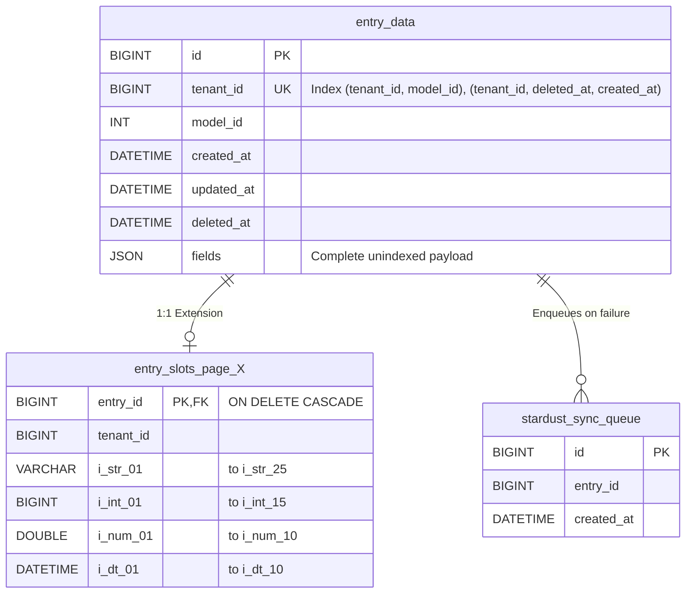

# ERD & Schema Reference

> **This document is the single source of truth for the physical schema of the StarDust core ingestion engine.**
> It is kept in sync with the core architecture blueprint.

## Entity-Relationship Diagram

## Schema Definitions

### `entry_data` (Core Payload Table)

The primary transactional storage for all entries. It stores the complete, unindexed JSON payload.

| Column | Type | Description |
| :--- | :--- | :--- |
| `id` | `BIGINT` | Primary Key. |
| `tenant_id` | `BIGINT` | Used for strict tenant isolation. |
| `model_id` | `INT` | The ID of the model this entry belongs to. |
| `created_at` | `DATETIME` | Timestamp of creation. |
| `updated_at` | `DATETIME` | Timestamp of last update. |
| `deleted_at` | `DATETIME` | Timestamp for soft deletion. |
| `fields` | `JSON` | The complete, unindexed JSON payload containing all dynamic data. |

**Indexes:**
- `(tenant_id, model_id)`
- `(tenant_id, deleted_at, created_at)`

### `entry_slots_page_X` (Extension Tables)

1:1 extension tables that store explicitly indexed fields for rapid filtering and lookup. A new page is dynamically provisioned when capacity runs low.

| Column | Type | Description |
| :--- | :--- | :--- |
| `entry_id` | `BIGINT` | Primary Key. Foreign Key referencing `entry_data.id` (`ON DELETE CASCADE`). |
| `tenant_id` | `BIGINT` | Used to ensure `INNER JOIN` matches across pages are secure. |
| `i_str_01`...`i_str_25` | `VARCHAR` | Indexed string slots. |
| `i_int_01`...`i_int_15` | `BIGINT` | Indexed integer slots. |
| `i_num_01`...`i_num_10` | `DOUBLE` | Indexed numeric (float/double) slots. |
| `i_dt_01`...`i_dt_10` | `DATETIME` | Indexed date/time slots. |

> [!WARNING]
> Indexes are only created if the corresponding model field is flagged with `is_filterable = true` in the schema registry at provisioning time.

### `stardust_sync_queue` (Ephemeral Operations Queue)

A tiny, dedicated table exclusively for queuing writes that fail due to extension capacity exhaustion or other temporary sync issues. Handled asynchronously by The Reconciler background process.

| Column | Type | Description |
| :--- | :--- | :--- |
| `id` | `BIGINT` | Primary Key. |
| `entry_id` | `BIGINT` | The ID of the `entry_data` row that needs sync. |
| `created_at` | `DATETIME` | Timestamp of queue entry creation. |
