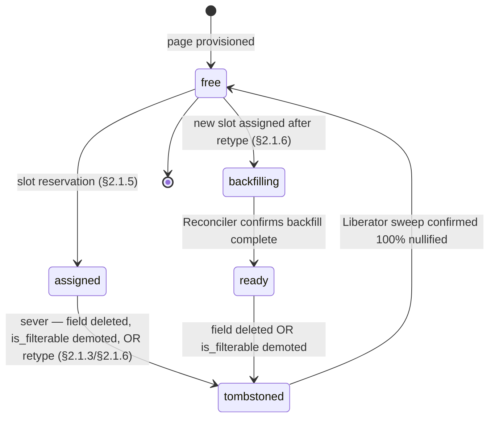

# ERD & Schema Reference

> **This document is the single source of truth for the physical schema of the StarDust core ingestion engine.**
> It is kept in sync with the core architecture blueprint.

The schema comprises three concern groups:

1. **Data plane** (§1–§3) — `entry_data`, `entry_slots_page_X`, `stardust_sync_queue`. Stores entry payloads and the indexed projections.
2. **Schema Registry** (§4) — `stardust_models`, `stardust_fields`, `stardust_pages`, `stardust_slot_assignments`. The coordination contract between the write path, the read path, and the three slot-aware daemons (Watcher, Reconciler, Liberator). The Chronicler is a fourth daemon but only reads `stardust_fields` as the field-name catalog for CSV header derivation — it does not consume the slot mapping (ADR [`0017`](../adrs/0017-schema-registry-as-coordination-contract.md)).
3. **Operational & Coordination** (§5) — `stardust_schema_version`, `stardust_export_jobs`, `stardust_reconciler_dlq`, `backfill_checkpoints`, `stardust_import_jobs`. Tables that exist for daemon coordination, async work, operator triage, and migration state.

## Entity-Relationship Diagram

```mermaid
erDiagram
    entry_data ||--o| entry_slots_page_X : "1:1 Extension"
    entry_data ||--o{ stardust_sync_queue : "Enqueues on failure"

    stardust_models ||--o{ stardust_fields : "has many"
    stardust_fields ||--o| stardust_slot_assignments : "mapped to (0..1 live)"
    stardust_pages ||--o{ stardust_slot_assignments : "owns slots"

    entry_data {
        BIGINT id PK
        BIGINT tenant_id UK "Index (tenant_id, model_id), (tenant_id, deleted_at, created_at)"
        INT model_id
        DATETIME created_at
        DATETIME updated_at
        DATETIME deleted_at
        JSON fields "Complete unindexed payload"
    }

    entry_slots_page_X {
        BIGINT entry_id PK, FK "ON DELETE CASCADE"
        BIGINT tenant_id
        VARCHAR i_str_01 "to i_str_25"
        BIGINT i_int_01 "to i_int_15"
        DOUBLE i_num_01 "to i_num_10"
        DATETIME i_dt_01 "to i_dt_10"
    }

    stardust_sync_queue {
        BIGINT id PK
        BIGINT entry_id
        DATETIME created_at
    }

    stardust_models {
        INT id PK
        BIGINT tenant_id
        VARCHAR name
    }

    stardust_fields {
        BIGINT id PK
        INT model_id FK
        VARCHAR name
        ENUM declared_type "string|int|numeric|datetime"
        BOOLEAN is_filterable
    }

    stardust_pages {
        INT id PK
        VARCHAR table_name "entry_slots_page_X"
        DATETIME provisioned_at
    }

    stardust_slot_assignments {
        BIGINT id PK
        INT page_id FK
        VARCHAR slot_column "e.g. i_str_01"
        ENUM slot_type "str|int|num|dt"
        BIGINT field_id FK "nullable when free/tombstoned"
        ENUM status "free|assigned|tombstoned|backfilling|ready"
        BIGINT sweep_cursor_id "Liberator progress"
    }

    %% §5 Operational tables — no FK relationships to data plane or registry by design

    stardust_schema_version {
        TINYINT id PK "always 1"
        BIGINT version "monotonic counter"
        DATETIME updated_at
    }

    stardust_export_jobs {
        BIGINT id PK
        BIGINT tenant_id "Index (tenant_id, status)"
        ENUM status "pending|processing|completed|failed"
        JSON filter
        ENUM format "csv|json"
        BIGINT last_cursor "nullable"
        VARCHAR artifact_path "nullable"
        DATETIME created_at
        DATETIME completed_at "nullable"
    }

    stardust_reconciler_dlq {
        BIGINT id PK
        ENUM source "sync_queue|bulk_import"
        BIGINT entry_id "intentionally NOT FK — survives entry_data deletion"
        BIGINT tenant_id "denormalized"
        INT model_id "denormalized"
        ENUM reason
        DATETIME failed_at
        INT retry_count
    }

    backfill_checkpoints {
        BIGINT id PK
        VARCHAR job_name UK
        BIGINT last_processed_id
        ENUM status "running|paused|completed|failed"
        DATETIME updated_at
    }

    stardust_import_jobs {
        BIGINT id PK
        BIGINT tenant_id "Index (tenant_id, status)"
        ENUM status "pending|processing|completed|failed"
        VARCHAR idempotency_key "nullable; UNIQUE (tenant_id, idempotency_key)"
        VARCHAR artifact_path "filesystem path to payload JSON"
        INT entry_count
        JSON manifest "nullable; per-chunk outcomes, populated by Reconciler"
        DATETIME created_at
        DATETIME completed_at "nullable"
    }
```

## Schema Definitions

### `entry_data` (Core Payload Table)

The primary transactional storage for all entries. It stores the complete, unindexed JSON payload.

| Column       | Type       | Description                                                       |
| :----------- | :--------- | :---------------------------------------------------------------- |
| `id`         | `BIGINT`   | Primary Key.                                                      |
| `tenant_id`  | `BIGINT`   | Used for strict tenant isolation.                                 |
| `model_id`   | `INT`      | The ID of the model this entry belongs to.                        |
| `created_at` | `DATETIME` | Timestamp of creation.                                            |
| `updated_at` | `DATETIME` | Timestamp of last update.                                         |
| `deleted_at` | `DATETIME` | Timestamp for soft deletion.                                      |
| `fields`     | `JSON`     | The complete, unindexed JSON payload containing all dynamic data. |

**Indexes:**

- `(tenant_id, model_id)`
- `(tenant_id, deleted_at, created_at)`

### `entry_slots_page_X` (Extension Tables)

1:1 extension tables that store explicitly indexed fields for rapid filtering and lookup. A new page is dynamically provisioned when capacity runs low.

| Column                  | Type       | Description                                                                 |
| :---------------------- | :--------- | :-------------------------------------------------------------------------- |
| `entry_id`              | `BIGINT`   | Primary Key. Foreign Key referencing `entry_data.id` (`ON DELETE CASCADE`). |
| `tenant_id`             | `BIGINT`   | Used to ensure `INNER JOIN` matches across pages are secure.                |
| `i_str_01`...`i_str_25` | `VARCHAR`  | Indexed string slots.                                                       |
| `i_int_01`...`i_int_15` | `BIGINT`   | Indexed integer slots.                                                      |
| `i_num_01`...`i_num_10` | `DOUBLE`   | Indexed numeric (float/double) slots.                                       |
| `i_dt_01`...`i_dt_10`   | `DATETIME` | Indexed date/time slots.                                                    |

> [!WARNING]
> Indexes are only created if the corresponding model field is flagged with `is_filterable = true` in the schema registry at provisioning time.

### `stardust_sync_queue` (Ephemeral Operations Queue)

A tiny, dedicated table exclusively for queuing writes that fail due to extension capacity exhaustion or other temporary sync issues. Handled asynchronously by The Reconciler background process.

| Column       | Type       | Description                                     |
| :----------- | :--------- | :---------------------------------------------- |
| `id`         | `BIGINT`   | Primary Key.                                    |
| `entry_id`   | `BIGINT`   | The ID of the `entry_data` row that needs sync. |
| `created_at` | `DATETIME` | Timestamp of queue entry creation.              |

---

## 4. Schema Registry Tables

> **Normative contract.** The registry is the sole coordination surface between the write path, the read path, and the three slot-aware daemons (Watcher, Reconciler, Liberator). The Chronicler (fourth daemon) reads `stardust_fields` as a field-name catalog only — it does not consume the slot mapping or participate in registry-mediated coordination. See ADR [`0017`](../adrs/0017-schema-registry-as-coordination-contract.md) for the rationale and atomicity invariants; ADR [`0015`](../adrs/0015-database-as-sole-daemon-coordination-point.md) for why the registry is the only coordination surface.

### 4.1 `stardust_models` (Model Catalog)

One row per logical model within a tenant. Models are the owner of fields.

| Column       | Type           | Description                                        |
| :----------- | :------------- | :------------------------------------------------- |
| `id`         | `INT`          | Primary Key. Matches `entry_data.model_id`.        |
| `tenant_id`  | `BIGINT`       | Tenant owning the model.                           |
| `name`       | `VARCHAR(128)` | Human-readable model name, unique within a tenant. |
| `created_at` | `DATETIME`     | Timestamp of model registration.                   |

**Indexes:**

- `UNIQUE (tenant_id, name)` — a tenant cannot define two models with the same name.

### 4.2 `stardust_fields` (Field Registry)

One row per model field. The declared type and `is_filterable` flag are set here and consumed by the slot assignment lifecycle (§2.1.5 of the blueprint).

| Column          | Type                                        | Description                                                                                       |
| :-------------- | :------------------------------------------ | :------------------------------------------------------------------------------------------------ |
| `id`            | `BIGINT`                                    | Primary Key.                                                                                      |
| `model_id`      | `INT`                                       | Foreign Key → `stardust_models.id` (`ON DELETE CASCADE`).                                         |
| `name`          | `VARCHAR(128)`                              | The field's logical name as it appears in `entry_data.fields` JSON (e.g., `blog_title`).          |
| `declared_type` | `ENUM('string','int','numeric','datetime')` | Drives the target slot column family (`i_str_XX`, `i_int_XX`, `i_num_XX`, `i_dt_XX`).             |
| `is_filterable` | `BOOLEAN`                                   | When `true`, the slot's composite index `(tenant_id, slot_column)` is active once status=`ready`. |
| `created_at`    | `DATETIME`                                  | Timestamp of field registration.                                                                  |
| `updated_at`    | `DATETIME`                                  | Timestamp of last metadata change (e.g., type change, filterability flip).                        |

**Indexes:**

- `UNIQUE (model_id, name)` — a model cannot declare the same field name twice.

> [!NOTE]
> Field lifecycle state is **not** stored on this table. A field's state is derived from the existence (and status) of its row in `stardust_slot_assignments`. A field with no live slot (no `assigned`, `backfilling`, or `ready` row) is in the **unmapped** state — see ADR [`0017`](../adrs/0017-schema-registry-as-coordination-contract.md) for the three diagnostic sub-states (`unmapped_new`, `unmapped_pending_promotion`, `unmapped_orphaned`) and §4.5 below for the read-path contract.

### 4.3 `stardust_pages` (Provisioned Extension Pages)

One row per provisioned `entry_slots_page_X` table. **Written exclusively by the Watcher** at page provisioning time; no other daemon mutates this table. The presence of a row is the signal the Reconciler consumes to discover new capacity (ADR [`0015`](../adrs/0015-database-as-sole-daemon-coordination-point.md)).

| Column           | Type           | Description                                           |
| :--------------- | :------------- | :---------------------------------------------------- |
| `id`             | `INT`          | Primary Key. Monotonically increasing.                |
| `table_name`     | `VARCHAR(64)`  | Physical table name (e.g., `entry_slots_page_3`).     |
| `provisioned_at` | `DATETIME`     | Timestamp when the Watcher created the table.         |
| `provisioned_by` | `VARCHAR(128)` | Hostname / PID of the Watcher instance (audit trail). |

**Indexes:**

- `UNIQUE (table_name)` — a page name is assigned exactly once.

### 4.4 `stardust_slot_assignments` (Field-to-Slot Mapping)

The authoritative field-to-slot mapping. One row per physical slot column per page. Populated in two phases: (1) the Watcher inserts the full slot inventory when it provisions a new page (all rows `status='free'`), (2) the slot assignment lifecycle (§2.1.5) updates rows as fields are mapped and evicted.

| Column            | Type                                                         | Description                                                                                  |
| :---------------- | :----------------------------------------------------------- | :------------------------------------------------------------------------------------------- |
| `id`              | `BIGINT`                                                     | Primary Key.                                                                                 |
| `page_id`         | `INT`                                                        | Foreign Key → `stardust_pages.id`.                                                           |
| `slot_column`     | `VARCHAR(16)`                                                | Physical column name on the page (e.g., `i_str_01`, `i_int_15`).                             |
| `slot_type`       | `ENUM('str','int','num','dt')`                               | Column family. Fixed at page provisioning; never changes.                                    |
| `field_id`        | `BIGINT` **NULL**                                            | Foreign Key → `stardust_fields.id`. `NULL` when `status IN ('free', 'tombstoned')`.          |
| `status`          | `ENUM('free','assigned','tombstoned','backfilling','ready')` | Lifecycle state. See ADR [`0017`](../adrs/0017-schema-registry-as-coordination-contract.md). |
| `sweep_cursor_id` | `BIGINT` **NULL**                                            | The Liberator's per-slot `entry_id` cursor used by the chunked nullification UPDATE.         |
| `tombstoned_at`   | `DATETIME` **NULL**                                          | Set when status enters `tombstoned`. Used for sweep priority ordering.                       |
| `updated_at`      | `DATETIME`                                                   | Timestamp of last status transition.                                                         |

**Indexes and constraints:**

- `UNIQUE (page_id, slot_column)` — one mapping row per physical slot. Prevents two fields from racing onto the same column.
- `UNIQUE (field_id) WHERE status IN ('assigned', 'backfilling', 'ready')` — a field has at most one live slot at any time. Old slots in `tombstoned` (including the old slot of an in-flight retype) have `field_id = NULL` and do not block a new assignment.
- `INDEX (status, slot_type)` — supports the Watcher's capacity scan (`WHERE status = 'free' AND slot_type = ?`) and the Liberator's sweep scan (`WHERE status = 'tombstoned'`).
- `INDEX (page_id, status)` — supports per-page capacity accounting.

> [!NOTE]
> The partial unique index `UNIQUE (field_id) WHERE status IN ('assigned', 'backfilling', 'ready')` requires MySQL 8.0.13 or newer. **MySQL 8.0.13 is the project minimum** per ADR [`0023`](../adrs/0023-minimum-mysql-version.md); the previously documented generated-column workaround for older versions has been removed and is no longer a supported configuration.

### 4.5 Slot Status State Machine

Each transition acts on a single `stardust_slot_assignments` row. A retype involves two rows — the old slot's `assigned → tombstoned` transition and the new slot's `free → backfilling` transition commit in the same transaction (§4.6 invariant #2). The Reconciler's coercion predicate during the `backfilling` phase — which JSON value / target-type pairs succeed and which produce `NULL` — is normative in [ADR `0024`](../adrs/0024-type-coercion-matrix-for-retype-backfill.md).

```mermaid
stateDiagram-v2
    [*] --> free : page provisioned
    free --> assigned : slot reservation (§2.1.5)
    assigned --> tombstoned : sever — field deleted, is_filterable demoted, OR retype (§2.1.3/§2.1.6)
    free --> backfilling : new slot assigned after retype (§2.1.6)
    backfilling --> ready : Reconciler confirms backfill complete
    ready --> tombstoned : field deleted OR is_filterable demoted
    tombstoned --> free : Liberator sweep confirmed 100% nullified
    free --> [*]
```

**Read routing per state:**

| Status                      | Slot-based read   | Filter acceptance                        |
| :-------------------------- | :---------------- | :--------------------------------------- |
| `free`                      | n/a (no field)    | n/a                                      |
| `assigned`                  | yes               | only if `is_filterable = true`           |
| `backfilling`               | no → JSON_EXTRACT | rejected                                 |
| `ready`                     | yes               | only if `is_filterable = true`           |
| `tombstoned`                | no → JSON_EXTRACT | rejected                                 |
| `(no live slot)` _unmapped_ | no → JSON_EXTRACT | rejected (regardless of `is_filterable`) |

The `(no live slot)` row covers the three unmapped sub-states defined in ADR [`0017`](../adrs/0017-schema-registry-as-coordination-contract.md) (`unmapped_new`, `unmapped_pending_promotion`, `unmapped_orphaned`). Read routing and filter acceptance are uniform across all three; the sub-state distinction is for operator diagnostics and Watcher prioritization, not for read-path correctness.

### 4.6 Atomicity Invariants

The following state transitions MUST commit inside a single registry transaction:

1. **Sever + tombstone** — `status: assigned → tombstoned` and `field_id → NULL` in one commit.
2. **Retype lifecycle entry** — all of the following commit together in a single transaction: (a) `stardust_fields.declared_type` is updated; (b) the old `stardust_slot_assignments` row flips `status: assigned → tombstoned` and `field_id → NULL` (standard sever, handed to the Liberator); (c) if a free slot of the target type exists, one such row flips `status: free → backfilling` with `field_id` set. If no free slot of the target type exists, (a) and (b) still commit; the new-slot assignment is deferred to the standard assignment path (§2.1.5) once the Watcher provisions capacity. The field is never observed with two live slots or with its old slot still carrying the pre-retype type.
3. **Sweep completion** — the Liberator's final `UPDATE entry_slots_page_X SET i_str_XX = NULL ...` batch and the registry's `status: tombstoned → free` (plus `field_id → NULL`) commit together.
4. **Page provisioning** — the Watcher's `CREATE TABLE entry_slots_page_X` (DDL, auto-commits), followed by a single transaction that inserts the `stardust_pages` row AND all `stardust_slot_assignments` rows for the new page's slots (`status='free'`). The page is never visible with partial slot inventory.

See ADR [`0017`](../adrs/0017-schema-registry-as-coordination-contract.md) §"State transitions have defined atomicity boundaries" for the full rationale.

---

## 5. Operational & Coordination Tables

> Tables that exist for daemon coordination, async work, operator triage, and migration state. Unlike the data plane (§1–§3) and the registry (§4), the §5 tables are **operationally coupled** to specific daemons or CLIs rather than to the consumer write path. None of them participate in the registry's atomicity invariants (§4.6).
>
> _Modularization deferred._ When this document crosses ~800 lines or a fourth concern group emerges, §5 is the natural cleavage point for a multi-file split.

### 5.1 `stardust_schema_version` (Registry Version Counter)

A single-row singleton holding a monotonically increasing integer that the API uses as a cache-invalidation token (ADR [`0015`](../adrs/0015-database-as-sole-daemon-coordination-point.md)). Every transaction that mutates coordination-relevant registry state — page provisioning, slot-status transitions, field metadata changes — increments `version` in the same transaction as the underlying mutation.

| Column       | Type              | Description                                                                                               |
| :----------- | :---------------- | :-------------------------------------------------------------------------------------------------------- |
| `id`         | `TINYINT`         | Primary Key. Always `1`. Singleton enforced by `CHECK (id = 1)`.                                          |
| `version`    | `BIGINT UNSIGNED` | Monotonically increasing version counter. Bumped in the same transaction as any registry-mutating commit. |
| `updated_at` | `DATETIME`        | Timestamp of last bump. Diagnostic only — not on the read path.                                           |

**Indexes and constraints:**

- `PRIMARY KEY (id)`
- `CHECK (id = 1)` — singleton enforcement.

> [!NOTE]
> The version-only liveness probe (`SELECT version FROM stardust_schema_version`) sits on every API write path. The table is intentionally one row, one column on a single buffer-pool page — sub-millisecond reads under load. The 60-second bounded staleness fallback lives in the cache layer, not on this table (per ADR [`0015`](../adrs/0015-database-as-sole-daemon-coordination-point.md)).

### 5.2 `stardust_export_jobs` (Async Export Job Queue)

The Chronicler daemon's claim-and-process queue for async export jobs. Rows are inserted by the engine API at submission time, claimed by Chronicler workers via `SELECT ... FOR UPDATE SKIP LOCKED`, and transition through `pending → processing → completed | failed`. Per-tenant fairness, the 24-hour artifact TTL, and the 5 GB artifact cap derive from ADR [`0010`](../adrs/0010-asynchronous-exports.md); the daemon-side claim, GC, lease, and worker-identity decisions live in [`blueprints/chronicler_daemon.md`](../blueprints/chronicler_daemon.md). The lease/heartbeat semantics and the extended `failed_reason` taxonomy below derive from ADR [`0025`](../adrs/0025-chronicler-failure-semantics.md).

| Column            | Type                                                | Description                                                                                                                                                                                                                              |
| :---------------- | :-------------------------------------------------- | :--------------------------------------------------------------------------------------------------------------------------------------------------------------------------------------------------------------------------------------- |
| `id`              | `BIGINT`                                            | Primary Key. The job ID exposed to consumers.                                                                                                                                                                                            |
| `tenant_id`       | `BIGINT`                                            | Tenant owning the job. Enforced for isolation on every read.                                                                                                                                                                             |
| `status`          | `ENUM('pending','processing','completed','failed')` | Lifecycle state.                                                                                                                                                                                                                         |
| `filter`          | `JSON`                                              | Envelope of shape `{model_id, filter}`: `model_id` is the engine-stamped target model the Chronicler hydrates on claim; `filter` is the validated `QueryFilter` payload submitted by the consumer (see [`queryfilter_wire_format.md`](../blueprints/queryfilter_wire_format.md)). The envelope keeps the engine's stamping orthogonal to the consumer payload so the Phase 8 QueryFilter validator can read `filter` as-is. |
| `format`          | `ENUM('csv','json')`                                | Artifact format. Validated at submission, not at materialization.                                                                                                                                                                        |
| `last_cursor`     | `BIGINT` **NULL**                                   | Most recently processed `entry_data.id` cursor. Updated per chunk. `NULL` until the first chunk commits.                                                                                                                                 |
| `artifact_path`   | `VARCHAR(512)` **NULL**                             | Absolute filesystem path of the materialized file. Set when `status='completed'`; nulled by GC sweep after TTL.                                                                                                                          |
| `failed_reason`   | `VARCHAR(64)` **NULL**                              | Closed taxonomy per ADR [`0025`](../adrs/0025-chronicler-failure-semantics.md): `artifact_size_exceeded`, `query_failure`, `disk_full`, `excessive_skips`, `other`. Set only when `status='failed'`.                                     |
| `skip_count`      | `INT UNSIGNED` (default `0`)                        | Cumulative skip-charge counter (`row_skipped` + `chunk_skipped`). Crossing `skip_count_cap` aborts the job with `failed_reason='excessive_skips'`. See ADR [`0025`](../adrs/0025-chronicler-failure-semantics.md).                       |
| `worker_identity` | `VARCHAR(128)` **NULL**                             | Hostname/PID of the claiming Chronicler worker. Re-claim overwrites this; the prior worker self-aborts on the mismatch per ADR [`0025`](../adrs/0025-chronicler-failure-semantics.md).                                                   |
| `claimed_at`      | `DATETIME` **NULL**                                 | Set in the same transaction as the `pending → processing` claim. Diagnostic; drives the lease-age computation in conjunction with `heartbeat_at`.                                                                                        |
| `heartbeat_at`    | `DATETIME` **NULL**                                 | Refreshed in every chunk-commit transaction (default 5s cadence). Abandoned-claim sweep keys on `heartbeat_at < NOW() - INTERVAL <lease_timeout> SECOND` per ADR [`0025`](../adrs/0025-chronicler-failure-semantics.md).                 |
| `created_at`      | `DATETIME`                                          | Submission timestamp. Drives FIFO ordering and per-tenant fairness.                                                                                                                                                                      |
| `completed_at`    | `DATETIME` **NULL**                                 | Set when `status` enters `completed` or `failed`. Drives the 24-hour TTL GC sweep.                                                                                                                                                       |

**Indexes and constraints:**

- `INDEX (status, created_at)` — supports the Chronicler's pending-job scan with FIFO secondary ordering.
- `INDEX (tenant_id, status)` — supports the per-tenant active-job cap (≤ 3 in `pending` or `processing`) enforced at the engine API submission boundary.
- `INDEX (status, heartbeat_at)` — supports the abandoned-claim sweep (`status='processing' AND heartbeat_at < NOW() - INTERVAL <lease_timeout> SECOND`) per ADR [`0025`](../adrs/0025-chronicler-failure-semantics.md).
- `INDEX (completed_at)` — supports the GC sweep (`completed_at + ttl < NOW()`).

> [!NOTE]
> `tenant_round_robin_position` referenced in [`blueprints/chronicler_daemon.md`](../blueprints/chronicler_daemon.md) §5 is **computed at claim time** (`MIN(created_at)` grouped by `tenant_id` over `status='pending'` rows), not stored as a column. Materializing it would require a second write per tenant per claim — no benefit over the windowed subquery.

> [!WARNING]
> The `filter` column stores arbitrary consumer JSON; it MUST NOT be materialized into log lines or alert payloads. Same hygiene as ADR [`0018`](../adrs/0018-reconciler-poison-pill-semantics.md) requires for the DLQ's `error_message`.

### 5.3 `stardust_reconciler_dlq` (Reconciler Dead Letter Queue)

Per-row quarantine for poison pills the Reconciler cannot process — malformed JSON, missing source row, or schema incompatibility. Operator-initiated replay only; no automatic retry, no automatic TTL. Fully and normatively specified by ADR [`0018`](../adrs/0018-reconciler-poison-pill-semantics.md); this section is the lift of that ADR's table into the schema reference.

| Column                 | Type                                                                           | Description                                                                                                                                                      |
| :--------------------- | :----------------------------------------------------------------------------- | :--------------------------------------------------------------------------------------------------------------------------------------------------------------- |
| `id`                   | `BIGINT`                                                                       | Primary Key.                                                                                                                                                     |
| `source`               | `ENUM('sync_queue','bulk_import')`                                             | Workload that produced the failure. Lets operators triage the two Reconciler workloads independently.                                                            |
| `entry_id`             | `BIGINT` **NULL**                                                              | Authoritative entry pointer. `NULL` only when `reason = 'missing_entry_data'`.                                                                                   |
| `tenant_id`            | `BIGINT`                                                                       | Denormalized from `entry_data` at quarantine time. Survives `entry_data` row deletion.                                                                           |
| `model_id`             | `INT`                                                                          | Denormalized from `entry_data` at quarantine time.                                                                                                               |
| `reason`               | `ENUM('malformed_json','missing_entry_data','schema_incompatibility','other')` | Closed cause taxonomy. Free-form detail goes in `error_message`.                                                                                                 |
| `error_message`        | `TEXT`                                                                         | Sanitized exception class + message. MUST NOT include unbounded payload contents (PII risk).                                                                     |
| `failed_at`            | `DATETIME`                                                                     | Quarantine timestamp. Drives the "oldest DLQ entry" operator alert.                                                                                              |
| `retry_count`          | `INT` (default `0`)                                                            | Bumped by the replay CLI on each operator-initiated re-enqueue. Pure audit field; not used for routing.                                                          |
| `chunk_correlation_id` | `VARCHAR(36)`                                                                  | The Reconciler's per-chunk UUID (per ADR [`0020`](../adrs/0020-structured-logging-mandate.md)). Lets operators trace from a structured-log event to the DLQ row. |

**Indexes and constraints:**

- `INDEX (source, failed_at)` — supports the "oldest unresolved entry per workload" alert query.
- `INDEX (entry_id)` — supports operator triage and replay.
- **No foreign key to `entry_data`** — by construction the DLQ MUST survive `entry_data` row deletion (the `missing_entry_data` reason exists precisely for this).

> [!NOTE]
> ADR [`0018`](../adrs/0018-reconciler-poison-pill-semantics.md) originally directed §3 placement (alongside `stardust_sync_queue`). The table was relocated to §5.3 as part of the operational consolidation post-StarDust/StarGate split (2026-05-03). The ADR is unchanged per the project's append-only ADR convention; this NOTE reconciles the cross-reference.

> [!WARNING]
> No automatic TTL. Quarantined rows persist until an operator runs `bin/stardust reconciler:dlq:replay` (or explicitly deletes). Time-based purging would re-create the silent-data-loss failure mode ADR [`0018`](../adrs/0018-reconciler-poison-pill-semantics.md) rejects.

> [!NOTE]
> Operator alert thresholds are non-negotiable: depth `> 100` and oldest-row age `> 12h`. Both thresholds are deployment-tunable; the **existence** of monitoring on both is not.

### 5.4 `backfill_checkpoints` (Backfill Pump Cursor State)

Persistent cursor state for the **Backfill Pump** CLI (`bin/stardust backfill`), enabling resumability across restarts via a per-job `last_processed_id` cursor over historical `entry_data`. One row per named backfill job; multiple concurrent jobs (e.g., per model or per legacy migration cohort) are supported by `job_name`. The CLI's `--from-id` flag overrides `last_processed_id` for manual resumption from a specific cursor; without the flag, the CLI resumes from the persisted value.

| Column              | Type                                            | Description                                                                                                                                                                                        |
| :------------------ | :---------------------------------------------- | :------------------------------------------------------------------------------------------------------------------------------------------------------------------------------------------------- |
| `id`                | `BIGINT`                                        | Primary Key.                                                                                                                                                                                       |
| `job_name`          | `VARCHAR(128)`                                  | Operator-supplied job identifier (e.g., `legacy_migration_2026_q2`, `model_42_rebuild`). Unique per active job.                                                                                    |
| `last_processed_id` | `BIGINT`                                        | The most recently committed `entry_data.id` cursor. Resumption point on restart. `0` before the first chunk commits.                                                                               |
| `status`            | `ENUM('running','paused','completed','failed')` | Lifecycle state. `running` during active CLI execution; `paused` when the operator stops the CLI; `completed` when the cursor reaches the configured upper bound; `failed` on unrecoverable error. |
| `started_at`        | `DATETIME`                                      | Timestamp of the first CLI invocation for this `job_name`. Set on insert.                                                                                                                          |
| `updated_at`        | `DATETIME`                                      | Timestamp of the most recent cursor commit. Drives the "stalled backfill" operator alert.                                                                                                          |
| `completed_at`      | `DATETIME` **NULL**                             | Set when `status` enters `completed` or `failed`.                                                                                                                                                  |
| `last_error`        | `VARCHAR(512)` **NULL**                         | Sanitized error message when `status='failed'`. Same PII hygiene as ADR [`0018`](../adrs/0018-reconciler-poison-pill-semantics.md).                                                                |

**Indexes and constraints:**

- `PRIMARY KEY (id)`
- `UNIQUE (job_name)` — operator cannot start two concurrent backfills under the same name; prevents cursor races.
- `INDEX (status, updated_at)` — supports the "stalled backfill" alert (`status='running' AND updated_at < NOW() - threshold`).

> [!NOTE]
> The CLI commits `last_processed_id` after each chunk. The frequency of commits (chunk size) is a CLI flag, not a table-level concern. On crash recovery, the CLI re-reads the row, resumes from `last_processed_id + 1`, and may re-process the partial chunk that was in flight at crash time — backfill operations MUST be idempotent.

> [!NOTE]
> **Retype-backfill usage.** In addition to the Backfill Pump CLI, the **Reconciler daemon** uses `backfill_checkpoints` to track per-field retype-backfill progress. When the schema-registry retype transaction commits ([ADR 0016](../adrs/0016-field-type-change-lifecycle.md) step 1), the Reconciler inserts a `backfill_checkpoints` row with `job_name = 'retype_field_{field_id}'` and performs a direct cursor scan over `entry_data` for the `(tenant_id, model_id)` partition of the retyping field, applying `JSON_EXTRACT` + type coercion per [ADR 0024](../adrs/0024-type-coercion-matrix-for-retype-backfill.md). It does **not** use `stardust_sync_queue` for this workload — that queue is reserved for capacity-exhaustion fallbacks only. The `last_processed_id` cursor advances per chunk; on daemon restart the Reconciler resumes from `last_processed_id + 1` for any `status = 'running'` retype-backfill rows. All retype-backfill writes MUST be idempotent (`INSERT … ON DUPLICATE KEY UPDATE`).

### 5.5 `stardust_import_jobs` (Async Bulk-Ingest Job Queue)

The Reconciler daemon's claim-and-process queue for async bulk-ingest submissions. Rows are inserted by the engine's `submitBulkWrite()` entry point when a synchronous bulk call would exceed the 1,000-entity threshold (per ADR [`0011`](../adrs/0011-chunked-bulk-ingestion.md)); the Phase 5 Reconciler will claim them via `SELECT ... FOR UPDATE SKIP LOCKED` and drain into `entry_data` + `entry_slots_page_X` using the same chunked-transaction model that the sync path uses. The schema mirrors `stardust_export_jobs` — ADR 0011 explicitly says "artifact path on local disk, identical to the export pattern" — but with two import-specific additions: a durable `(tenant_id, idempotency_key)` unique index that enforces the ADR 0011 idempotency contract at the database level, and an `entry_count` column captured at submission so operators can observe per-tenant queue depth in entities rather than jobs. The on-disk artifact format itself (single-document JSON, not NDJSON) and the Reconciler's reader contract are pinned by ADR [`0028`](../adrs/0028-single-document-json-for-import-artifacts.md).

| Column            | Type                                                | Description                                                                                                                                                                                                |
| :---------------- | :-------------------------------------------------- | :--------------------------------------------------------------------------------------------------------------------------------------------------------------------------------------------------------- |
| `id`              | `BIGINT`                                            | Primary Key. The Import Job ID returned to the caller of `submitBulkWrite()`.                                                                                                                              |
| `tenant_id`       | `BIGINT`                                            | Tenant owning the submission. Enforced for isolation on every read; combined with `idempotency_key` to scope idempotency per tenant.                                                                       |
| `status`          | `ENUM('pending','processing','completed','failed')` | Lifecycle state. Inserted as `pending`; transitions are owned by the Phase 5 Reconciler.                                                                                                                   |
| `idempotency_key` | `VARCHAR(128)` **NULL**                             | Caller-supplied retry key per ADR [`0011`](../adrs/0011-chunked-bulk-ingestion.md). A retry with the same `(tenant_id, idempotency_key)` pair returns the existing job ID rather than creating a new row.  |
| `artifact_path`   | `VARCHAR(512)`                                      | Absolute filesystem path to the payload artifact under `Config::$artifactDir`. Required (NOT NULL) — the Reconciler reads it to process the job. Single-document JSON per ADR `0028` (linked above).       |
| `entry_count`     | `INT UNSIGNED`                                      | Number of entities in the submitted payload. Captured at submission for operator observability.                                                                                                            |
| `manifest`        | `JSON` **NULL**                                     | Per-chunk outcome manifest per ADR [`0011`](../adrs/0011-chunked-bulk-ingestion.md). NULL until the Reconciler begins processing; populated chunk-by-chunk thereafter.                                     |
| `failed_reason`   | `VARCHAR(64)` **NULL**                              | Set only when `status='failed'`. Closed taxonomy is owned by the Phase 5 Reconciler.                                                                                                                       |
| `worker_identity` | `VARCHAR(128)` **NULL**                             | Hostname/PID of the claiming Reconciler worker. Mirrors `stardust_export_jobs.worker_identity` and self-aborts on mismatch per ADR [`0025`](../adrs/0025-chronicler-failure-semantics.md).                 |
| `claimed_at`      | `DATETIME` **NULL**                                 | Set in the same transaction as the `pending → processing` claim.                                                                                                                                         |
| `heartbeat_at`    | `DATETIME` **NULL**                                 | Refreshed by the Reconciler in every chunk-commit transaction. Drives the abandoned-claim sweep.                                                                                                           |
| `created_at`      | `DATETIME`                                          | Submission timestamp. Drives FIFO ordering across tenants and the "oldest pending import" operator alert.                                                                                                  |
| `completed_at`    | `DATETIME` **NULL**                                 | Set when `status` enters `completed` or `failed`.                                                                                                                                                          |

**Indexes and constraints:**

- `PRIMARY KEY (id)`
- `UNIQUE KEY (tenant_id, idempotency_key)` — enforces ADR [`0011`](../adrs/0011-chunked-bulk-ingestion.md) idempotency. Multiple NULL `idempotency_key` values are permitted (MySQL UNIQUE allows multiple NULLs) so unkeyed submissions never collide with each other.
- `INDEX (status, created_at)` — supports the Reconciler's pending-job scan with FIFO secondary ordering.
- `INDEX (tenant_id, status)` — supports per-tenant queue-depth observability.
- `INDEX (status, heartbeat_at)` — supports the abandoned-claim sweep when the Reconciler grows multi-worker capacity.

> [!NOTE]
> Phase 3 owns _submission_: it persists the artifact + the row and returns the ID. Status transitions, claim semantics, and `manifest` population are Phase 5 (Reconciler) work — this section documents the column shapes Phase 5 will rely on, not their lifecycle.
